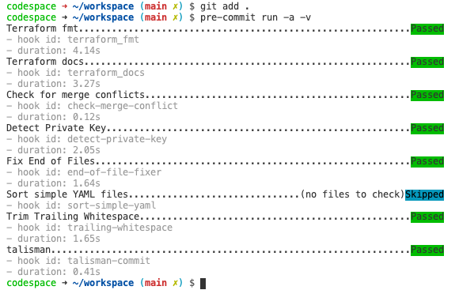

GitHub Codespaces
-----------------

GitHub (Codespaces_) provides cloud-powered development environments for any activity - whether it's a long-term project, or a short-term task like reviewing a pull request. You can work with these environments from three possible clients: Visual Studio Code, a browser-based editor, or the Visual Studio IDE (currently in Private Preview).

Environments
############

An environment is the "backend" half of GitHub Codespaces. It's where all of the compute associated with software development happens: compiling, debugging, restoring, etc. When you need to work on a new project, pick up a new task, or review a PR, you can simply spin up a Cloud-hosted environment, and GitHub Codespaces takes care of configuring it correctly. It automatically configures everything you need to work on your project: the source code, runtime, compiler, debugger, editor, custom dotfile configurations, relevant editor extensions, and more.

.. note:: VSCode Codespaces how to: https://docs.microsoft.com/en-us/visualstudio/codespaces/how-to/vscode

Using codespace to contribute to this project
#############################################

This project has implemented codespaces to validate code **before** it's brought into source control. This helps ensure that formatting, credentials, and other sensitive information is not accidentally shared.

If configured correctly, when a repository is opened in Visual Studio Code with a .devcontainer folder, VSCode will prompt the user to re-open the repository from a Codespaces container.

|image01|

.. warning:: This does mean that anyone working within the repository as a contributor will need to have Docker installed alongside their VSCode.

Opening the repository in the devcontainer will take some time, currently several minutes, to download and launch. Once the repository is running in the container, you will need to enter your GitHub credentials, to interact with source control by opening a terminal in vscode, which will interact with the Docker hosted devcontainer.

.. note:: You will need to reenter your credentials every time you rebuilt the container

Add credentials:

.. code-block::

    # https://docs.gitlab.com/ee/gitlab-basics/start-using-git.html
    git config --global user.name "your_username"
    git config --global user.email "your_email_address@example.com"

Pushing to Source Control
#########################

The devcontainer in this repository is set up with several scripts located in the devcontainer/scripts. Before you can commit to the repository, you will need to pass your changes through the scripts with a pre-commit command:

|image02|

.. code-block::

    # https://git-scm.com/docs/git-add
    git add .
    # https://pre-commit.com/
    pre-commit run -a -v

If warnings are found from your changes, please address them as needed with the recommended actions before pushing changes.

.. _Codespaces: https://code.visualstudio.com/docs/remote/codespaces

.. |image01| image:: images/image01.png

