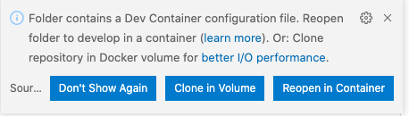
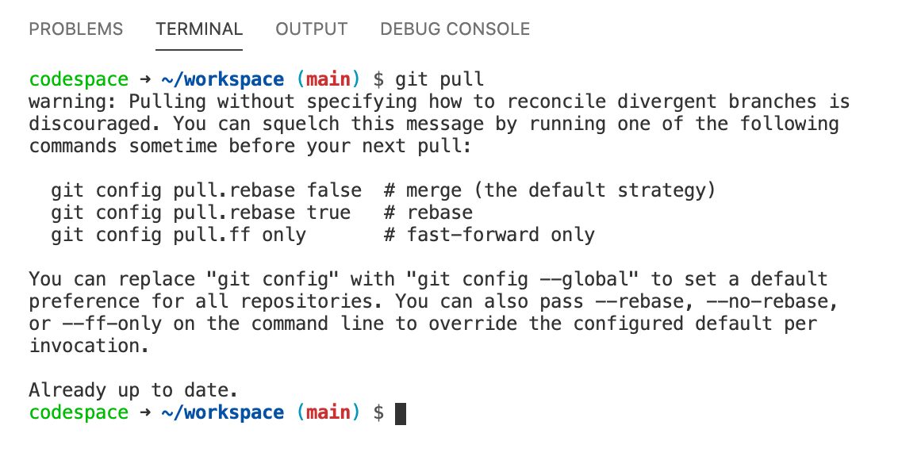
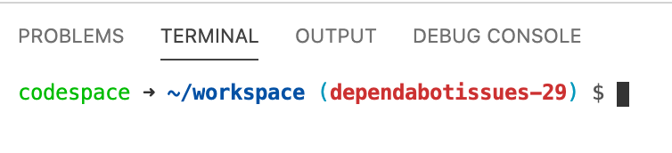

GitHub Codespaces
-----------------

GitHub (Codespaces_) provides cloud-powered development environments for any activity - whether it is a long-term project or a short-term task like reviewing a pull request. You can work with these environments from three possible clients: Visual Studio Code, a browser-based editor, or the Visual Studio IDE (currently in Private Preview).

Environments
############

An environment is the "backend" half of GitHub Codespaces. It is where all of the compute associated with software development happens: compiling, debugging, restoring, etc. When you need to work on a new project, pick up a new task, or review a PR, you can simply spin up a Cloud-hosted environment, and GitHub Codespaces takes care of configuring it correctly. It automatically configures everything you need to work on your project: the source code, runtime, compiler, debugger, editor, custom dotfile configurations, relevant editor extensions, and more.

.. note:: VSCode Codespaces how to: https://docs.microsoft.com/en-us/visualstudio/codespaces/how-to/vscode

Using codespace to contribute to this project
#############################################

This project has implemented codespaces to validate code **before** it is brought into source control. This helps ensure that formatting, credentials, and other sensitive information is not accidentally shared.

If configured correctly, when a repository is opened in Visual Studio Code with a .devcontainer folder, VSCode will prompt the user to re-open the repository from a Codespaces container.

|image01|

.. warning:: This does mean that anyone working within the repository as a contributor will need to have Docker installed alongside their VSCode.

Opening the repository in the devcontainer will take some time, currently several minutes, to download and launch. Once the repository is running in the container. You will need to enter your GitHub credentials to interact with source control by opening a terminal in vscode, interacting with the Docker hosted devcontainer.

.. note:: You will need to reenter your credentials every time you rebuild the container

Add credentials:

.. code-block::

    # https://docs.gitlab.com/ee/gitlab-basics/start-using-git.html
    git config --global user.name "your_username"
    git config --global user.email "your_email_address@example.com"

Pushing to Source Control
#########################

The devcontainer in this repository is set up with several scripts located in the devcontainer/scripts. This project heavily utilizes branches for work. If you are going to contribute, please start by opening an issue with the work. After the issue is created/identified, you can follow below to create a branch and contribute.

.. note:: Examples are all shown from within VSCode

First, make sure your main branch is up to date:

.. code-block::

    git pull

|image03|

After your main branch is in sync, you can create a new branch.

|image04|

The branch name should have something close to what your issue is related to and the issue number. Keep in mind you cant use pound-signs in branch names.

|image05|

.. note:: After creating the new branch, you may need to hit return in your terminal window to show the changes.

|image06|

Since this is a new branch, make sure there are not any changes before beginning work:

|image07|

At this point, you can work on your branch!

Before you can commit to the repository, you will need to pass your changes through the scripts with a pre-commit command:

|image08|

.. code-block::

    # https://git-scm.com/docs/git-add
    git add .
    # https://pre-commit.com/
    pre-commit run -a -v

If warnings are found from your changes, please address them as needed with the recommended actions before pushing your new branch to the project.

Pushing your branch to the project will spawn a new notification on the repo for a Compare and Pull. Ensure you are creating a pull request only from your branch, as others might be in approval.

.. note:: When you commit your branch to the repo, you can link pull requests to issues. This will clean up your issue when the PR is closed on main. `pull to issue link`_

|image10|

Create your PR for approval, if needed

|image11|

Approvals
#########

Depending on the change you are working through, you might need to get a code owners approval. These are in place to protect parts of the project from accidentally being changed. Code owners are typically module/solution owners. If you are creating a module/solution, make sure you are adding your config to the CODEOWNERS_ file at the root of the repository.

.. _CODEOWNERS: https://github.com/f5devcentral/f5-digital-customer-engagement-center/blob/main/CODEOWNERS
.. _Codespaces: https://code.visualstudio.com/docs/remote/codespaces
.. _`pull to issue link`: https://docs.github.com/en/github/managing-your-work-on-github/linking-a-pull-request-to-an-issue

.. |image04| image:: images/image04.png
  :width: 50%
.. |image05| image:: images/image05.png
  :width: 50%

.. |image07| image:: images/image07.png
  :width: 50%
.. |image08| image:: images/image08.png
.. |image10| image:: images/image10.png
  :width: 75%
.. |image11| image:: images/image11.png
  :width: 75%
