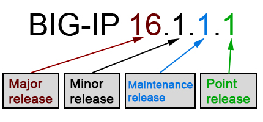

BIG-IP Upgrade
--------------

This solution
#############

This solution creates an environment for upgrading a traditional BIG-IP Active-Standby cluster. Consumers of the solution can upgrade with the in-place demo configuration or bring in a custom configuration.

BIG-IP environments are incredibly diverse. This solution aims to create a general environment where different upgrades and configurations can be emulated.

**This solution builds without using best practices.** BIG-IP in the public cloud should use secrets managers, ssh keys, availability zones, and **never** be accessible from the general internet. This was done intentionally to present the most commonly deployed BIG-IP environment where these tools are not used/available.

F5 provides a supported `AWS CloudFormation Template`_. This solution is loosely based on the CFT.

Example of solution:

|image21|

Reasons to keep your BIG-IP software up to date
###############################################

Traditional applications
************************

F5 research indicates that 97 percent of organizations rely on traditional applications that have monolithic, client-server, or three-tier architectures to enable most of their mission-critical processes. These applications have several problems:

- Developed using obsolete languages
- Use obsolete traffic patterns
- Have unaddressed security vulnerabilities

To address these problems, you must use a flexible wrapper or scaffolding with application security and delivery technology. An approach like this requires that you:

- Integrate application delivery with application security.
- Use programmability around application services to fill application gaps.
- Push the boundaries on automation.

To make all this work and provide a robust shield for these applications, it's essential that you use the latest software versions and capabilities.

Business considerations
***********************

When you keep your BIG-IP systems up to date and consistent across your estate, you can:

- Reduce your total cost of ownership (TCO).
- Mitigate business disruptions by ensuring you have the latest bug fixes, security updates, and performance enhancements.
- Drive automation and consolidate application delivery and application security to quickly adapt to change.

Operations considerations
*************************

Similarly, keeping your BIG-IP systems up to date enables you can achieve operational efficiencies by:

- Using a standard version across your BIG-IP installations and adopting consistent operational models.
- Using the latest programmatic interfaces, API enhancements, and management tool capabilities to drive automation and quickly respond to business.
- Deploying the latest security improvements, critical fixes, and vulnerability mitigations.
- Deploying the latest bug fixes, performance improvements, scale optimizations, and hardware support.
- Using new features across application delivery and application security to improve digital experiences.

Upgrade vs. update
******************

F5 has the following two kinds of upgrades.

**Upgrade**: A version that introduces new features, hardware support, and specific performance improvements.

**Update**: A version that introduces product defects and security fixes.

F5 makes this distinction because upgrades and updates require different considerations before you install.

You can discern upgrades from updates by examining your current and prospective BIG-IP version numbers. Increases in one or both of:

|image20|

The first two numbers of your software version is an upgrade.
The last two numbers of your software version is an update.

More information can be found in the official `BIG-IP update and upgrade guide`_

.. toctree::
   :maxdepth: 1
   :glob:

   labSetup*
   lab*

.. |image21| image:: images/image21.gif
  :width: 75%
  :align: middle

.. _`BIG-IP update and upgrade guide`: https://support.f5.com/csp/article/K84205182
.. _`AWS CloudFormation Template`: https://github.com/F5Networks/f5-aws-cloudformation/tree/main/supported/failover/same-net/via-api/3nic/existing-stack/payg
