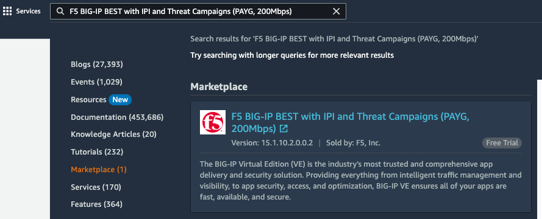

BIG-IP Upgrade | Environment
----------------------------

This solution uses AWS services to host the BIG-IPs. The solution can be deployed with F5 UDF or any AWS account with rights to the below resources.

- Terraform is used for infrastructure management
- Ansible is used for configuration management
- AWS is the platform

Prior knowledge of Terraform, Ansible, or AWS is not needed. The solution aims for a smaller learning curve on infrastructure/configuration management (with abstractions) in exchange for more time within BIG-IP.

Terraform_ is an open-source infrastructure code software tool that provides a consistent CLI workflow to manage hundreds of cloud services. Terraform codifies cloud APIs into declarative configuration files.

Ansible_ is an open-source software provisioning, configuration management, and application-deployment tool enabling infrastructure as code.

`Visual Studio Code`_ is a streamlined code editor supporting development operations like debugging, task running, and version control.

This solution leverages Terraform to create and manage the following products and services. Ansible is used for BIG-IP configuration management after Terraform operations are complete.

- Amazon Elastic Compute Cloud (EC2)
- Amazon Identity and Access Management (IAM)
- Amazon Simple Storage Service (S3)
- Terraform
- Ansible
- VSCode
- BIG-IP Build Resources
   * Cloud-init (userdata)

Solution Setup
##############

For access to a UDF, environment see `F5 UDF Environment Access`_.

.. warning:: The random BIG-IP password and AWS tokens are stored in cloud-init and the Terraform state file. If this solution is running with any longevity, it is recommended to change the password and tokens.
.. warning:: Skipping Steps 1-3 will result in a Terraform failure

#. Accessing AWS

   UDF ephemeral accounts have access to subscribe to AWS marketplace images. Unfortunately, there is no way to subscribe to an offering programmatically. Before running this solution, you will need to log in to the aws console and subscribe.

   From the UDF environment, locate your Console URL and generated password. Click the URL to log in to the AWS console.

   Example:

   |image01|
   |image02|

#. BIG-IP Marketplace

   BIG-IP offerings are licensed by the modules and throughput. For this solution, we will license a **BEST PAYG 200mbps** on version **12.1.6**. This will allow for all BIG-IP modules and 200mbps of tested traffic with an older version to upgrade.

   From the top search bar, search for ``big-ip 200mbps`` and click

   Example:

   |image03|

#. Subscribe to the BIG-IP 200mbps image and accept the terms

   .. note:: You can choose different offerings by changing the default Terraform variable to a different BIG-IP amazon machine image (AMI) search, default is ``F5 Networks Licensed Hourly BIGIP-12.1.6*Best*200MBPS*``

   Example:

   |image04|
   |image05|
   |image06|

   .. note:: Once the subscription is processing you can move on to the next step

#. Create a working environment

   VSCode is our preferred IDE. This allows an editor and terminal within a single pane, open VSCode, and create a new Terminal. In the UDF environment, you can access VSCode through the **coder** access method on the **ubuntuHost** resource.

   For access to coder in a UDF (course or blueprint) environment, see `F5 UDF Environment Access`_.

   Example:

   |image07|

#. Set or verify environment AWS credentials

   .. note:: AWS Access and Secret keys for the UDF environment are located in the Blueprint or Course Documentation, under section **cloud accounts**

   .. warning:: The default region in Terraform is ``us-west-2``, if you choose a different credential region, make sure to update Terraform

   In the terminal window, copy the below text and paste+enter:

   .. code-block::

      aws configure

   Variables Table for awscli to UDF Cloud Accounts:

   ===================== ===========================================================
   Variable Name         Cloud Account Variable Value
   ===================== ===========================================================
   AWS Access Key ID     API Key
   AWS Secret Access Key API Secret
   Default region name   us-west-2
   Default output format json
   ===================== ===========================================================

   Example:

   |image09|

#. Clone the public repository of solutions

   .. note:: Examples are shown pulling the repositories down to the **Desktop** folder. If you choose to change the clone location, be aware of the path changes

   In the terminal window, copy the below text and paste+enter:

   .. code-block::

      git clone -b 'main' --single-branch https://github.com/f5devcentral/f5-digital-customer-engagement-center

   Example:

   |image08|

#. Change directory to the F5 Digital Customer Engagement Center repository

   In the terminal window, copy the below text and paste+enter:

   .. code-block::

      cd /home/ubuntu/Desktop/f5-digital-customer-engagement-center/solutions/delivery/application_delivery_controller/big-ip/upgrade/aws

   Example:

   |image10|

#. Run the setup script **This will create AWS resource objects**

   In the terminal window, copy the below text and paste+enter:

   .. code-block::

      bash setup.sh

   Example:

   |image11|

#. Continue with Terraform when ready

   Press ``enter`` when requested

   Example:

   |image13|

#. Enter the AWS api credentials for Terraform

   The BIG-IP uses the AWS credentials to perform an ``API`` failover, moving the secondary IP addresses from one Elastic Network Interface to another. This is used to replicate the failover on-premises from an active BIG-IP to a standby.

   |image12|

#. Terraform and Ansible Completed

   .. warning:: Terraform is building several services, then Ansible will run. This can take 10-15 minutes to complete

   .. note:: If you need to see the outputs again later and have not saved them, utilize the ``terraform output`` command

   The outputs from our Terraform run are in green. We will need this information to access our BIG-IPs and testing the virtual service.

   Example:

   |image14|

#. The BIG-IP resources

   Terraform created two BIG-IPs. Ansible created the virtual services and the BIG-IP Cluster. Within Terrafroms outputs are the public ip addresses for the management interfaces for both BIG-IPs. Log in to a BIG-IP to see the cluster settings and version of BIG-IP deployed

   The Terraform outputs have the management public IP address of our BIG-IPs called **f5vm01_mgmt_public_pip** and **f5vm02_mgmt_public_pip**. Since this address is public, it is accessible from anywhere on the internet. Open a browser and browse to the page

   .. note:: The BIG-IP management interfaces use a self-signed certificate. Accept the invalid certificate. If you are using Chrome on the page, you can type ``thisisunsafe`` all one word

   .. code-block::

      https://(f5vm01_mgmt_public_pip) or https://(f5vm02_mgmt_public_pip)

   Example:

   |image15|

#. Log in to the BIG-IP

   Log in with user ``awsuser``, and the Terraform generated password found in the outputs **generated_password**

   Example:

   |image17|

#. Validate the BIG-IP setup

   A cluster was created, and the TMOS version of the BIG-IP was created with 12.1.6

   Example:

   |image19|

   |image18|

#. Verify that the test service is available

   The test service was created with Ansible, a basic virtual server and an irule for 80 to 443 redirect, and another virtual server with FQDN pool members and an irule that gives back client information in the form of an HTML page.

   The Terraform outputs have the public IP address of our testing virtual service called **public_vip_pip**. Since this address is public, it is accessible from anywhere on the internet. Open a browser and browse to the page

   .. note:: The BIG-IP is performing TLS offload. The certificate is self-signed. Accept the invalid certificate. If you use Chrome, on the page, you can type ``thisisunsafe`` all one word

   .. code-block::

      https://(public_vip_pip)

   Example:

   |image15|

#. The virtual service should be up and available

   .. note:: If the test virtual is not available, failover the BIG-IP cluster

   The irule on the virtual server will present some client information to validate that the service is ready

   Example:

   |image16|

#. The environment has been created, and all access has been set

   At this point, we can utilize our BIG-IPs and test service for upgrades.

   Proceed to `BIG-IP Upgrade | Deployments`_

#. Destroy the AWS environment and all resources **This will destroy AWS resource objects**

   .. note:: Destruction of the AWS environment does not need the API token/key these can be blank

   In the terminal window, copy the below text and paste+enter:

   .. code-block::

      bash cleanup.sh

   Example:

   |image22|

.. |image01| image:: images/image01.png
  :width: 75%
  :align: middle
.. |image02| image:: images/image02.png
  :width: 25%
  :align: middle

.. |image05| image:: images/image05.png
  :width: 50%
  :align: middle
.. |image06| image:: images/image06.png
  :width: 75%
  :align: middle
.. |image07| image:: images/image07.png
  :width: 25%
  :align: middle
.. |image08| image:: images/image08.png
  :width: 75%
  :align: middle
.. |image09| image:: images/image09.png
  :width: 50%
  :align: middle
.. |image10| image:: images/image10.png
  :width: 75%
  :align: middle
.. |image11| image:: images/image11.png
  :width: 100%
  :align: middle
.. |image12| image:: images/image12.png
  :width: 50%
  :align: middle
.. |image13| image:: images/image13.png
  :width: 50%
  :align: middle
.. |image14| image:: images/image14.png
  :width: 50%
  :align: middle
.. |image15| image:: images/image15.png
  :width: 50%
  :align: middle
.. |image16| image:: images/image16.png
  :width: 35%
  :align: middle
.. |image17| image:: images/image17.png
  :width: 50%
  :align: middle
.. |image18| image:: images/image18.png
  :width: 75%
  :align: middle
.. |image19| image:: images/image19.png
  :width: 75%
  :align: middle
.. |image22| image:: images/image22.png
  :width: 100%
  :align: middle

.. _Terraform: https://www.terraform.io/
.. _Ansible: https://www.ansible.com/
.. _`Visual Studio Code`: https://code.visualstudio.com/
.. _`F5 UDF Environment Access`: ../../../../../../usage/getting_started.html
.. _`BIG-IP Upgrade | Deployments`: lab01.html
