NGINX Kubernetes Ingress Controller | Deployment
------------------------------------------------

|image00|

With the infrastructure in place to support the solution, the NGINX Kubernetes Ingress Controller deployment can begin.

What is NGINX Kubernetes Ingress Controller?

NGINX Ingress Controller provides a robust feature set to secure, strengthen, and scale containerized apps, including:

- Advanced app centric configuration - Use role-based access control (RBAC) and self service to set up security guardrails (not gates), so teams can manage their apps securely and with agility. Enable multi tenancy, reusability, simpler configs, and more.
- Visibility and performance monitoring - Pinpoint undesirable behaviors and performance bottlenecks to simplify troubleshooting and make fixes faster.

1. Change the directory into the NGINX Ingress cloned repository.

   In the terminal window, copy the below text and paste+enter:

   .. code-block::

      cd ~/Desktop/kubernetes-ingress/

   Example:

   |image16|

2. Copy NGINX repository Certificate and Key

   NGNIX Ingress Controller has two offerings, an open-source edition and a purchased supported solution. Both solutions come from NGINX; however, there are features and performance differences between the two offerings. Below are popular features and use cases.

   |image49|

   This solution uses the purchased NGINX Ingress Controller. Through an account team, workshop registration, or an instructor, you should have received an NGINX certificate and key to access the NGINX registry. Access to the registry allows for building current NGINX products.

   VSCode Coder will allow you to drag files into the interface. Drag the cert and key files to the **root** of the `Kubernetes-ingress` folder.

   Example:

   |image17|

   Verify contents of the certificate and key

   In the terminal window, copy the below text and paste+enter:

   .. code-block::

      cat nginx-repo.*

3. Verify that you have a certificate and key

   In the terminal window, copy the below text and paste+enter:

   .. code-block::

      ls nginx-repo.*

   Example:

   |image18|

4. Create the NGINX Ingress Controller Docker image

   .. warning:: NGINX Ingress Controller should NEVER be uploaded into a public registry, this would allow for stealing intellectual property, breaking country software agreements, etc. The license owner would be responsible.

   .. note:: Building the image will take a few minutes (3-5)

   .. note:: Terraform command ``terraform output`` displays environment outputs

   Within the Kubernetes-ingress Registry are all the needed files to create our NGINX Ingress Controller Docker image. With the certificate and key in place, we can **make** our image. After the image is created, our local installation of docker will push our image to the Registry we created with Terraform. When Terraform applied our Registry object, it output the name of our registry. Its output was a prefix and looked like a URL.

   Example of Terraform outputs:

   |image12|

   Step 1. In the terminal window, **replace** ``RegistryURL`` with the output value and copy the below text and paste+enter:

   .. code-block::

      make DOCKERFILE=DockerfileForPlus PREFIX=RegistryURL

   Example:

   |image19|

   After the image is built, docker will publish the image into Registry.

   Example:

   |image20|

5. Verify that the docker image was created

   In the terminal window, copy the below text and paste+enter:

   .. code-block::

      docker images

   Example:

   |image21|

6. Modify the NGINX Kubernetes Ingress Controller manifest

   .. warning:: Failure to update the manifest with a valid image:tag location will result in a failed deployment. Change Line ``1791``

   Kubernetes deployments are typically maintained through manifest files. The deployment of the NGINX Ingress Controller will be created through manifests. Multiple Kubernetes resources can be made through a single file. This environments to-be-created resources are declared in the ``nginx-ingress-install.yml`` file.

   When executed, Kubernetes will build all the resources. For resources it doesnt know about (the newly created NGINX Ingress Controller container), it will reach out to the created registry and pull down the image we created. If you ever need to update the container, push a new one to the registry, change the tag and rerun the deployment. Declarative nature systems will replace with what has been defined.

   Kubernetes resources types created:

    - Kubernetes namespace
    - Kubernetes service account
    - Kubernetes cluster role
    - Kubernetes clusterrolebinding
    - Kubernetes secret
    - Kubernetes configmap
    - Kubernetes ingressclass
    - Kubernetes customresourcedefinitions
    - NGINX Ingress Controller deployment
    - NGINX Ingress Controller service

   Step 1. Modify the manifests file on line ``1791`` for the ``image:tag`` value

   .. note:: Docker images and tags can be found by running the docker command ``docker images``

   The NGINX Ingress Controller resource is in the environment-specific registry. However, the manifest does not know what that resource location is. Update the manifest by replacing the default value with the registryURL and image:tag location of the environment.

   For modifying the file, either **vi** or opening the file in VSCode will produce the same result.

   The vi method:

   In the terminal window, copy the below text and paste+enter:

   .. code-block::

      sudo vi /home/ubuntu/Desktop/f5-digital-customer-engagement-center/solutions/delivery/application_delivery_controller/nginx/kic/templates/nginx-ingress-install.yml

   modify the image:tag

   save and exit file with ``:wq``

   To modify with VSCode, navigate to f5-digital-customer-engagement-center > solutions > delivery > application_delivery_controller > nginx > kic > templates > nginx-ingress-install.yml, alter and save

   Example:

   |image23|

7. Deploy the NGINX Kubernetes Ingress Controller

   .. note:: If the NGINX Ingress Controller Pod is not in a **running** state, verify the **image:tag** value is correct from deployment manifest

   In the terminal window copy the below text and paste+enter:

   .. code-block::

      kubectl apply -f /home/ubuntu/Desktop/f5-digital-customer-engagement-center/solutions/delivery/application_delivery_controller/nginx/kic/templates/nginx-ingress-install.yml

   Validate that the NGINX Ingress Controller is running:

   .. code-block::

      kubectl -n nginx-ingress get pods -o wide

   Example:

   |image24|

8. Expose the NGINX Ingress Controller Dashboard

   NGINX Ingress Controller (all purchased editions) have an internal dashboard that can be exposed. The Dashboard presents analytic stats of services deployed on NGINX. These same stats can also be exposed for collection systems like Prometheus.

   In the terminal window copy the below text and paste+enter:

   .. code-block::

      kubectl apply -f /home/ubuntu/Desktop/f5-digital-customer-engagement-center/solutions/delivery/application_delivery_controller/nginx/kic/templates/nginx-ingress-dashboard.yml

   Example:

   |image26|

9. See the NGINX Ingress Controller services

   .. warning:: The **EXTERNAL-IP** values will be used during several parts of the lab, in AWS this is an FQDN. It is recommended to copy these to an easily referenceable location like a clipboard/digital notepad

   The deployment of NGINX Controller Ingress contains two Kubernetes services: Ingress and the other for Dashboard.

   In the terminal window, copy the below text and paste+enter:

   .. code-block::

      kubectl get svc --namespace=nginx-ingress

   Example:

   |image27|

10. Export the NGINX Ingress Controller services

    Interacting with the NGINX Ingress Controller is more comfortable with exporting the service External IPs into system variables. This allows for templating to take place when we expose our applications.

    In the terminal window copy the below text and paste+enter:

    .. code-block::

       export dashboard_nginx_ingress=$(kubectl get svc dashboard-nginx-ingress --namespace=nginx-ingress | tr -s " " | cut -d' ' -f4 | grep -v "EXTERNAL-IP")

    .. code-block::

       export nginx_ingress=$(kubectl get svc nginx-ingress --namespace=nginx-ingress | tr -s " " | cut -d' ' -f4 | grep -v "EXTERNAL-IP")

11. Browse to the exposed NGINX Ingress Controller services

   .. note:: The Dashboard and the Ingress websites will take a few minutes to become available (1-3 Minutes)

   There is nothing yet deployed on NGINX Ingress Controller. However, the Dashboard and the Ingress are active. When the services were created in Kubernetes, Kubernetes created an AWS ELB. These ELBs allow for access to the services, and if the NGINX services ever scale, they will dynamically be added.

   NGINX Dashboard URL (replace with the dashboard-nginx-ingress EXTERNAL-IP): ``http://EXTERNAL-IP/dashboard.html``

   Example:

   |image28|

   NGINX Ingress Controller URL (replace with the nginx-ingress EXTERNAL-IP): ``http://EXTERNAL-IP/``

   Example:

   |image29|

12. The NGINX Ingress Controller services have been created and exposed

    At this point, we can deploy our applications, and provide access through NGINX!

    Proceed to `Arcadia Application | Deployment`_

.. |image00| image:: images/image00.png
  :width: 75%
  :align: middle
.. |image12| image:: images/image12.png
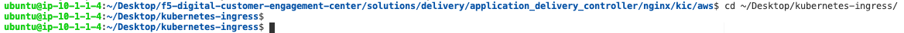
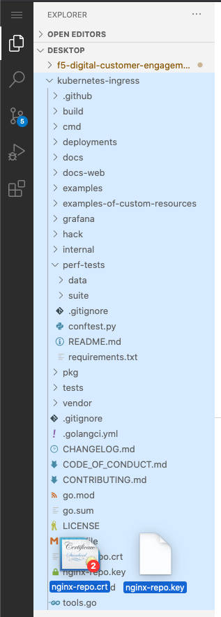
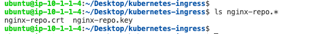
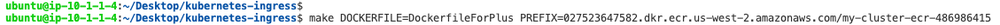
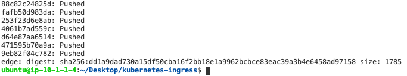
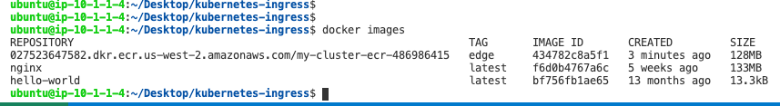
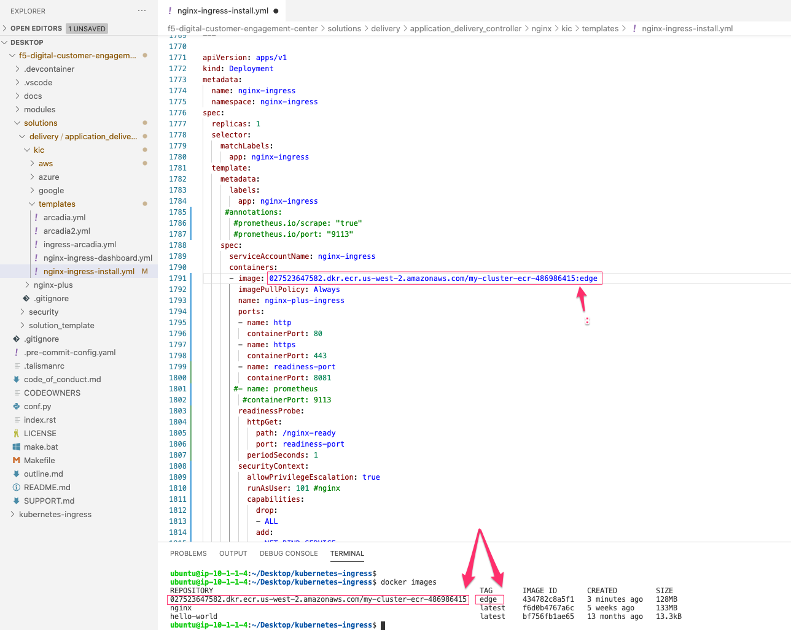
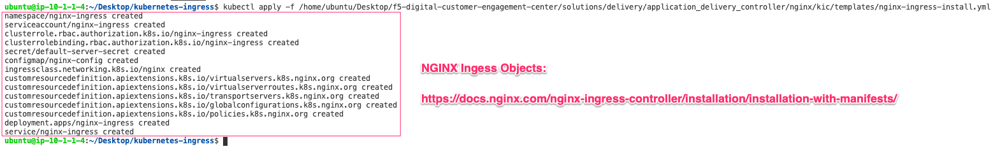
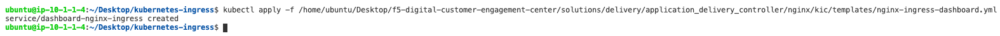
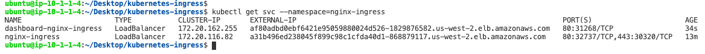
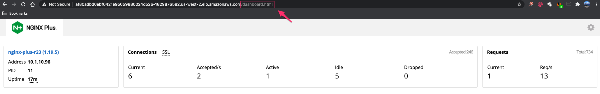
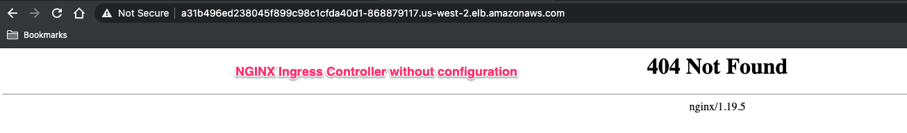
.. |image48| image:: images/image48.png
  :width: 75%
  :align: middle
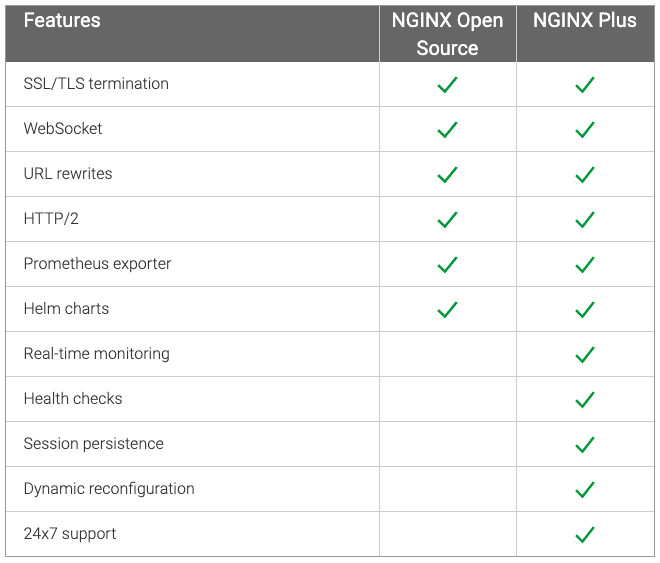

.. _`Arcadia Application | Deployment`: lab02.html
