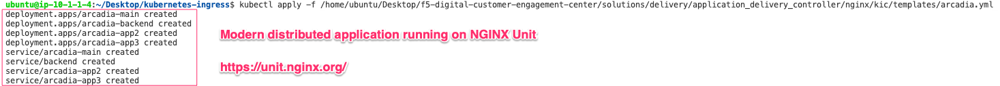
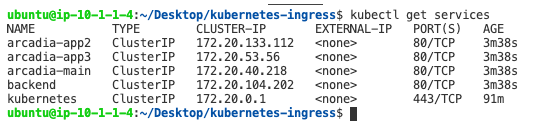

Arcadia Application | Deployment
--------------------------------

For this workshop, we are going to use the "Arcadia Financial" application.
The application is built with four different microservices that are deployed in the Kubernetes environment.

- **Main** - provides access to the web GUI of the application for use by browsers
- **Backend** - is a supporting microservice and provides support for the customer-facing services only
- **App2** - provides money transfer API based functionalities for both the Web app and third party consumer applications
- **App3** - provides referral API based functionalities for both the Web app and third party consumer applications

All of our pods are created based on the `NGINX Unit`_ application server.

NGINX Unit is a dynamic application server capable of running beside NGINX Plus and NGINX Open Source or standalone. NGINX Unit supports a RESTful JSON API, deploys configuration changes without service disruptions, and runs apps built with multiple languages and frameworks. Designed from scratch around your distributed applications' needs, it lays the foundation for your service mesh.

|image50|

1. Deploy the Arcadia Application into Kubernetes

   The Arcadia Application deployment is a single manifest file containing the resources need to build.

   - Kubernetes deployment for the four docker containers
   - Kubernetes services for the four docker containers

   In the terminal window, copy the below text and paste+enter:

   .. code-block::

      kubectl apply -f /home/ubuntu/Desktop/f5-digital-customer-engagement-center/solutions/delivery/application_delivery_controller/nginx/kic/templates/arcadia.yml

   Example:

   |image25|

2. Arcadia application Kubernetes objects

   In the terminal window, copy the below text and paste+enter:

   .. code-block::

      kubectl get services

   Example:

   |image30|

3. Arcadia application has been deployed and started

   Proceed to `NGINX Ingress Controller | Examples`_

.. |image50| image:: images/image50.png
  :width: 50%

.. _`NGINX Unit`: https://www.nginx.com/products/nginx-unit/
.. _`NGINX Ingress Controller | Examples`: lab03.html
