NGINX Ingress Controller | Examples
-----------------------------------

Included below are several examples of how NGINX Ingress Controller deployments. It is recommended that you progress through building on top of each other. Going this way highlights the lifecycle of container-based services that will evolve.

|image51|

The VirtualServer and VirtualServerRoute resources are new load-balancing configurations introduced in release 1.5 as an alternative to the Ingress resource. The resources enable use cases not supported with the Ingress resource, such as traffic splitting and advanced content-based routing. The resources are implemented as `Custom Resources`_.

A custom resource is an extension of the Kubernetes API that is not necessarily available in a default Kubernetes installation. It represents a customization of a particular Kubernetes installation. However, many core Kubernetes functions are now built using custom resources, making Kubernetes more modular.

Custom resources can appear and disappear in a running cluster through dynamic registration, and cluster admins can update custom resources independently of the cluster itself. Once a custom resource is installed, users can create and access its objects using kubectl, just as they do for built-in resources like Pods.

**NGINX Ingress Controller Examples**:

- Basic: This is a simple layer 7 routing ingress, taking our EXTERNAL-IP address and moving clients to Arcadia Application
- Https: Layer 7 routing ingress with TLS, TLS secret is stored in Kubernetes as a TLS secret
- Https with Active Monitors: Https + Active Health Monitors to Pods
- Https with Active Monitors, Cacheing: Https + Active Health Monitors + Cacheing for site content
- Https with Active Monitors, Cacheing, mTLS: Https + Active Health Monitors + Cacheing + mTLS for client ca challenge

1. Basic

   Create NGINX Ingress Controller with Basic HTTP:

   In the terminal window, copy the below text and paste+enter:

   .. literalinclude :: ../../../../../../solutions/delivery/application_delivery_controller/nginx/kic/templates/ingress-arcadia.yml
      :language: text

   Example:

   |image31|

   NGINX Dashboard should be updated reflecting the new services discovered

   NGINX Dashboard URL (replace with your dashboard-nginx-ingress EXTERNAL-IP): ``http://EXTERNAL-IP/Dashboard.html``

   Example:

   |image32|

   Arcadia application is now exposed through the NGINX Ingress Controller on HTTP!

   NGINX Ingress Controller URL (replace with your nginx-ingress EXTERNAL-IP): ``http://EXTERNAL-IP/``

   Example:

   |image33|

2. Https

   .. note:: There is no change to the Dashboard when using HTTPS. However, the Ingress will now listen on both port 80 and port 443

   TLS Secrets stored in Kubernetes can be referenced with NGINX Ingress Controller. First, we need to install them into Kubernetes.

   Step 1. Create Kubernetes TLS Secret

   In the terminal window, copy the below text and paste+enter:

   .. literalinclude :: ../../../../../../solutions/delivery/application_delivery_controller/nginx/kic/templates/arcadiaSecret.yml
      :language: text

   Step 2. Create NGINX Ingress Controller with HTTPS:

   In the terminal window, copy the below text and paste+enter:

   .. literalinclude :: ../../../../../../solutions/delivery/application_delivery_controller/nginx/kic/templates/ingress-arcadia-https.yml
      :language: text

   Arcadia application is now exposed through the NGINX Ingress Controller on HTTP!

   NGINX Ingress Controller URL (replace with your nginx-ingress EXTERNAL-IP): ``https://EXTERNAL-IP/`` or ``https://EXTERNAL-IP/``

3. HTTPS with Active Monitors

   NGINX Plus can periodically check the health of upstream servers by sending special health‑check requests to each server and verifying the correct response.

   Create NGINX Ingress Controller with Https with Active Monitors:

   In the terminal window, copy the below text and paste+enter:

   .. literalinclude :: ../../../../../../solutions/delivery/application_delivery_controller/nginx/kic/templates/ingress-arcadia-https.yml
      :language: text

   Example:

   |image35|

   NGINX Dashboard should be updated reflecting the active monitors

   NGINX Dashboard URL (replace with your dashboard-nginx-ingress EXTERNAL-IP): ``http://EXTERNAL-IP/Dashboard.html``

   Example:

   |image36|

   Arcadia application is now exposed through the NGINX Ingress Controller only on HTTP with monitors!

   NGINX Ingress Controller URL (replace with your nginx-ingress EXTERNAL-IP): ``https://EXTERNAL-IP/``

4. HTTPS with Active Monitors, Cacheing

   A content cache sits in between a client and an “origin server”, and saves copies of all the content it sees. If a client requests content that the cache has stored, it returns the content directly without contacting the origin server. This improves performance as the content cache is closer to the client and more efficiently uses the application servers because they don’t have to generate pages from scratch each time.

   Step 1. Create NGINX Ingress Controller Cacheing Path:

   In the terminal window, copy the below text and paste+enter:

   .. literalinclude :: ../../../../../../solutions/delivery/application_delivery_controller/nginx/kic/templates/nginx-config-cache.yml
      :language: text

   Example:

   |image37|

   Step 2.  NGINX Dashboard should be updated with the cache location

   Example:

   |image38|

   Step 3. Create NGINX Ingress Controller with Https with Active Monitors, Cacheing:

   In the terminal window, copy the below text and paste+enter:

   .. literalinclude :: ../../../../../../solutions/delivery/application_delivery_controller/nginx/kic/templates/ingress-arcadia-cache.yml
      :language: text

   Example:

   |image39|

   Arcadia application is now exposed through the NGINX Ingress Controller only on HTTP with monitors and caching!

   NGINX Ingress Controller URL (replace with your nginx-ingress EXTERNAL-IP): ``https://EXTERNAL-IP/``

4. Https with Active Monitors, Cacheing, mTLS

   NGINX Ingress Controller can participate in the mTLS cert exchange with services.

   By default, the TLS protocol only proves the identity of the server to the client using X.509 certificates, and the authentication of the client to the server is left to the application layer. TLS also offers client-to-server authentication using client-side X.509 authentication.[14] As it requires provisioning of the certificates to the clients and involves a less user-friendly experience, it's rarely used in end-user applications.

   Mutual TLS authentication ('''mTLS''') is much more widespread in business-to-business (B2B) applications, where a limited number of programmatic and homogeneous clients are connecting to specific web services, the operational burden is limited, and security requirements are usually much higher as compared to consumer environments.

   Step 1. Create the Arcadia mTLS secret in Kubernetes:

   In the terminal window, copy the below text and paste+enter:

   .. literalinclude :: ../../../../../../solutions/delivery/application_delivery_controller/nginx/kic/templates/arcadiaMTLSSecret.yml
      :language: text

   Step 2. Create the custom resource policy for mTLS

   In the terminal window, copy the below text and paste+enter:

   .. literalinclude :: ../../../../../../solutions/delivery/application_delivery_controller/nginx/kic/templates/arcadiaMTLSPolicy.yml
      :language: text

   Step 3. Create NGINX Ingress Controller with Https with Active Monitors, Cacheing:

   In the terminal window, copy the below text and paste+enter:

   .. literalinclude :: ../../../../../../solutions/delivery/application_delivery_controller/nginx/kic/templates/ingress-arcadia-mtls.yml
      :language: text

   Example:

   |image42|

   Arcadia application is now exposed through the NGINX Ingress Controller with mTLS!

   NGINX Ingress Controller URL (replace with your nginx-ingress EXTERNAL-IP): ``https://EXTERNAL-IP/``

   |image43|

   Step 4. After mTLS is enabled, you will need to present a certificate that NGINX Ingress Controller can validate against its CA

   In the terminal window, copy the below text and paste+enter:

   .. code-block::

      curl --insecure https://$nginx_ingress/ --cert /home/ubuntu/Desktop/f5-digital-customer-engagement-center/solutions/delivery/application_delivery_controller/nginx/kic/templates/client-cert.pem --key /home/ubuntu/Desktop/f5-digital-customer-engagement-center/solutions/delivery/application_delivery_controller/nginx/kic/templates/client-key.pem

   Example:

   |image44|

5. The fun does not need to stop yet!

   The NGINX product team creates several examples of using NGINX VirtualServers, Ingress, and Configmaps, all of the examples in the `nginxinc GitHub repository`_ will also work in this environment.

6. NGINX Examples have all been completed

   At this point, as good stewards of automation, the next step is the destruction of the environment.

   Proceed to `NGINX Kubernetes Ingress Controller | Destruction`_

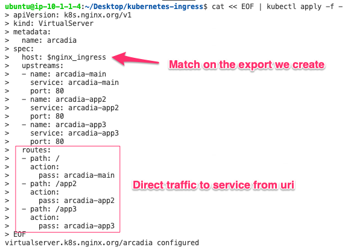
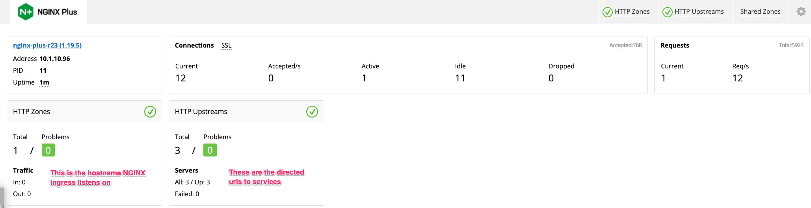
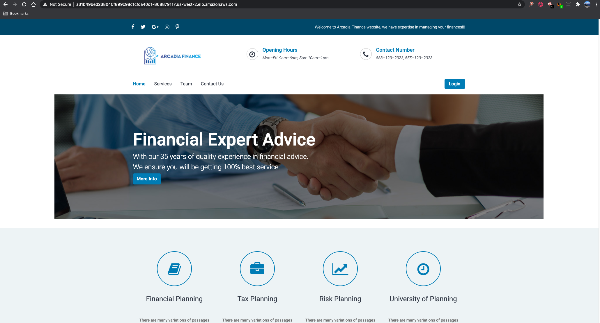
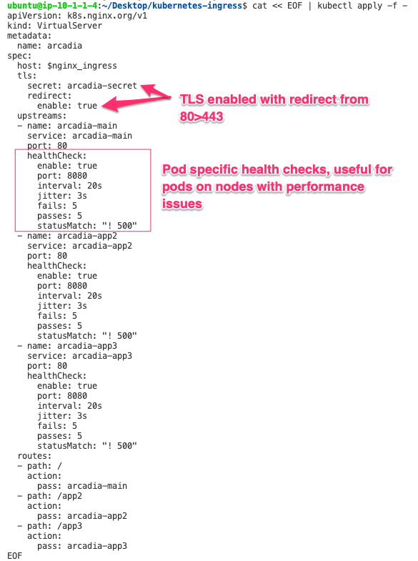
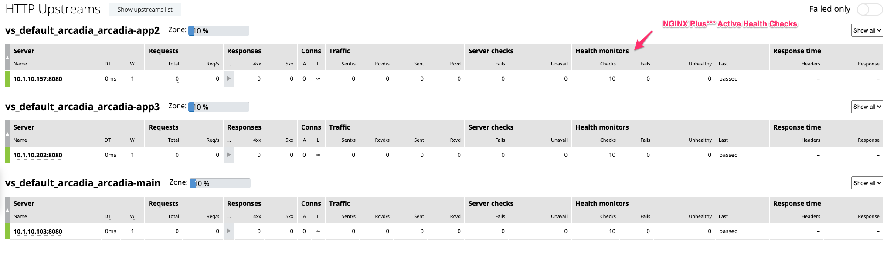
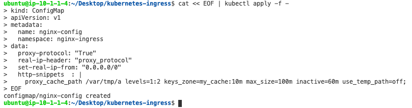
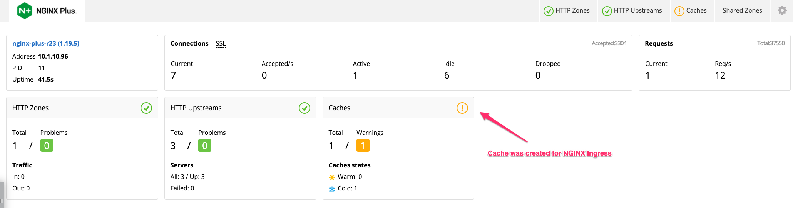
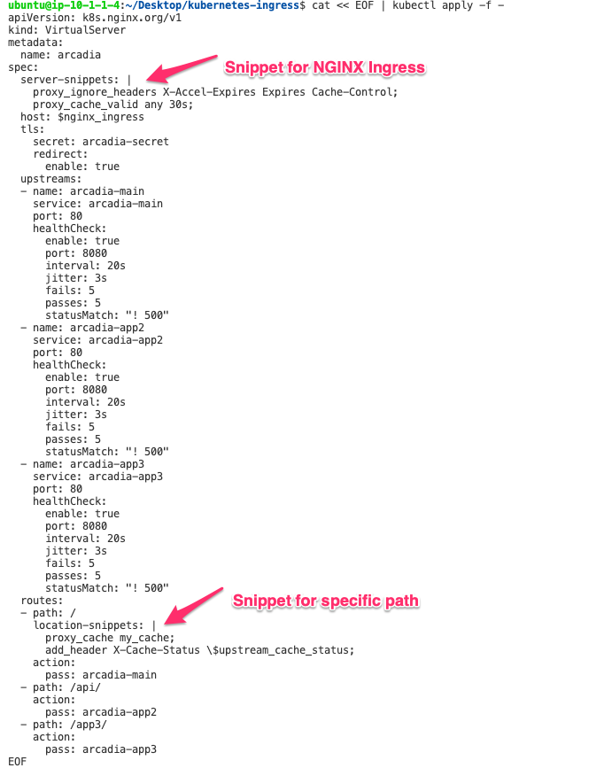
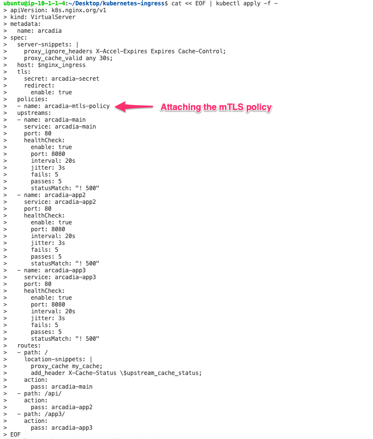
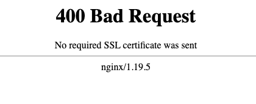

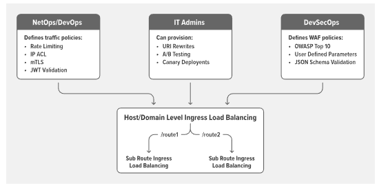

.. _`Custom Resources`: https://kubernetes.io/docs/concepts/extend-kubernetes/api-extension/custom-resources/
.. _`NGINX Kubernetes Ingress Controller | Destruction`: lab04.html
.. _`nginxinc GitHub repository`: https://github.com/nginxinc/kubernetes-ingress/tree/master/examples-of-custom-resources
