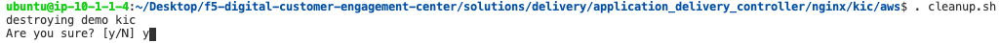

NGINX Kubernetes Ingress Controller | Destruction
-------------------------------------------------

.. warning:: The cleanup scripts will delete all Kubernetes services in the **default** and **nginx-ingress** namespaces

Thanks for playing in the F5 Digital Customer Engagement Center NGINX Ingress Controller Solution!

1. Cleaning up the environment will destroy all Kubernetes services and the environment.

   In the terminal window, copy the below text and paste+enter:

   .. code-block::

      cd /home/ubuntu/Desktop/f5-digital-customer-engagement-center/solutions/delivery/application_delivery_controller/nginx/kic/aws
      . cleanup.sh

   Example:

   |image45|

2. Accept the Destruction.

   |image46|

3. Let Terraform clean up its resources:

   |image47|

GO FIND `ANOTHER SOLUTION`_ TO LEARN!

.. _`ANOTHER SOLUTION`: ../../../../../../index.html
