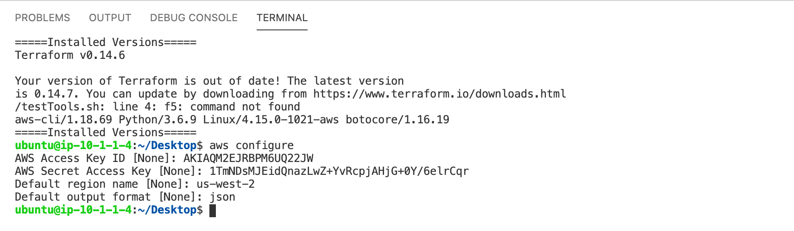
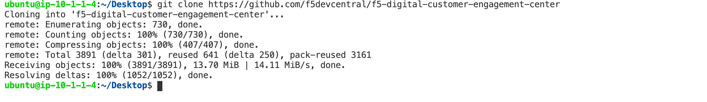
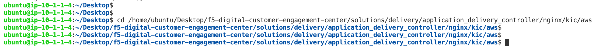
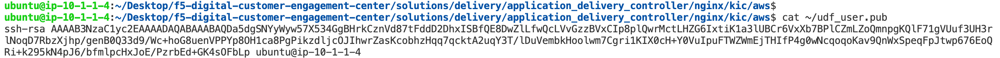
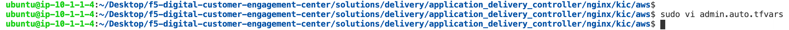
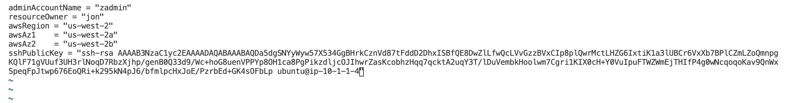
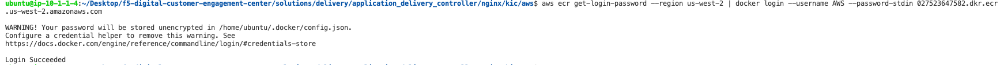

NGINX Kubernetes Ingress Controller | AWS Environment
-----------------------------------------------------

Terraform_ is an open-source infrastructure as code software tool that provides a consistent CLI workflow to manage hundreds of cloud services. Terraform codifies cloud APIs into declarative configuration files.

`Visual Studio Code`_ is a streamlined code editor with support for development operations like debugging, task running, and version control.

This solution requires the following products and services.

- Amazon Elastic Container Registry (ECR)
- Amazon Elastic Kubernetes Service (EKS)
- Amazon Elastic Compute Cloud (EC2)
- Amazon Elastic Load Balancing (ELB)
- Amazon Auto Scaling
- Amazon Identity and Access Management (IAM)
- Amazon Simple Storage Service (S3)
- Terraform
- VSCode

- NGINX Ingress Build Resources
   * Docker v18.09+
   * GNU Make
   * git
   * OpenSSL, optionally, if you would like to generate a self-signed certificate and a key for the default server.
   * For NGINX Plus, you must have the NGINX Plus license - the certificate (nginx-repo.crt) and the key (nginx-repo.key).

.. note:: Double-clicking in the empty space of VSCode will create a new file that can be used as a digital notepad

1.  VSCode is our preferred IDE. This allows an editor and terminal within a single pane, open VSCode, and a new Terminal. If you are in the UDF environment, you can access VSCode through the **coder** access method on the **ubuntuHost** resource. Also, see `F5 UDF Environment Access`_.

   Example:

   |image01|

2.  Set or verify your AWS credentials

   .. note:: AWS Access and Secret keys for the UDF environment are located under **cloud accounts**
   .. warning:: For UDF users, the region must be ``us-west-2``

   In the terminal window, copy the below text and paste+enter:

   .. code-block::

      aws configure

   Example:

   |image02|

3.  git clone the public repositories containing all code.

   .. note:: Examples are shown pulling the repositories down to the **Desktop** folder. If you choose to change the clone location, be aware of the path

   In the terminal window, copy the below text and paste+enter:

   .. code-block::

      git clone https://github.com/f5devcentral/f5-digital-customer-engagement-center
      git clone https://github.com/nginxinc/kubernetes-ingress

   Example:

   |image03|
   |image04|

4. Change directory to the f5 digital customer engagement center repository

   In the terminal window copy the below text and paste+enter:

   .. code-block::

      cd /home/ubuntu/Desktop/f5-digital-customer-engagement-center/solutions/delivery/application_delivery_controller/nginx/kic/aws

   Example:

   |image05|

5. SSH key for created AWS Resources

   .. note:: For UDF run workshops, an SSH key has already been created for you

   Terraform will need an SSH key for creating resources. If you have one, you can provide it or create a new one.

   In the terminal window, copy the below text and paste+enter:

   .. code-block::

      cat ~/udf_user.pub

   Copy the output to be used in the next step, or provide your SSH key.

   Example:

   |image06|

6. Modify Terraform admin.auto.tfvars file for deployment.

   .. warning:: ``resourceOwner`` is arbitrary. For UDF users, awsRegion must be ``us-west-2``

   In the terminal window copy the below text and paste+enter:

   .. code-block::

      cp admin.auto.tfvars.example admin.auto.tfvars
      sudo vi admin.auto.tfvars

   ============== ===========================================================
   Variable Name   Variable Value
   ============== ===========================================================
   resourceOwner  Arbitrary (i.e. johnc)
   awsRegion      Leave us-west-2
   awsAz1         Leave us-west-2a
   awsAz2         Leave us-west-2b
   sshPublicKey   Copy pasted ssh key from previous step
   ============== ===========================================================

   save and exit file with ``:wq``

   Example:

   |image07|
   |image08|
   |image09|

7. Run the setup script - this will create objects in your AWS account.

   In the terminal window copy the below text and paste+enter:

   .. code-block::

      ./setup.sh

   Example:

   |image10|

8. Accept the Terraform deployment

   ``enter`` when needed

   Example:

   |image11|

9. Terraform Completed

   .. warning:: Terraform is building several services, this can take 10-15 minutes

   The outputs from our Terraform run are in Green. We will need this information to access our services and create/publish NGINX into the environment.

   Save the outputs for the next few steps.

   Example:

   |image12|

10. All of the Terraform-created objects are dynamic, so up until they didnt exist. Now that the resources are created, we need to apply access to those services.

   Step 1: Log in to ECR. Change the ``ecrRepositoryURL`` to the terraform output.

   In the terminal window copy the below text and paste+enter:

   .. code-block::

      aws ecr get-login-password --region us-west-2 | docker login --username AWS --password-stdin ecrRepositoryURL

   ECR is used as our registry for the Kubernetes environment. Registries are used to keep container images for lifecycle and deployments. NGINX Ingress Controller is a contain.

   Example:

   |image13|

   Step 2: Log in to EKS. Change the ``kubernetesClusterName`` to the terraform output.

   In the terminal window copy the below text and paste+enter:

   .. code-block::

      aws eks --region us-west-2 update-kubeconfig --name kubernetesClusterName

   Kubernetes in this environment will host our application, and we will be using NGINX Ingress Controller to expose that application.

   Example:

   |image14|

   Step 3: Update the Subnet Tags for the EKS cluster. Change the ``publicSubnetAZ1`` and ``publicSubnetAZ2`` to the terraform output.

   In the terminal window copy the below text and paste+enter:

   .. code-block::

      aws ec2 create-tags \
         --resources publicSubnetAZ1 publicSubnetAZ2 \
         --tags Key=kubernetes.io/cluster/my-cluster-3820603181,Value=shared   Key=kubernetes.io/role/elb,Value=1

   For EKS to create an Elastic Load Balancer for our Ingress solution, two tags need to be placed on the public subnets. Ideally, Terraform would add the tags. However, the EKS module from Terraform does not manipulate those. So, we are doing it manually. These issues can be tracked here.

   - issue01_
   - issue02_

   Example:

   |image15|

11. The environment has been created, all access has been set.

   At this point, we can deploy our services and provide access.

   Proceed to `NGINX Kubernetes Ingress Controller | Deployment`_

.. |image01| image:: images/image01.png
  :width: 50%
  :align: middle

.. |image04| image:: images/image04.png
  :width: 50%
  :align: middle

.. |image07| image:: images/image07.png
  :width: 75%
  :align: middle

.. |image10| image:: images/image10.png
  :width: 75%
  :align: middle
.. |image11| image:: images/image11.png
  :width: 40%
  :align: middle
.. |image12| image:: images/image12.png
  :width: 75%
  :align: middle

.. |image14| image:: images/image14.png
  :align: middle
.. |image15| image:: images/image15.png
  :align: middle

.. _issue01: https://github.com/terraform-aws-modules/terraform-aws-eks/issues/1005
.. _issue02: https://github.com/f5devcentral/f5-digital-customer-engagement-center/issues/51
.. _Terraform: https://www.terraform.io/
.. _`Visual Studio Code`: https://code.visualstudio.com/
.. _`NGINX Kubernetes Ingress Controller | Deployment`: lab01.html
.. _`F5 UDF Environment Access`: ../../../../../usage/f5_udf_getting_started.html
