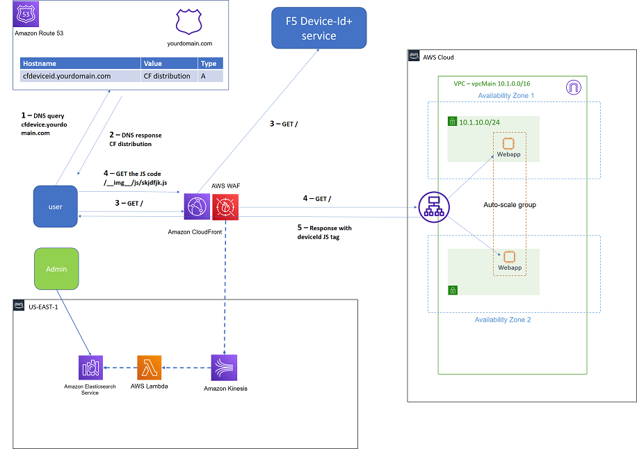
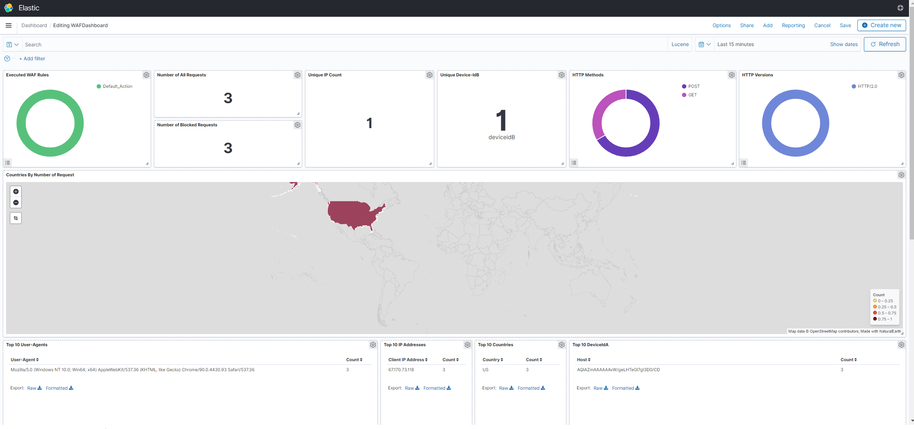

AWS Edge with F5 Device-Id
-----------------------------------

This solution is designed to quickly and easily demonstrate some of the benefits of using F5's Device-Id+ with AWS edge services.
F5 Device ID+ is a real-time, high-precision device identifier that utilizes advanced signal collection and proven machine learning algorithms to assign a unique identifier to each device visiting your site.

Deployment is simple, with immediate benefits for the security, networking, fraud, and digital teams.

|image00|

Example of the dashboard:

|image01|
Extra resources on components used in this lab:
1. F5 Device-Id overview - https://f5cloudservices.zendesk.com/hc/en-us/articles/360058428514-About-F5-Device-ID-
2. https://aws.amazon.com/cloudfront/
3. https://aws.amazon.com/elasticsearch-service/
4. https://aws.amazon.com/waf/

.. warning:: Choose the cloud provider environment listed below to start the solution. Example: **NGINX Kubernetes Ingress Controller | AWS Environment**

.. toctree::
   :maxdepth: 1
   :glob:

   labSetup*
   lab*
