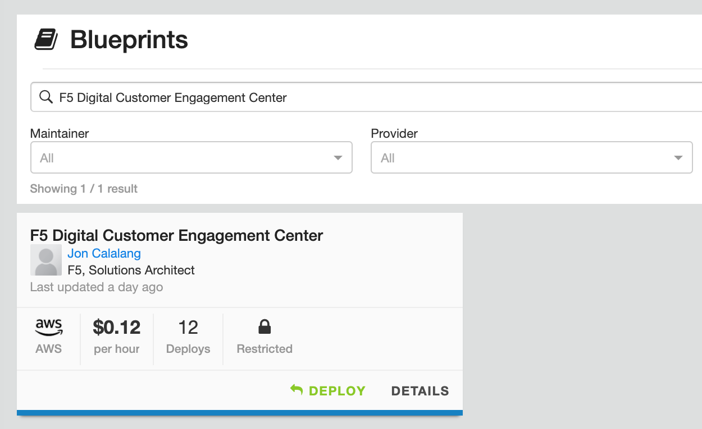
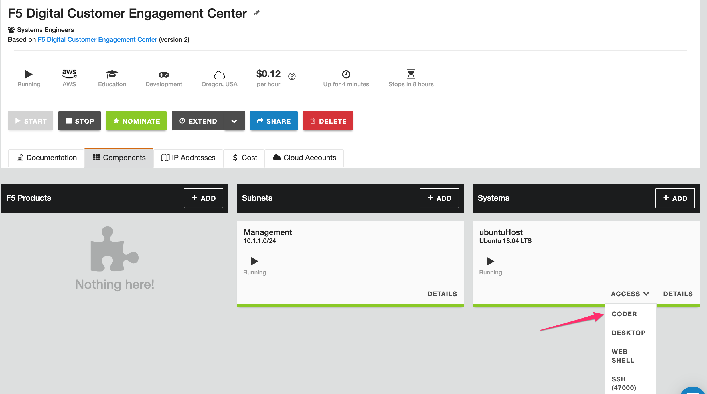

*************************************
F5 UDF Environment Access - Blueprint
*************************************

F5 has an internal lab environment that can be used to launch solutions from this project. The benefit of utilizing the UDF environment is access to cloud accounts (AWS), clean-up, and cost.

The jumphost comes pre-configured with packages and software to make running solutions easier. However, code in this project is designed to be run in any environment.

If you have been or have access to the UDF environment, the blueprint for this project is a called **F5 Digital Engagement Center**

The following steps will get your UDF jumphost configured.

1. Deploy the UDF Blueprint, Or if you are in a Lab class, your instructor will do this action for you.

   |image01|

   |image02|

2. Once the blueprint is deployed, you will need to start it. This action does not happen automatically.

   |image03|

3. Default run-time is 8 hours. Most solutions will be completed in far less; choose an appropriate time window.

   .. warning:: When a UDF blueprint is stopped, either by action or timer expiring, all cloud resources deployed will be removed.

   |image04|

4. Starting of the blueprint can take a few minutes. During this window, the ubuntuHost, VPC, and networking in AWS are all being created. Resources will turn green when available.

   |image05|

5. Every time a UDF blueprint is brought online with Cloud Accounts, and the ephemeral account is created. This account has access to resources highlighted either programmatically or through an AWS console. These resources are located on the **Cloud Accounts** tab.

   |image06|

6. With the resources available, we can log in to the ubuntuHost. There are a few access methods to the host. However, Coder has been installed and is the primary access method. Open the Coder Access Method

   .. note:: Coder in its most basic form is VSCode in a web browser. It has access to all VSCode extensions and tools.

   |image07|

7. When accessing Coder, a simple password has been created, ``password``.

   For users of VSCode, the screen should be very familiar. VSCode is an extendable IDE for users not aware, allowing you to craft and interact programmatically with systems.

   |image08|

.. |image02| image:: images/image02.png
  :width: 50%
.. |image03| image:: images/image03.png
.. |image04| image:: images/image04.png
  :width: 50%
.. |image05| image:: images/image05.png
.. |image06| image:: images/image06.png

.. |image08| image:: images/image08.png
  :width: 50%
