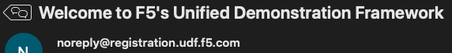
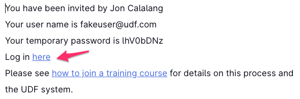
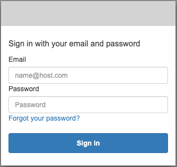
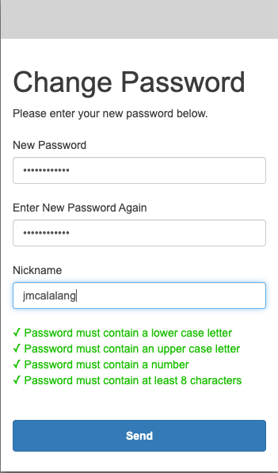
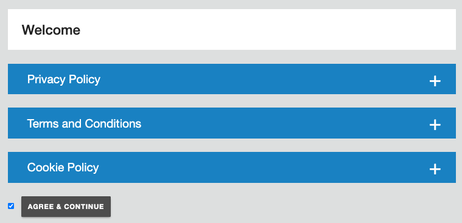
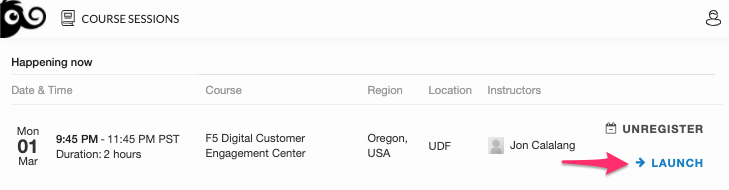
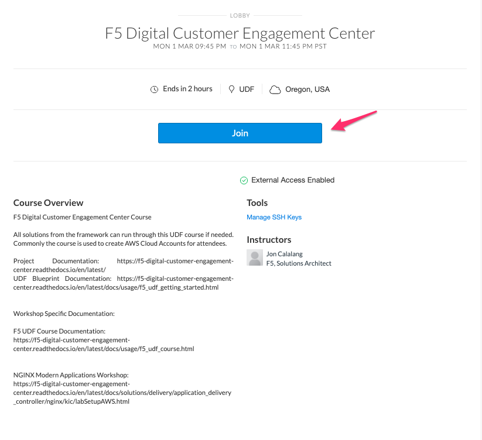
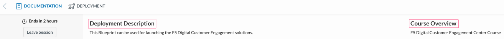
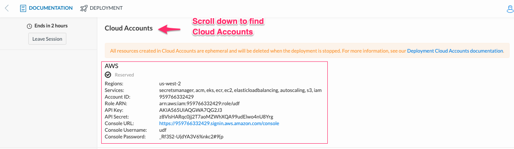
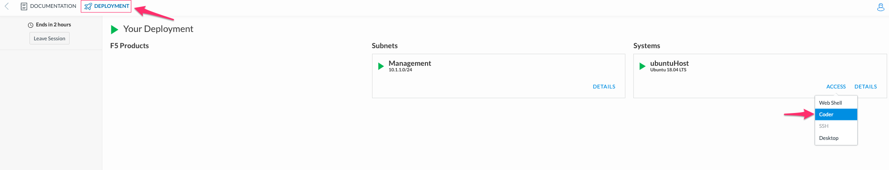

Getting started - F5 UDF Environment Access - Course
----------------------------------------------------

F5 has an internal Universal Development Framework (UDF_) with courses containing solutions. The benefit of utilizing UDF courses with blueprints is access to cloud accounts (AWS), clean-up, and cost. It also provides a consistent experience for attendees, with no dependencies installed on a client computer.

A jumphost comes configured with instances, packages, and software within this course, making solutions run easier.

The course for this project is called **F5 Digital Engagement Center**

.. note:: These steps are from the initial UDF registration email. If you have already logged into UDF, you can skip to Step 6

The following steps will log you into the course:

1. An email should have arrived from **noreply@registration.udf.f5.com** at your registration email

   |image09|

2. Within the email will be a **Log in** link, the registration email, and a temporary password

   Log in to UDF with the Log in link

   |image10|

3. Log in with the registration email and temporary password

   |image11|

4. Create a new password and a Nickname for your user

   .. warning:: A nickname should never contain any personally identifiable information, like Credit Cards or SSNs

   |image12|

5. Accept the EULAs. Each can be read by expanding with the + sign

   |image13|

6. After logging into UDF, a presentation of courses available is presented. Locate the correct course and **LAUNCH**

   |image14|

7. Join the course

   |image15|

8. The Deployment Description and Course Overview contain relevant information to the workshop

   Deployment Description

     - Deployment Specific Documentation
     - Temp NGINX Certificate and Key

   Course Overview

     - Course Specific Documentation
     - Workshop Specific Documentation

   |image16|

9. At the bottom of the Documentation page are UDF Cloud Accounts. These accounts are created by creating the environment and deleted after the environment is stopped. They are ephemeral. This account information is used in different courses. Please make a note of the location. This ephemeral account has access to Services noted either programmatically or through an AWS console.

   |image17|

10. Navigate to the **DEPLOYMENT** tab and log in to the Coder application on ubuntuHost

   |image18|

11. When accessing Coder, a simple password has been created, ``password``

   .. note:: Coder in its most basic form is VSCode in a web browser. It has access to all VSCode extensions and tools.

   For users of VSCode, the screen should be very familiar. VSCode is an extendable IDE for users not aware, allowing you to craft and interact programmatically with systems.

   |image08|

12. Access into the UDF environment is complete. Please follow the workshop-specific documentation located on the Course Description.

.. |image08| image:: images/image08.png
  :width: 50%

.. _UDF: https://udf.f5.com
