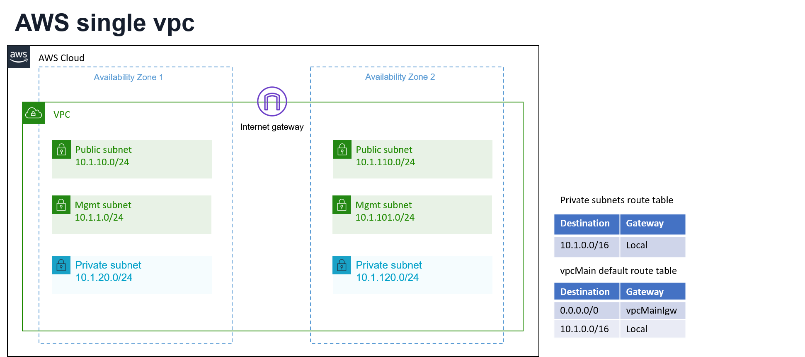

# Description
Single VPC network module with default ip address scheme

## Diagram


## Usage example

Here's the gist of using it directly from github.

```hcl
module "aws_network" {
  source       = "../../../../../../modules/aws/terraform/network/min"
  projectPrefix      = "single-vpc-example"
  resourceOwner       = var.resourceOwner
}
```

## Available features

vpc, subnets, routing tables, internet gateway
## Requirements

No requirements.

## Providers

| Name | Version |
|------|---------|
| aws | n/a |

## Inputs

| Name | Description | Type | Default | Required |
|------|-------------|------|---------|:--------:|
| projectPrefix | project name, will be used as prefix for resource names | `string` | f5-dcec | no |
| buildSuffix | random build suffix for tagging | `string` | YY | no |
| resourceOwner | owner of the deployment, for tagging purposes | `string` | f5-user | no |
| awsAz1 | availability zone 1 | `any` | `null` | no |
| awsAz2 | availability zone 2 | `any` | `null` | no |
| awsRegion | aws region | `string` | us-east-1 | no |
| map\_public\_ip\_on\_launch | assigns public ip's to instances in the public subnet by default | `bool` | `false` | no |
| vpcMainCidr | cidr for vpcMain | `string` | 10.1.0.0/16 | no |
| vpcMainSubPubACidr | cidr for vpc Main public subnet in Az1 | `string` | 10.1.10.0/24 | no |
| vpcMainSubPubBCidr | cidr for vpc Main public subnet in Az2 | `string` | 10.1.110.0/24 | no |
| vpcMainSubMgmtACidr | cidr for vpc Main mgmt subnet in Az1 | `string` | 10.1.1.0/24 | no |
| vpcMainSubMgmtBCidr | cidr for vpc Main mgmt subnet in Az2 | `string` | 10.1.101.0/24 | no |
| vpcMainSubPrivACidr | cidr for vpc Main private subnet in Az1 | `string` | 10.1.20.0/24 | no |
| vpcMainSubPrivBCidr | cidr for vpc Main private subnet in Az2 | `string` | 10.1.120.0/24 | no |

## Outputs

| Name | Description |
|------|-------------|
| subnetsAz1 | Dictionary of subnets in az1 { public , mgmt , private } |
| subnetsAz2 | Dictionary of subnets in az1 { public , mgmt , private } |
| vpcMainIgw | vpc Main's internet gateway |
| vpcMainRtb | vpc Main's route table |
| vpcs | Dictionary of vpc id's { main } |

<!-- END OF PRE-COMMIT-TERRAFORM DOCS HOOK -->


## How to Contribute

Submit a pull request

# Authors
Yossi rosenboim
