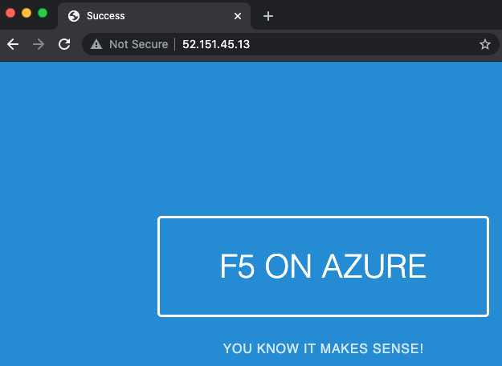
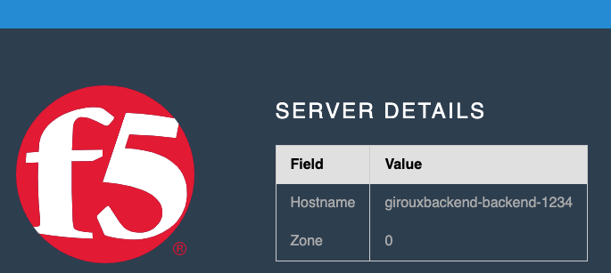

# Azure Backend

This module will create one Azure Virtual Machine (VM), install docker, and run a simple web web server listening on port 80.

To use this module within a solutions context:

```hcl
module "backend" {
    source              = "github.com/f5devcentral/f5-digital-customer-engagement-center//modules/azure/terraform/backend/"
    projectPrefix       = "somePrefix"
    buildSuffix         = "someSuffix"
    resourceOwner       = "someName"
    azureResourceGroup  = "someResourceGroup"
    azureLocation       = "westus2"
    ssh_key             = "ssh-rsa AAABC123....."
    subnet              = "someSubnet"
    securityGroup       = "someSecurityGroup"
    public_address      = false
}
```

The web browser will display a page consisting of the cloud name, server name, and zone. Here is an example:





<!-- markdownlint-disable no-inline-html -->
<!-- BEGINNING OF PRE-COMMIT-TERRAFORM DOCS HOOK -->
## Requirements

| Name | Version |
|------|---------|
| terraform | ~> 0.14 |
| azurerm | ~> 2 |

## Providers

| Name | Version |
|------|---------|
| azurerm | ~> 2 |
| random | n/a |

## Inputs

| Name | Description | Type | Default | Required |
|------|-------------|------|---------|:--------:|
| azureLocation | location where Azure resources are deployed (abbreviated Azure Region name) | `string` | n/a | yes |
| azureResourceGroup | resource group to create objects in | `string` | n/a | yes |
| buildSuffix | random build suffix for resources | `string` | n/a | yes |
| resourceOwner | name of the person or customer running the solution | `string` | n/a | yes |
| securityGroup | security group for virtual machine | `string` | n/a | yes |
| ssh\_key | public key used for authentication in ssh-rsa format | `string` | n/a | yes |
| subnet | subnet for virtual machine | `string` | n/a | yes |
| adminAccountName | admin account name used with instance | `string` | `"ubuntu"` | no |
| azureZones | The list of availability zones in a region | `list(any)` | <pre>[<br>  1,<br>  2,<br>  3<br>]</pre> | no |
| instanceType | instance type for virtual machine | `string` | `"Standard_B2ms"` | no |
| name | The name to assign to the server VM. If left empty(default), a name will be generated as '{projectPrefix}-backend-{buildSuffix}' where {projectPrefix} and {buildSuffix} will be the values of the respective variables. | `string` | `null` | no |
| projectPrefix | prefix for resources | `string` | `"demo"` | no |
| public\_address | If true, an ephemeral public IP address will be assigned to the webserver. Default value is 'false'. | `bool` | `false` | no |
| user\_data | An optional cloud-config definition to apply to the launched instances. If empty (default), a simple webserver will be launched that displays the hostname of the instance that serviced the request. | `string` | `null` | no |
| zone | The availability zone where the server will be deployed. If empty (default), instances will be randomly assigned from zones found in variable 'azureZones'. | `string` | `""` | no |

## Outputs

| Name | Description |
|------|-------------|
| backendInfo | VM instance output parameters as documented here: https://registry.terraform.io/providers/hashicorp/azurerm/latest/docs/resources/linux_virtual_machine |
| privateIp | private ip address of the instance |
| publicIp | public ip address of the instance |

<!-- END OF PRE-COMMIT-TERRAFORM DOCS HOOK -->
<!-- markdownlint-enable no-inline-html -->
