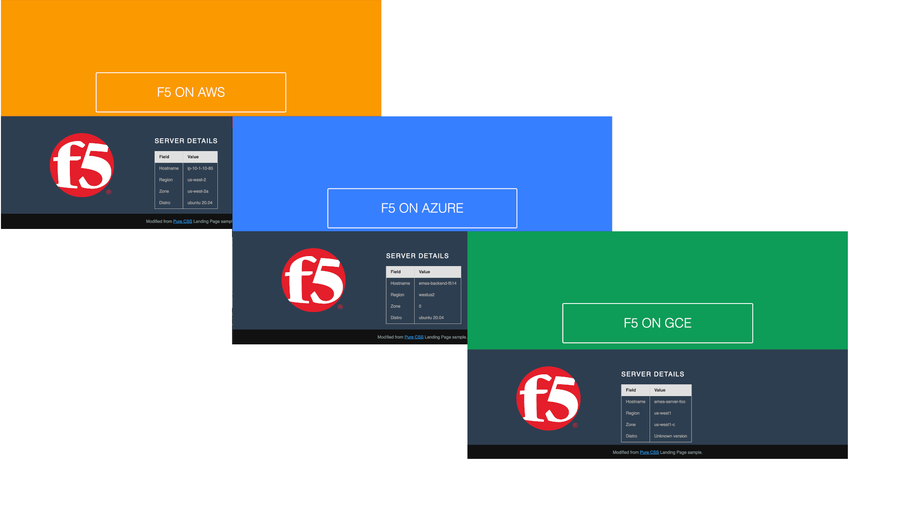

# Backend files

These files create a very simple website that shows some information about the
compute instance into which it has been deployed, with a different background
colour for each major cloud provider.




## Requirements

1. A target VM image with [cloud-init](https://cloudinit.readthedocs.io/en/latest/index.html) support.

2. Include the minified/compressed files in the VM onboarding `cloud-config` declaration.

   For example, if the VM will be configured to use the content of `/var/www/html`
   as the default website root, the files could be added to a Terraform scripted
   onboarding template like this:

   ```yaml
   ## template: jinja
   #cloud-config
   write_files:
     - path: /var/www/html/index.html
       permissions: '0644'
       owner: root
       content: |
         ${index_html}
     - path: /var/www/html/styles.css
       permissions: '0644'
       owner: root
       encoding: gz+b64
       content: |
         ${styles_css}
     - path: /var/www/html/f5-logo-rgb.svg
       permissions: '0644'
       owner: root
       encoding: gz+b64
       content: |
         ${f5_logo_rgb_svg}
   ```

   where `${index_html}` variable contains the [HTML file](index.html) - *stripped
   of carriage returns and newlines* - and `${styles_css}` and `S{f5_logo_rgb_svg}` contain the gzipped and base64 encoded contents of [styles.css](styles.css) and [f5_logo_rgb.svg](f5_logo_rgb.svg), respectively.

   See the sample implementation in GCP backend [main.tf](../../../google/terraform/backend/main.tf#L14-L16) and [cloud-config.yml](../../../google/terraform/backend/templates/cloud-config.yml#L41-L57).

## NOTES

* HTML needs to be added as one-single line/minified

  YAML is indentation sensitive, and if the HTML page is added as-is to the
  `cloud-config` then there will be errors during onboarding as parts of the HTML
  are interpreted as YAML, not HTML. To avoid this, and still keep it easy to edit
  the HTML, the AWS, Azure, and GCP implementations strip `\\n` and `\\r` characters
  before inserting into the YAML.

* Adding a new cloud colour

  Simply define a new CSS class named for the lower-cased value of `v1.cloud_name`
  in [styles.css](styles.css#L185). The background colour should be distinct from
  the existing clouds.
