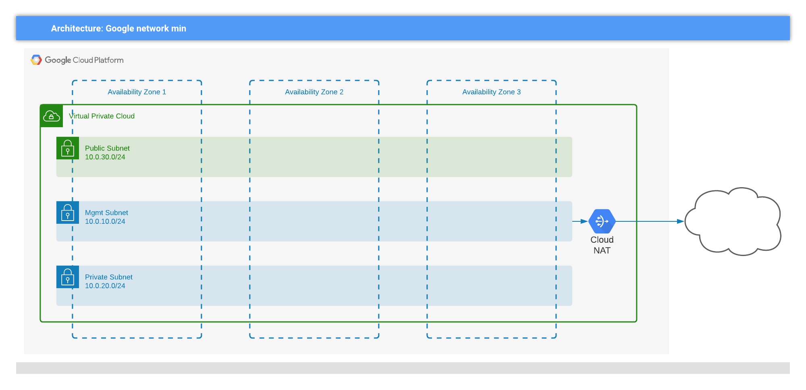

# GCP infra

This module will create three VPC networks in a single GCE [Region] that isolates
public facing, private internal/services, and management traffic for a three-leg
deployment.

A NAT is included on `mgmt` network to allow BIG-IP and other resources to access
internet.

## Default

To use this module within a solutions context:

```hcl
module "infra" {
    source        = "path/to/google/terraform/infra/"
    gcpProjectId  = var.gcpProjectId
    gcpRegion     = var.gcpRegion
    projectPrefix = var.projectPrefix
    buildSuffix   = var.buildSuffix
}
```

The result of invoking the module is the creation of a set of resources like this.



## All features - install a container registry and workstation, and isolate the VPC networks

> NOTE: this may not be a useful example - additional steps are required to move
> dependent software to a bucket, for example.

```hcl
module "lock_down" {
    source        = "path/to/google/terraform/infra/"
    gcpProjectId  = var.gcpProjectId
    gcpRegion     = var.gcpRegion
    projectPrefix = var.projectPrefix
    buildSuffix   = var.buildSuffix
    features      = {
        workstation = true
        isolated  = true
        registry = true
    }
}
```

## Overriding the VPC properties

Need private and public networks, with maximum supported MTU and a NAT gateway
on private?

```hcl
module "vpc_override" {
    source        = "path/to/google/terraform/infra/"
    gcpProjectId  = var.gcpProjectId
    gcpRegion     = var.gcpRegion
    projectPrefix = var.projectPrefix
    buildSuffix   = var.buildSuffix
    vpc_options   = {
        mgmt = null,
        private = {
            primary_cidr = "172.16.0.0/16"
            mtu          = 1500
            nat = true
        }
        public = {
            primary_cidr = "172.17.0.0/16"
            mtu          = 1500
            nat = false
        }
  }
}
```

<!-- markdownlint-disable no-inline-html -->
<!-- BEGINNING OF PRE-COMMIT-TERRAFORM DOCS HOOK -->
## Requirements

| Name | Version |
|------|---------|
| terraform | >= 0.14.5 |
| google | >= 3.54 |

## Providers

| Name | Version |
|------|---------|
| google | >= 3.54 |
| google-beta | n/a |

## Modules

| Name | Source | Version |
|------|--------|---------|
| artifacts | terraform-google-modules/cloud-dns/google | 3.1.0 |
| gcr | terraform-google-modules/cloud-dns/google | 3.1.0 |
| googleapis | terraform-google-modules/cloud-dns/google | 3.1.0 |
| nat | terraform-google-modules/cloud-router/google | 0.4.0 |
| vpc | terraform-google-modules/network/google | 3.0.1 |
| workstation | ../workstation/ |  |

## Resources

| Name |
|------|
| [google-beta_google_artifact_registry_repository](https://registry.terraform.io/providers/hashicorp/google-beta/latest/docs/resources/google_artifact_registry_repository) |
| [google_project_service](https://registry.terraform.io/providers/hashicorp/google/latest/docs/resources/project_service) |

## Inputs

| Name | Description | Type | Default | Required |
|------|-------------|------|---------|:--------:|
| buildSuffix | random build suffix for resources | `string` | n/a | yes |
| gcpProjectId | gcp project id | `string` | n/a | yes |
| gcpRegion | region where gke is deployed | `string` | n/a | yes |
| features | Allow module cconsumers to modify the default behaviour of infra module.<br>  workstation: boolean to toggle creation of a `workstation` VM that can be used<br>               for development, testing, and a proxy for BIG-IP, GKE, etc.<br>               Enabled by default.<br>  isolated:    boolean to toggle creation of an `isolated` set of VPCs and the<br>               required supporting infrastructure (private DNS). Disabled by default.<br>  registry:    boolean to toggle enablement of Google Artifact Registry for<br>               container storage and helm charts. Disabled by default. | <pre>object({<br>    workstation = bool<br>    isolated    = bool<br>    registry    = bool<br>  })</pre> | <pre>{<br>  "isolated": false,<br>  "registry": false,<br>  "workstation": true<br>}</pre> | no |
| labels | An optional map of key:value strings that will be applied to resources as labels,<br>where supported. | `map(string)` | `{}` | no |
| projectPrefix | prefix for resources | `string` | `"demo"` | no |
| resourceOwner | owner of the deployment, for tagging purposes | `string` | `"f5-dcec"` | no |
| vpc\_options | Allow module consumers to override the VPC features and addressing scheme used by<br>infra. The default values will generate a set of three management, public, and<br>private VPCs that use the same CIDR ranges and MTU as `network/min`. | <pre>object({<br>    mgmt = object({<br>      primary_cidr = string<br>      mtu          = number<br>      nat          = bool<br>    })<br>    private = object({<br>      primary_cidr = string<br>      mtu          = number<br>      nat          = bool<br>    })<br>    public = object({<br>      primary_cidr = string<br>      mtu          = number<br>      nat          = bool<br>    })<br>  })</pre> | <pre>{<br>  "mgmt": {<br>    "mtu": 1460,<br>    "nat": true,<br>    "primary_cidr": "10.0.10.0/24"<br>  },<br>  "private": {<br>    "mtu": 1460,<br>    "nat": false,<br>    "primary_cidr": "10.0.20.0/24"<br>  },<br>  "public": {<br>    "mtu": 1460,<br>    "nat": false,<br>    "primary_cidr": "10.0.30.0/24"<br>  }<br>}</pre> | no |
| workstation\_options | Allow module consumers to override the default workstation features | <pre>object({<br>    vpc = string<br>  })</pre> | <pre>{<br>  "vpc": "main"<br>}</pre> | no |

## Outputs

| Name | Description |
|------|-------------|
| registries | A JSON object containing registry attributes keyed by registry intent (e.g. container, npm, etc). |
| subnets | A map of subnetworks created by module, keyed by usage context. |
| vpcs | A map of VPC networks created by module, keyed by usage context. |
| workstation | A JSON object containing workstation attributes and connection helper commands from the embedded<br>workstation module. |
<!-- END OF PRE-COMMIT-TERRAFORM DOCS HOOK -->
<!-- markdownlint-enable no-inline-html -->
