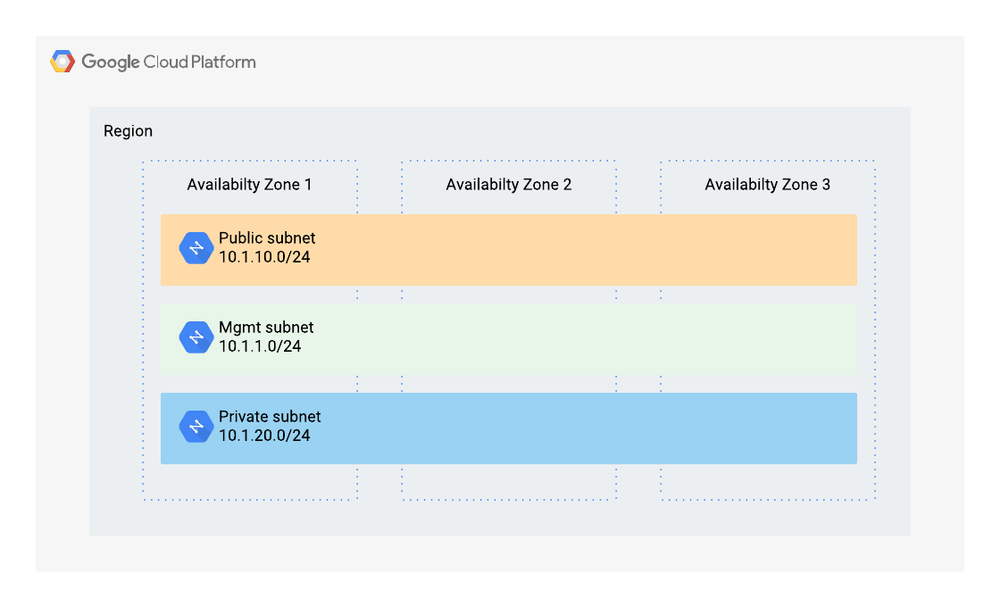

# GCP minimal network example
<!-- spell-checker: ignore markdownlint jumphost -->

This example will create a set of VPC networks using [network/min](../)
module. Three VPC networks will be created each with a single subnet in the
provided region:

* `mgmt` (a.k.a. `main`)
* `private`
* `public`



> Figure 1: High-level resources created by this example

## Running the example

1. Copy `terraform.tfvars.example` to `terraform.tfvars`; edit the values as needed

   ```hcl
   projectPrefix = "unique-prefix"
   buildSuffix = "unique-suffix"
   gcpRegion = "region"
   gcpProjectId = "my-gcp-projectid"
   resourceOwner = "my-name"
   ```

2. Initialise and apply Terraform

   ```shell
   terraform init
   terraform apply -auto-approve
   ```

3. Use the networks

4. Clean up the resources

   ```shell
   terraform destroy -auto-approve
   ```

<!-- markdownlint-disable MD033 MD034 -->
<!-- BEGINNING OF PRE-COMMIT-TERRAFORM DOCS HOOK -->
## Requirements

| Name | Version |
|------|---------|
| terraform | ~> 0.14.5 |
| google | >= 3.54 |

## Providers

No provider.

## Modules

| Name | Source | Version |
|------|--------|---------|
| network | ../ |  |

## Resources

No resources.

## Inputs

| Name | Description | Type | Default | Required |
|------|-------------|------|---------|:--------:|
| buildSuffix | random build suffix for resources | `string` | n/a | yes |
| gcpProjectId | gcp project id | `string` | n/a | yes |
| gcpRegion | region where gke is deployed | `string` | n/a | yes |
| projectPrefix | prefix for resources | `string` | n/a | yes |
| resourceOwner | owner of GCP resources | `string` | `"f5-dcec"` | no |

## Outputs

| Name | Description |
|------|-------------|
| subnets | A map of subnetworks created by module, keyed by usage context. |
| vpcs | A map of VPC networks created by module, keyed by usage context. |
<!-- END OF PRE-COMMIT-TERRAFORM DOCS HOOK -->
<!-- markdownlint-enable MD033 MD034 -->
