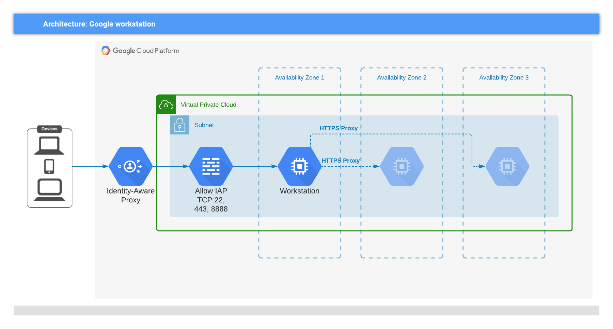
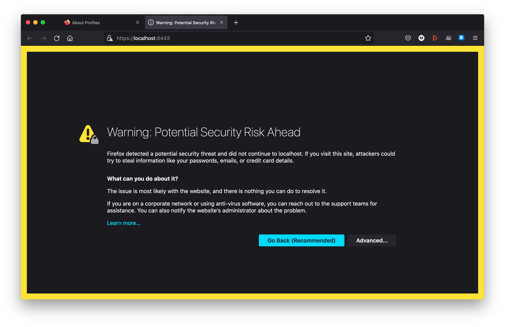
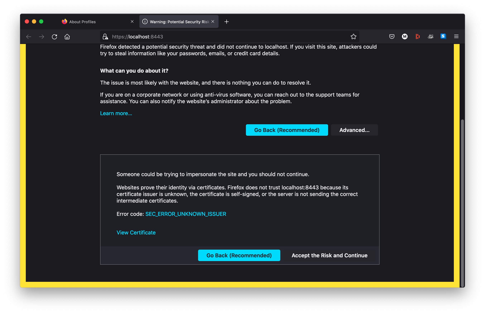
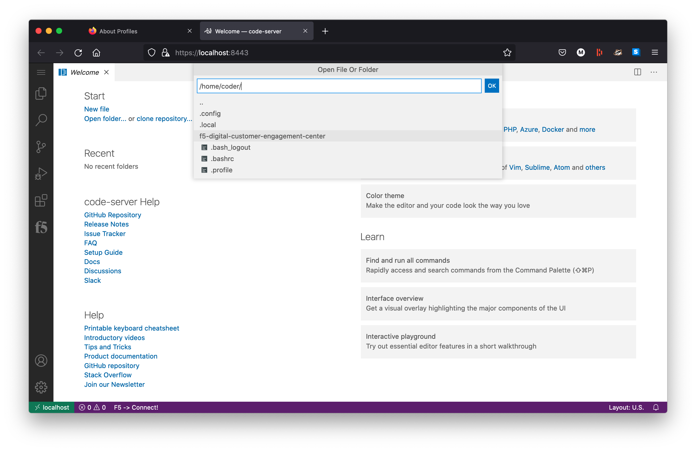
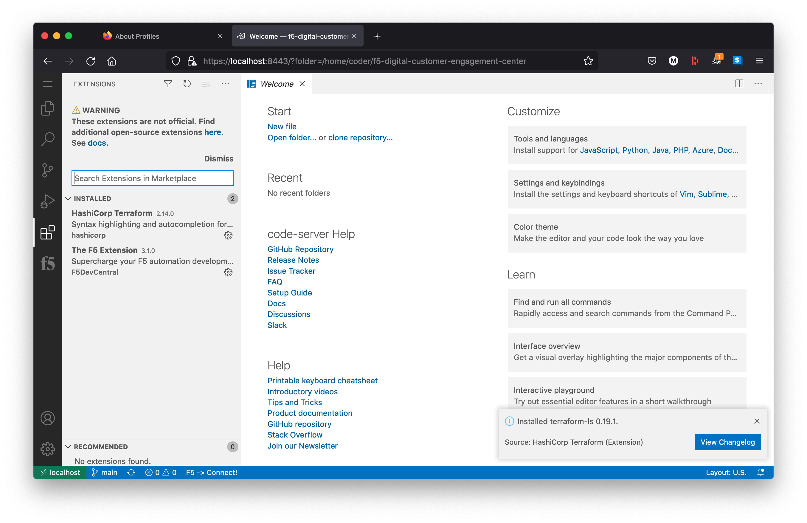
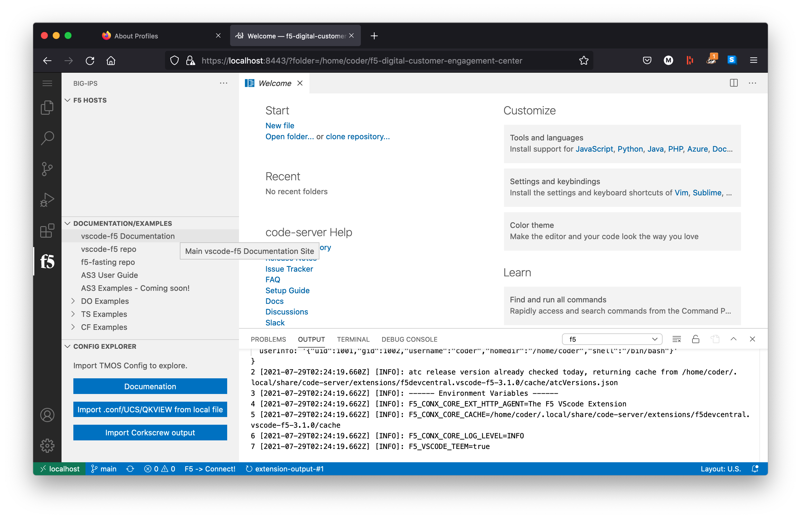

# Workstation

<!-- spell-checker: ignore jumphost markdownlint gcloud -->

This module will create an Ubuntu VM that can be used as a Code Server workstation
and jumphost. The workstation will use GCP identity-aware proxy and OS Login
capabilities to limit access to accounts with the correct permissions.


<!-- markdownlint-disable no-inline-html -->
<p align="center">Figure 1: Resources provisioned by workstation module</p>
<!-- markdownlint-enable no-inline-html -->

1. Enable Identity-Aware Proxy in the GCP project

2. Firewall rule to allow ingress TCP to ports 22, 443, and 8888 on `workstation` from IAP CIDR

3. Workstation VM (Ubuntu Focal LTS) deployed to one of the AZs in region
   * [Code Server](https://github.com/cdr/code-server) v3.11.0
      * Latest [F5 VS-Code](https://github.com/f5devcentral/vscode-f5) extension
      * [Terraform VS-Code](https://open-vsx.org/extension/hashicorp/terraform) 2.13.2 extension
   * [NGINX OSS](https://nginx.org/) as reverse-proxy for Code Server, and forward-proxy to other resources on network
   * [F5 CLI](https://clouddocs.f5.com/sdk/f5-cli/)
   * [Terraform](https://www.terraform.io/docs/index.html) v0.14.11
   * [Docker CE](https://docker.io)
   * [Containerd](https://containerd.io)


## Using workstation

Terraform can provide some starter `gcloud` commands to perform various tasks;
access these using the `terraform output` command.

<!-- spell-checker: disable -->
```shell
terraform output connection_helpers
```

```text
"{\"code_server_tunnel\":\"gcloud compute start-iap-tunnel emes-workstation-abcd 443 --local-host-port=localhost:8443 --project=my-google-project --zone=us-west1-b\",\"proxy_tunnel\":\"gcloud compute start-iap-tunnel emes-workstation-abcd 8888 --local-host-port=localhost:8888 --project=my-google-project --zone=us-west1-b\",\"ssh\":\"gcloud compute ssh emes-workstation-abcd --tunnel-through-iap --project=my-google-project --zone=us-west1-b\"}"
```

You can grab an individual connection command through copy and paste or with
[JQ](https://stedolan.github.io/jq/). The example commands below all use
[JQ](https://stedolan.github.io/jq/) to extract the relevant command.

### Code Server (browser-based VS Code) via IAP


1. Launch HTTP/HTTPS IAP tunnel via Workstation VM

   <!-- spell-checker: disable -->
   ```shell
   eval $(terraform output connection_helpers | jq -r 'fromjson | .code_server_tunnel')
   ```

   ```text
   Testing if tunnel connection works.
   Listening on port [8443].
   ```
   <!-- spell-checker: enable -->

2. Browse to https://localhost:8443 directly (no HTTPS proxy needed)

   > NOTE: be sure to disable HTTP and/or HTTPS proxy to access the Code Server session

   1. If using Workstation with a TLS certificate that was not provisioned by
      a trusted authority, click through warnings as needed.

      
      <!-- markdownlint-disable no-inline-html -->
      <p align="center">Figure 2: Self-signed TLS certificate warning</p>
      <!-- markdownlint-enable no-inline-html -->

      Click *Advanced*

      
      <!-- markdownlint-disable no-inline-html -->
      <p align="center">Figure 3: Self-signed TLS certificate warning</p>
      <!-- markdownlint-enable no-inline-html -->

      Click *Accept the Risk and Continue*

   2. Code Server will be displayed in browser

      
      <!-- markdownlint-disable no-inline-html -->
      <p align="center">Figure 4: Code Server Welcome Page</p>
      <!-- markdownlint-enable no-inline-html -->

      
      <!-- markdownlint-disable no-inline-html -->
      <p align="center">Figure 5: Some cloned git repos will be present</p>
      <!-- markdownlint-enable no-inline-html -->

      
      <!-- markdownlint-disable no-inline-html -->
      <p align="center">Figure 6: Pre-installed modules</p>
      <!-- markdownlint-enable no-inline-html -->

      
      <!-- markdownlint-disable no-inline-html -->
      <p align="center">Figure 7: F5 VSCode Extension</p>
      <!-- markdownlint-enable no-inline-html -->

3. Terminate tunnel when finished

   `Ctrl-C` to terminate the HTTP/HTTPS proxy tunnel

   <!-- spell-checker: disable -->
   ```text
   Testing if tunnel connection works.
   Listening on port [8443].
   ^CServer shutdown complete.
   ```
   <!-- spell-checker: enable -->

### HTTPS Forward-Proxy via IAP

1. Launch HTTP/HTTPS IAP tunnel via Workstation VM

   <!-- spell-checker: disable -->
   ```shell
   eval $(terraform output connection_helpers | jq -r 'fromjson | .proxy_tunnel')
   ```

   ```text
   Testing if tunnel connection works.
   Listening on port [8888].
   ```
   <!-- spell-checker: enable -->

2. Configure browser to use `127.0.0.1:8888` as HTTP and HTTPS proxy

   
   <!-- markdownlint-disable no-inline-html -->
   <p align="center">Figure 8: Configure HTTP/HTTPS proxy in FireFox</p>
   <!-- markdownlint-enable no-inline-html -->

3. Connect to GCP resources using their DNS name or IP address

   
   <!-- markdownlint-disable no-inline-html -->
   <p align="center">Figure 9: Viewing bu23app from Workstation on bu21 VPC</p>
   <!-- markdownlint-enable no-inline-html -->

4. Terminate tunnel when finished

   `Ctrl-C` to terminate the HTTP/HTTPS proxy tunnel

   <!-- spell-checker: disable -->
   ```text
   Testing if tunnel connection works.
   Listening on port [8888].
   ^CServer shutdown complete.
   ```
   <!-- spell-checker: enable -->

### SSH

<!-- spell-checker: disable -->
```shell
eval $(terraform output connection_helpers | jq -r 'fromjson | .ssh')
```

```text
Welcome to Ubuntu 20.04.2 LTS (GNU/Linux 5.8.0-1038-gcp x86_64)

 * Documentation:  https://help.ubuntu.com
 * Management:     https://landscape.canonical.com
 * Support:        https://ubuntu.com/advantage

  System information as of Thu Jul 29 02:11:02 UTC 2021

  System load:  0.0               Processes:                148
  Usage of /:   6.2% of 48.29GB   Users logged in:          0
  Memory usage: 3%                IPv4 address for docker0: 172.17.0.1
  Swap usage:   0%                IPv4 address for ens4:    10.1.0.2

14 updates can be applied immediately.
8 of these updates are standard security updates.
To see these additional updates run: apt list --upgradable


The programs included with the Ubuntu system are free software;
the exact distribution terms for each program are described in the
individual files in /usr/share/doc/*/copyright.

Ubuntu comes with ABSOLUTELY NO WARRANTY, to the extent permitted by
applicable law.


The programs included with the Ubuntu system are free software;
the exact distribution terms for each program are described in the
individual files in /usr/share/doc/*/copyright.

Ubuntu comes with ABSOLUTELY NO WARRANTY, to the extent permitted by
applicable law.

Creating directory '/home/m_emes_f5_com'.
Terraform v0.14.11

Your version of Terraform is out of date! The latest version
is 1.0.3. You can update by downloading from https://www.terraform.io/downloads.html
f5, version 0.9.2
Google Cloud SDK 349.0.0
alpha 2021.07.19
beta 2021.07.19
bq 2.0.70
core 2021.07.19
gsutil 4.65
minikube 1.21.0
skaffold 1.27.0
m_emes_f5_com@emes-bu21-workstation-foo:~$
```
<!-- spell-checker: enable -->

> NOTE: additional SSH flags can be appended _after_ '--'. E.g. to forward your
> local SSH key:

<!-- spell-checker: disable -->
```shell
eval $(terraform output connection_helpers | jq -r 'fromjson | .ssh') -- -A
```

```text
m_emes_f5_com@emes-bu21-workstation-foo:~$ ssh-add -L
ssh-rsa REDACTED emes@FLD-ML-00058546
...
<!-- spell-checker: enable -->
