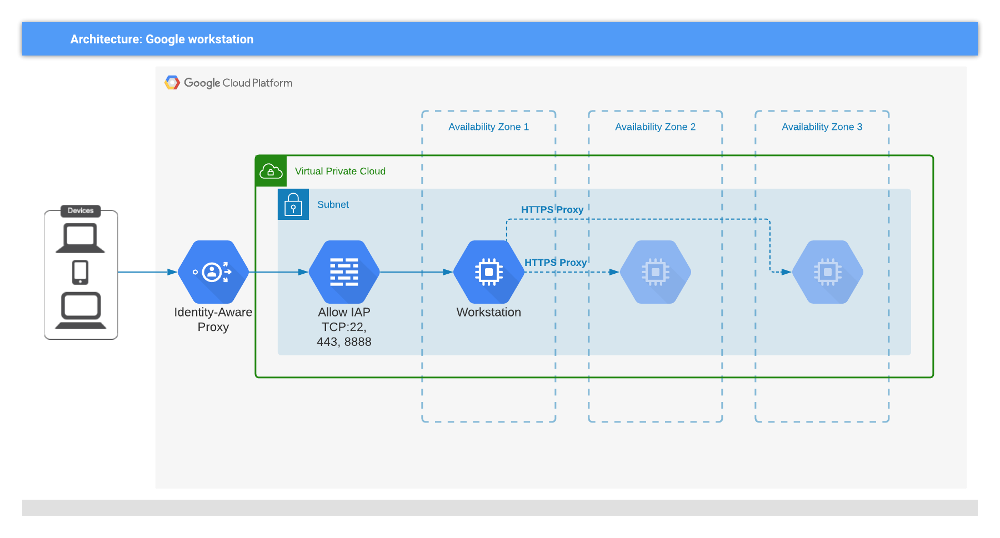

# GCP workstation example
<!-- spell-checker: ignore markdownlint jumphost -->

This example will create a set of VPC networks using [network/min](../../network/min/)
module and add a [workstation](../) VM on the `main` (a.k.a. `mgmt` or
`control-plane`) network.



> Figure 1: Resources provisioned by this example

## Running the example

1. Copy `terraform.tfvars.example` to `terraform.tfvars`; edit the values as needed

   ```hcl
   projectPrefix = "unique-prefix"
   buildSuffix = "unique-suffix"
   gcpRegion = "region"
   gcpProjectId = "my-gcp-projectid"
   resourceOwner = "my-name"
   ```

2. Initialise and apply Terraform

   ```shell
   terraform init
   terraform apply -auto-approve
   ```

3. Use the VM

   See instructions in workstation [README](../README#usage)

4. Clean up the resources

   ```shell
   terraform destroy -auto-approve
   ```

## Infra module

See also the [infra](../../infra/) module to have a single dependency that will
create VPC networks with configurations typically used with F5 products, a
workstation to use as a jumphost and development server, along with supporting
GCP resources given a broad scenario type.

<!-- markdownlint-disable MD033 MD034 -->
<!-- BEGINNING OF PRE-COMMIT-TERRAFORM DOCS HOOK -->
## Requirements

| Name | Version |
|------|---------|
| terraform | >= 0.14.5 |
| google | >= 3.54 |

## Providers

No provider.

## Inputs

| Name | Description | Type | Default | Required |
|------|-------------|------|---------|:--------:|
| buildSuffix | random build suffix for resources | `string` | n/a | yes |
| gcpProjectId | gcp project id | `string` | n/a | yes |
| gcpRegion | region where resources will be deployed | `string` | n/a | yes |
| projectPrefix | prefix for resources | `string` | n/a | yes |
| resourceOwner | owner of GCP resources | `string` | `"f5-dcec"` | no |

## Outputs

| Name | Description |
|------|-------------|
| connection\_helpers | A set of gcloud commands to create IAP tunnels for direct access to Code Server,<br>proxying to protected resources, and starting an SSH session. See the README for<br>details. |
| self\_link | The fully-qualifed self-link of the workstation instance. |
| service\_account | The service account used by workstation instance. |

<!-- END OF PRE-COMMIT-TERRAFORM DOCS HOOK -->
<!-- markdownlint-enable MD033 MD034 -->
