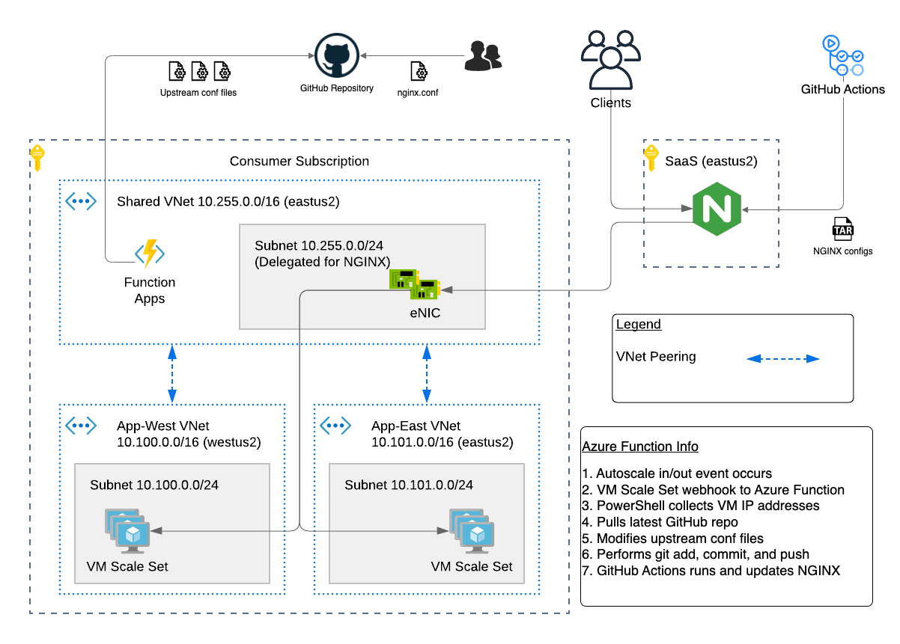
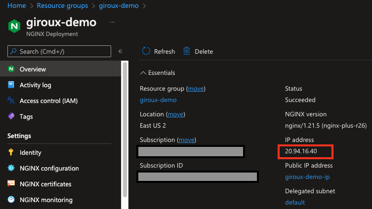
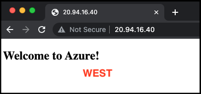
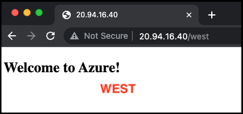
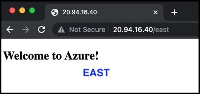
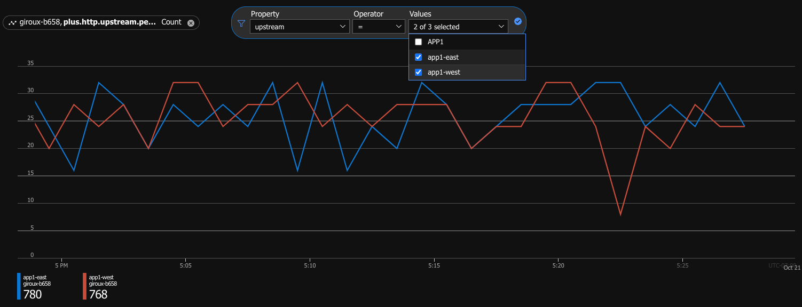

# F5 NGINX for Azure Deployment with Demo Application in Multiple Regions

## To Do

- n/a

## Issues

- Find an issue? Fork, clone, create branch, fix and PR. I'll review and merge into the main branch. Or submit a GitHub issue with all necessary details and logs.

## Contents

- [Introduction](#introduction)
- [Configuration Example](#configuration-example)
- [Requirements](#requirements)
- [Installation Example](#installation-example)
- [CI/CD Pipeline NGINX Configurations](#cicd-pipeline-nginx-configurations)
- [Monitor and Metrics](#monitor-and-metrics)
- [Troubleshooting](#troubleshooting)

## Introduction

This solution will create an [F5 NGINX for Azure](https://docs.nginx.com/nginx-for-azure) deployment and a set of Azure VNets for a demo application hosted in multiple Azure regions. The application will be running in the West and East regions, and NGINX will provide traffic management, security, and high availability across regions. This Terraform deployment uses the concept of "Day 1" for initial deployment and "Day 2" for ongoing operatoins. The former involves deploying infrastructure into Azure. The latter involves NGINX configuration updates.

The "Day 1" infrastructure deployment will consist of the following:

- F5 Dataplane Subscription (SaaS)
  - NGINX for Azure deployment
  - Note: hidden, user will not see this
- Shared VNet and subnets (customer Hub)
  - NGINX eNICs for [VNet injection](https://learn.microsoft.com/en-us/azure/virtual-network/virtual-network-for-azure-services)
  - Azure Function App with PowerShell code
  - NGINX metrics published to Azure Monitor
- Application VNet and subnets (customer Spoke)
  - 1x App VNet in West region
  - 1x App VNet in East region
  - VM Scale Sets for each region
- VNet peering
  - Hub to/from App-West VNet
  - Hub to/from App-East VNet

The "Day 2" operations will consist of the following:
- NGINX configuration files stored in GitHub repository
- NGINX for Azure configurations updated by GitHub Actions

## Configuration Example

The following is an example configuration diagram for this solution deployment.



## Requirements

- Azure CLI
- Terraform
- Azure User with 'Owner' role to deploy resources
- GitHub repository to store NGINX configurations
  - [Sample repo](https://github.com/JeffGiroux/nginx-for-azure-configs) with requirements
  - GitHub access token
  - GitHub secrets
  - Azure Key Vault secret
- Azure [Managed Identity](https://learn.microsoft.com/en-us/azure/active-directory/managed-identities-azure-resources/overview) for the NGINX deployment
  - NGINX metrics are published to Azure Monitoring
  - Secrets are retrieved from Key Vault
  - **Note:** Optional...if not supplied, one will be created

## Installation Example

- Create a GitHub repository to store NGINX configurations
  - [Sample repo](https://github.com/JeffGiroux/nginx-for-azure-configs) with requirements
  - Complete all requirements from sample repo, then head back here

- Authenticate your terminal session with AZ CLI and select subscription
```bash
# Login
az login

# Show subscriptions
az account show
{
  "environmentName": "AzureCloud",
  "id": "abc-123-xyz",
...
  "name": "f5-xyz_Cloud_Sales",
...
}

# Set default
az account set -s <subscriptionId>
```

- Clone the repo and open the solution's directory
```bash
git clone https://github.com/f5devcentral/f5-digital-customer-engagement-center
cd f5-digital-customer-engagement-center/solutions/delivery/application_delivery_controller/nginx/nginx-for-azure/
```

- Create the tfvars file and update it with your settings.
  - **Note:** `projectPrefix` can only consist of lowercase letters and numbers, and must be between 3 and 24 characters long.
```bash
cp admin.auto.tfvars.example admin.auto.tfvars
# MODIFY TO YOUR SETTINGS
vi admin.auto.tfvars
```

- Run the setup script:
```bash
./setup.sh
```

- Terraform will output a GitHub actions workflow file named 'nginxGithubActions.yml'. Add the workflow file to your GitHub repository storing the NGINX configurations. The workflow file needs to be placed into the following location:
```
.github/workflows/nginxGithubActions.yml
```

## Test your setup:

1. Copy the public IP from the NGINX Deployment. This value can also be found in Terraform outputs as 'public_IP_nginx'.



2. On your laptop/PC, open a browser to public IP address.

Note: Depending on health checks and client request, you will either get the "West" or "East" application servers.



3. Manually choose the West region by browsing to the /west URL path.



4. Manually choose the East region by browsing to the /east URL path.



## CI/CD Pipeline NGINX Configurations

The NGINX configuration for this demo contains URL path routing and multiple upstream selections. The configuration is stored and managed in a GitHub repository, and it is pushed to the NGINX deployment through GitHub Actions using [NGINX Configuration Automation Workflows](https://docs.nginx.com/nginx-for-azure/management/nginx-configuration/#nginx-configuration-automation-workflows).

This demo also utilizes autoscale notify events to trigger Azure Functions running PowerShell. The PowerShell script collects IP addresses of all VM instances in the autoscale groups...aka the upstream servers. Why is this needed? The current implemementation of NGINX for Azure does not have service discovery. Additionally, the SaaS offering in Azure does not have an API to automatically add VMs to NGINX backend pools similar to how you can easily add VMs as targets to Azure Load Balancer or other Azure services. As a workaround, PowerShell is used to retrieve the IP addresses.

There are a few places in which you can adjust NGINX configurations for this demo. Most configuration changes should occur in the nginx.conf file which is in the GitHub repo. However, if you find the need to adjust server line directives, ports, or other upstream settings, then you can also adjust the PowerShell script and reapply Terraform.

### Example Workflow #1: Modify nginx.conf in GitHub repository
1. User has a requirement to add rate limiting
2. Edit [nginx.conf](https://github.com/JeffGiroux/nginx-for-azure-configs/blob/main/configs/nginx.conf) to add rate limiting directives (see [Rate Limiting](https://docs.nginx.com/nginx-for-azure/management/rate-limiting/))
3. Commit changes to repo
4. GitHub Actions runs, creates tarball of configs, deploys to NGINX

### Example Workflow #2: Scale In/Out Event
1. VMSS scale in/out event occurs
2. VMSS webhook notify to Azure Function running PowerShell script [vmssFunction.ps1](function-app/vmAutoscaleNginxConfig/vmssFunction.ps1)
3. PowerShell collects VM IP addresses
4. Pulls latest GitHub repo
5. Modifies upstream conf files with server IP addresses
6. Performs git add, commit, and push
7. GitHub Actions runs, creates tarball of configs, deploys to NGINX

### Example Workflow #3: Modify upstream server directives
1. User has a requirement to add upstream [server directive](http://nginx.org/en/docs/http/ngx_http_upstream_module.html#server) weight options
2. Edit [vmssFunction.ps1](function-app/vmAutoscaleNginxConfig/vmssFunction.ps1)
3. Locate "server" lines that need modification and add weight parameters
4. Reapply Terraform
5. Terraform state sees difference in vmssFunction.ps1 and creates new function-app.zip
6. Zip package is deployed to Azure Function
7. Upon next Function trigger, PowerShell runs
8. Performs git add, commit, and push
9. GitHub Actions runs, creates tarball of configs, deploys to NGINX

Example below
```
  $server = "server " + $ip + ":80 weight=5;" | Out-File $app1WestVmssConf -Append
```

## Monitor and Metrics
This demo automatically associates a managed identity to the NGINX deployment and enables diagnostics. NGINX will publish application telemetry data to Azure Monitor, and you can review/analyze/alert on those metrics. See [Enable NGINX for Azure Monitoring](https://docs.nginx.com/nginx-for-azure/monitoring/enable-monitoring/) for more info.



## Cleanup
- Run the solution destroy script:
```bash
./destroy.sh
```

## Troubleshooting

### Serial Logs of Application Servers (upstreams)
Review the serial logs for the Azure virtual machine. Login to the Azure portal, open "Virtual Machines", then locate your instance...click it. Hit Serial Console. Then review the serial logs for errors.

### NGINX for Azure
Review the NGINX deployment logs and contact support. See the links below...
- [Troubleshooting NGINX for Azure](https://docs.nginx.com/nginx-for-azure/troubleshooting/troubleshooting/)
- [FAQ](https://docs.nginx.com/nginx-for-azure/troubleshooting/faq/)

### Traffic Flows
Review the high level diagram to see the architecture and understand traffic flows. If the NGINX deployment cannot access the application upstream servers, then please validate there arethe necessary Network Seurity Group rules, VNet peering, and DNS entries.

## How to Contribute

Submit a pull request

# Authors
- Jeff Giroux


<!-- markdownlint-disable no-inline-html -->
<!-- BEGINNING OF PRE-COMMIT-TERRAFORM DOCS HOOK -->
## Requirements

| Name | Version |
|------|---------|
| terraform | >= 1.2.0 |
| azurerm | >= 3 |

## Providers

| Name | Version |
|------|---------|
| archive | n/a |
| azurerm | >= 3 |
| local | n/a |
| null | n/a |
| random | n/a |

## Modules

No Modules.

## Resources

| Name |
|------|
| [archive_file](https://registry.terraform.io/providers/hashicorp/archive/latest/docs/data-sources/file) |
| [azurerm_application_insights](https://registry.terraform.io/providers/hashicorp/azurerm/latest/docs/resources/application_insights) |
| [azurerm_function_app_host_keys](https://registry.terraform.io/providers/hashicorp/azurerm/latest/docs/data-sources/function_app_host_keys) |
| [azurerm_key_vault](https://registry.terraform.io/providers/hashicorp/azurerm/latest/docs/data-sources/key_vault) |
| [azurerm_key_vault_access_policy](https://registry.terraform.io/providers/hashicorp/azurerm/latest/docs/resources/key_vault_access_policy) |
| [azurerm_linux_virtual_machine_scale_set](https://registry.terraform.io/providers/hashicorp/azurerm/latest/docs/resources/linux_virtual_machine_scale_set) |
| [azurerm_monitor_autoscale_setting](https://registry.terraform.io/providers/hashicorp/azurerm/latest/docs/resources/monitor_autoscale_setting) |
| [azurerm_network_security_group](https://registry.terraform.io/providers/hashicorp/azurerm/latest/docs/resources/network_security_group) |
| [azurerm_public_ip](https://registry.terraform.io/providers/hashicorp/azurerm/latest/docs/resources/public_ip) |
| [azurerm_resource_group](https://registry.terraform.io/providers/hashicorp/azurerm/latest/docs/resources/resource_group) |
| [azurerm_resource_group_template_deployment](https://registry.terraform.io/providers/hashicorp/azurerm/latest/docs/resources/resource_group_template_deployment) |
| [azurerm_role_assignment](https://registry.terraform.io/providers/hashicorp/azurerm/latest/docs/resources/role_assignment) |
| [azurerm_service_plan](https://registry.terraform.io/providers/hashicorp/azurerm/latest/docs/resources/service_plan) |
| [azurerm_storage_account](https://registry.terraform.io/providers/hashicorp/azurerm/latest/docs/resources/storage_account) |
| [azurerm_subnet](https://registry.terraform.io/providers/hashicorp/azurerm/latest/docs/resources/subnet) |
| [azurerm_subnet_network_security_group_association](https://registry.terraform.io/providers/hashicorp/azurerm/latest/docs/resources/subnet_network_security_group_association) |
| [azurerm_subscription](https://registry.terraform.io/providers/hashicorp/azurerm/latest/docs/data-sources/subscription) |
| [azurerm_user_assigned_identity](https://registry.terraform.io/providers/hashicorp/azurerm/latest/docs/resources/user_assigned_identity) |
| [azurerm_virtual_network](https://registry.terraform.io/providers/hashicorp/azurerm/latest/docs/resources/virtual_network) |
| [azurerm_virtual_network_peering](https://registry.terraform.io/providers/hashicorp/azurerm/latest/docs/resources/virtual_network_peering) |
| [azurerm_windows_function_app](https://registry.terraform.io/providers/hashicorp/azurerm/latest/docs/resources/windows_function_app) |
| [local_file](https://registry.terraform.io/providers/hashicorp/local/latest/docs/resources/file) |
| [null_resource](https://registry.terraform.io/providers/hashicorp/null/latest/docs/resources/resource) |
| [random_id](https://registry.terraform.io/providers/hashicorp/random/latest/docs/resources/id) |

## Inputs

| Name | Description | Type | Default | Required |
|------|-------------|------|---------|:--------:|
| projectPrefix | prefix for resources | `string` | n/a | yes |
| resourceOwner | name of the person or customer running the solution | `string` | n/a | yes |
| sshPublicKey | public key used for authentication in ssh-rsa format | `string` | n/a | yes |
| adminName | admin account name used with app server instance | `string` | `"azureuser"` | no |
| enableMetrics | Enable publishing metrics data from NGINX deployment | `bool` | `true` | no |
| gitRepoUrl | GitHub repository for NGINX configuration files (ex. https://github.com/User123/app1-nginx-configs.git) | `string` | `null` | no |
| gitTokenSecretName | Azure Key Vault secret name that contains the GitHub access token. The secret name will be used during runtime to retrieve the GitHub access token so it is not exposed in scripts. (ex. mySecret123) | `string` | `null` | no |
| keyVaultName | Name of existing Azure Key Vault (ex. myKv123) | `string` | `null` | no |
| keyVaultRg | Resource group of existing Azure Key Vault (ex. myKvRg123) | `string` | `null` | no |
| numServers | number of app server instances to launch in each autoscale group | `number` | `1` | no |
| userAssignedIdentityId | The resource ID of the user-assigned managed identity associated to the NGINX deployment resource. If one is not supplied, a user identity resource will automatically be created. (ex. /subscriptions/xxxx/resourcegroups/myRg123/providers/Microsoft.ManagedIdentity/userAssignedIdentities/myIdentity123) | `string` | `null` | no |
| vnets | The set of VNets to create | <pre>map(object({<br>    cidr           = list(any)<br>    subnetPrefixes = list(any)<br>    subnetNames    = list(any)<br>    location       = string<br>  }))</pre> | <pre>{<br>  "appEast": {<br>    "cidr": [<br>      "10.101.0.0/16"<br>    ],<br>    "location": "eastus2",<br>    "subnetNames": [<br>      "default"<br>    ],<br>    "subnetPrefixes": [<br>      "10.101.0.0/24"<br>    ]<br>  },<br>  "appWest": {<br>    "cidr": [<br>      "10.100.0.0/16"<br>    ],<br>    "location": "westus2",<br>    "subnetNames": [<br>      "default"<br>    ],<br>    "subnetPrefixes": [<br>      "10.100.0.0/24"<br>    ]<br>  },<br>  "shared": {<br>    "cidr": [<br>      "10.255.0.0/16"<br>    ],<br>    "location": "eastus2",<br>    "subnetNames": [<br>      "default"<br>    ],<br>    "subnetPrefixes": [<br>      "10.255.0.0/24"<br>    ]<br>  }<br>}</pre> | no |

## Outputs

| Name | Description |
|------|-------------|
| nginxDeploymentName | Name of the NGINX deployment |
| nginxPublicIp | Public IP address of the NGINX deployment |
<!-- END OF PRE-COMMIT-TERRAFORM DOCS HOOK -->
<!-- markdownlint-enable no-inline-html -->
