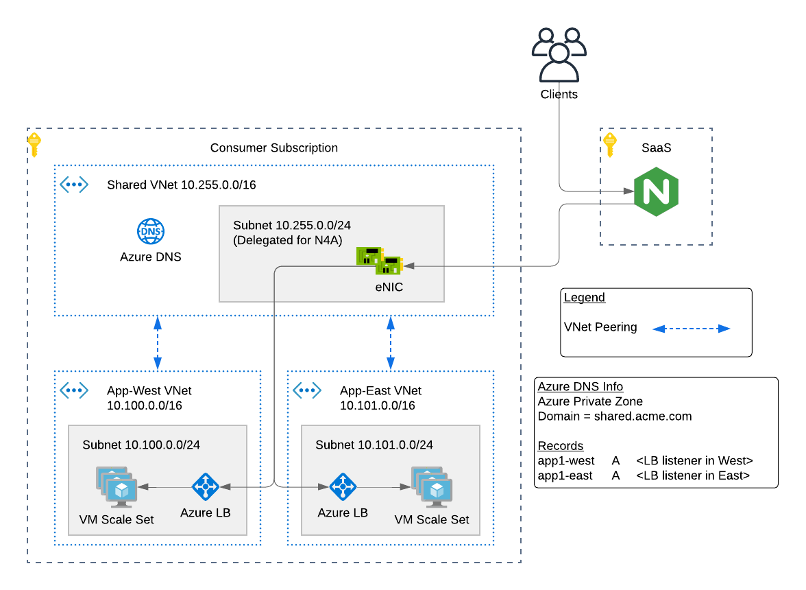

# F5 NGINX for Azure Deployment with Demo Application in Multiple Regions

## To Do

- Add F5 NGINX for Azure Terraform code (TBD...waiting for GA release)

## Issues

- Find an issue? Fork, clone, create branch, fix and PR. I'll review and merge into the main branch. Or submit a GitHub issue with all necessary details and logs.

## Contents

- [Introduction](#introduction)
- [Configuration Example](#configuration-example)
- [Requirements](#requirements)
- [Installation Example](#installation-example)
- [Troubleshooting](#troubleshooting)

## Introduction

This solution will create an [F5 NGINX for Azure](https://docs.nginx.com/nginx-for-azure) (N4A) deployment and a set of Azure VNets for a demo application hosted in multiple Azure regions. The application will be running in the West and East regions, and N4A will provide traffic management, security, and high availability across regions.

The resulting deployment will consist of the following:

- F5 Dataplane Subscription (SaaS)
  - N4A deployment
  - Note: hidden, user will not see this
- Shared VNet and subnets (customer Hub)
  - N4A eNICs for [VNet injection](https://learn.microsoft.com/en-us/azure/virtual-network/virtual-network-for-azure-services)
- Application VNet and subnets (customer Spoke)
  - 1x App VNet in West region
  - 1x App VNet in East region
  - VM Scale Sets for each region
  - Azure LBs for each region
- VNet peering
  - Hub to/from App-West VNet
  - Hub to/from App-East VNet

## Configuration Example

The following is an example configuration diagram for this solution deployment.



## Requirements

- Azure CLI
- Terraform
- Azure Subscription
- Azure User with 'Owner' role

## Installation Example

- Clone the repo and open the solution's directory
```bash
git clone https://github.com/f5devcentral/f5-digital-customer-engagement-center
cd f5-digital-customer-engagement-center/solutions/delivery/application_delivery_controller/nginx/nginx-for-azure/
```

- Create the tfvars file and update it with your settings
```bash
cp admin.auto.tfvars.example admin.auto.tfvars
# MODIFY TO YOUR SETTINGS
vi admin.auto.tfvars
```

- Run the setup script:
```bash
./setup.sh
```

## Test your setup:

1. Copy the public IP from the NGINX Deployment. This value can also be found in Terraform outputs as 'public_IP_n4a'.


2. On your laptop/PC, open a browser to public IP address.

Note: Depending on health checks and client request, you will either get the "West" or "East" application servers.


3. Manually choose the West region by browsing to the /west URL path.


4. Manually choose the East region by browsing to the /east URL path.


The examples based on URL path routing are dependent upon the nginx.conf. In this demo, the example configuration below is applied which allows for URL path routing and multiple upstream selections. See [templates/nginx.conf](templates/nginx.conf).

```
http {
  upstream app1 {
    server 10.100.0.5:80;
    server 10.101.0.5:80 backup;
  }
  upstream app1-west {
    server 10.100.0.5:80;
  }
  upstream app1-east {
    server 10.101.0.5:80;
  }

  server {
    listen 80 default_server;
    location / {
      proxy_pass http://app1/;
    }
    location /west/ {
      proxy_pass http://app1-west/;
    }
    location /east/ {
      proxy_pass http://app1-east/;
    }
  }
}
```

## Cleanup
- Run the solution destroy script:
```bash
./destroy.sh
```

## Troubleshooting

### Serial Logs of Application Servers (upstreams)
Review the serial logs for the Azure virtual machine. Login to the Azure portal, open "Virtual Machines", then locate your instance...click it. Hit Serial Console. Then review the serial logs for errors.

### NGINX for Azure
Review the N4A deployment logs and contact support. See the links below...
- [Troubleshooting NGINX for Azure](https://docs.nginx.com/nginx-for-azure/troubleshooting/troubleshooting/)
- [FAQ](https://docs.nginx.com/nginx-for-azure/troubleshooting/faq/)

### Traffic Flows
Review the high level diagram to see the architecture and understand traffic flows. If the N4A deployment cannot access the application upstream servers, then please validate there arethe necessary Network Seurity Group rules, VNet peering, and DNS entries.

## How to Contribute

Submit a pull request

# Authors
- Jeff Giroux


<!-- markdownlint-disable no-inline-html -->
<!-- BEGINNING OF PRE-COMMIT-TERRAFORM DOCS HOOK -->
## Requirements

| Name | Version |
|------|---------|
| terraform | >= 1.2.0 |
| azurerm | >= 3 |

## Providers

| Name | Version |
|------|---------|
| azurerm | >= 3 |
| random | n/a |

## Modules

No Modules.

## Resources

| Name |
|------|
| [azurerm_lb](https://registry.terraform.io/providers/hashicorp/azurerm/latest/docs/resources/lb) |
| [azurerm_lb_backend_address_pool](https://registry.terraform.io/providers/hashicorp/azurerm/latest/docs/resources/lb_backend_address_pool) |
| [azurerm_lb_probe](https://registry.terraform.io/providers/hashicorp/azurerm/latest/docs/resources/lb_probe) |
| [azurerm_lb_rule](https://registry.terraform.io/providers/hashicorp/azurerm/latest/docs/resources/lb_rule) |
| [azurerm_linux_virtual_machine_scale_set](https://registry.terraform.io/providers/hashicorp/azurerm/latest/docs/resources/linux_virtual_machine_scale_set) |
| [azurerm_network_security_group](https://registry.terraform.io/providers/hashicorp/azurerm/latest/docs/resources/network_security_group) |
| [azurerm_private_dns_a_record](https://registry.terraform.io/providers/hashicorp/azurerm/latest/docs/resources/private_dns_a_record) |
| [azurerm_private_dns_zone](https://registry.terraform.io/providers/hashicorp/azurerm/latest/docs/resources/private_dns_zone) |
| [azurerm_private_dns_zone_virtual_network_link](https://registry.terraform.io/providers/hashicorp/azurerm/latest/docs/resources/private_dns_zone_virtual_network_link) |
| [azurerm_public_ip](https://registry.terraform.io/providers/hashicorp/azurerm/latest/docs/resources/public_ip) |
| [azurerm_resource_group](https://registry.terraform.io/providers/hashicorp/azurerm/latest/docs/resources/resource_group) |
| [azurerm_resource_group_template_deployment](https://registry.terraform.io/providers/hashicorp/azurerm/latest/docs/resources/resource_group_template_deployment) |
| [azurerm_subnet](https://registry.terraform.io/providers/hashicorp/azurerm/latest/docs/resources/subnet) |
| [azurerm_subnet_network_security_group_association](https://registry.terraform.io/providers/hashicorp/azurerm/latest/docs/resources/subnet_network_security_group_association) |
| [azurerm_virtual_network](https://registry.terraform.io/providers/hashicorp/azurerm/latest/docs/resources/virtual_network) |
| [azurerm_virtual_network_peering](https://registry.terraform.io/providers/hashicorp/azurerm/latest/docs/resources/virtual_network_peering) |
| [random_id](https://registry.terraform.io/providers/hashicorp/random/latest/docs/resources/id) |

## Inputs

| Name | Description | Type | Default | Required |
|------|-------------|------|---------|:--------:|
| projectPrefix | prefix for resources | `string` | n/a | yes |
| resourceOwner | name of the person or customer running the solution | `string` | n/a | yes |
| sshPublicKey | public key used for authentication in ssh-rsa format | `string` | n/a | yes |
| adminName | admin account name used with app server instance | `string` | `"azureuser"` | no |
| domain\_name | The DNS domain name that will be used in Azure private DNZ zone for VM names | `string` | `"shared.acme.com"` | no |
| num\_servers | number of instances to launch | `number` | `1` | no |
| vnets | The set of VNets to create | <pre>map(object({<br>    cidr           = list(any)<br>    subnetPrefixes = list(any)<br>    subnetNames    = list(any)<br>    location       = string<br>  }))</pre> | <pre>{<br>  "appEast": {<br>    "cidr": [<br>      "10.101.0.0/16"<br>    ],<br>    "location": "eastus2",<br>    "subnetNames": [<br>      "default"<br>    ],<br>    "subnetPrefixes": [<br>      "10.101.0.0/24"<br>    ]<br>  },<br>  "appWest": {<br>    "cidr": [<br>      "10.100.0.0/16"<br>    ],<br>    "location": "westus2",<br>    "subnetNames": [<br>      "default"<br>    ],<br>    "subnetPrefixes": [<br>      "10.100.0.0/24"<br>    ]<br>  },<br>  "shared": {<br>    "cidr": [<br>      "10.255.0.0/16"<br>    ],<br>    "location": "eastus2",<br>    "subnetNames": [<br>      "default"<br>    ],<br>    "subnetPrefixes": [<br>      "10.255.0.0/24"<br>    ]<br>  }<br>}</pre> | no |

## Outputs

| Name | Description |
|------|-------------|
| public\_IP\_n4a | Public IP address of the N4A deployment |
<!-- END OF PRE-COMMIT-TERRAFORM DOCS HOOK -->
<!-- markdownlint-enable no-inline-html -->
