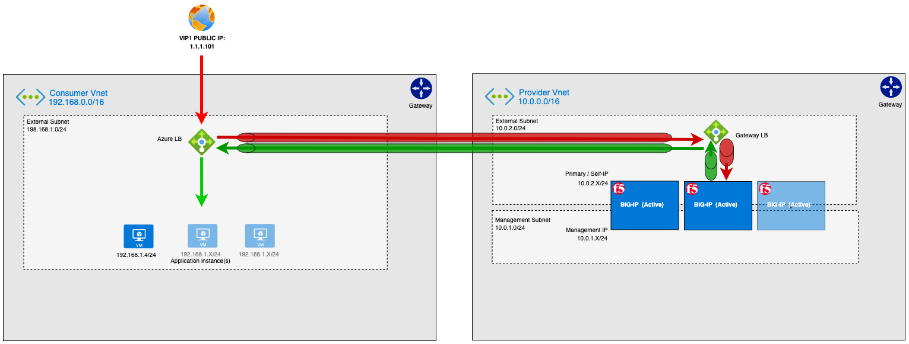

# azure-gwlb-f5-tf
Deploys Azure Gateway Load Balancer and F5 BIG-IP using Terraform

## Instructions

### Deploy this demo
````
terraform init
terraform plan
terraform apply -auto-approve
````

### Verify your deployment
1. Find the output called "web_address_for_application". This is output at the end of deployment, or you can determine it again with this command
````
terraform output
````
2. Visit this URL in your browser. You should see a demo web app. This traffic is flowing via a Web App Firewall (WAF).
3. (Optional) Check out the BIG-IP configuration by accessing the mgmt console using the username, password, and public IP address from the Terraform outputs.
4. (optional) Access the linux vm that is hosting the demo web app (ssh details are in Terraform output). Optionally deploy your own web app that listens on port 80 or 443.

### Delete this demo
We can use Terraform to destroy the remaining infrastructure.
````
terraform destroy -auto-approve
````

## Architecture


## Prerequisites
- terraform version ~> 1.0.8
- az cli installed and authenticated
The below providers were tested and working with Terraform 1.0.8
* provider registry.terraform.io/hashicorp/azurerm v2.79.1
* provider registry.terraform.io/hashicorp/null v3.1.0
* provider registry.terraform.io/hashicorp/template v2.2.0
* provider registry.terraform.io/hashicorp/random v3.1.0
* provider registry.terraform.io/hashicorp/tls v3.1.0
* This solution requires an Azure account that can provision objects described in the solution.
* This solution requires you to accept any Azure Marketplace "License/Terms and Conditions" for the images used in this solution.
  * By Default, this solution uses f5-bigip-virtual-edition-200m-best-hourly
    * Azure CLI:
    ````
    az vm image terms accept --urn f5-networks:f5-big-ip-best:f5-bigip-virtual-edition-200m-best-hourly:latest
    ````
