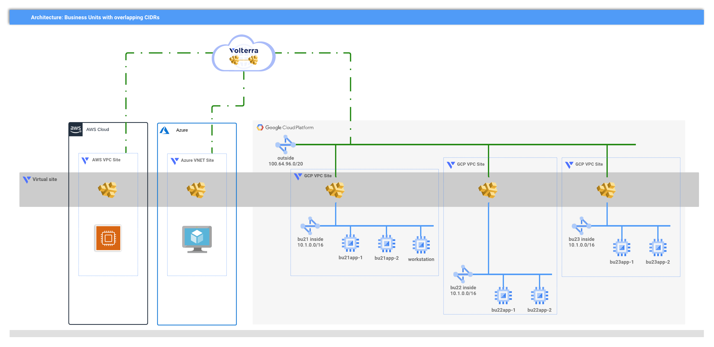

# Multi-cloud Volterra demo

<!-- spell-checker: ignore volterra markdownlint tfvars -->
This module will create a set of Volterra AWS TGW, Azure VNET, and GCP VPC Sites
with ingress/egress gateways configured and a virtual site that spans the cloud
sites.


<!-- markdownlint-disable no-inline-html -->
<p align="center">Figure 1: High-level overview of solution; this modu</p>
<!-- markdownlint-enable no-inline-html -->

HTTP load balancers are created for each business unit service, and are advertised
on every CE site that match the selector predicate for the Virtual Site. This means
that existing resources can use DNS discovery via the Volterra gateways without
changing the deployment.

> See [Scenario](SCENARIO.md) document for details on why this solution was chosen
> for a hypothetical customer looking for a minimally invasive solution
> to multi-cloud networking.

## Prerequisites

### AWS

Cloud Credentials, awsRegion

### Azure

Cloud Credentials, awsLocation

## Google

Cloud Credentials, gcpProjectId, gcpRegion

```hcl
module "volterra_sa" {
  source                   = "git::https://github.com/memes/terraform-google-volterra//modules/service-account?ref=0.3.1"
  gcp_project_id           = "my-gcp-project-id"
  gcp_role_name            = "my_volterra_role"
  gcp_service_account_name = "volterra-site-sa"
  cloud_credential_name    = "my-gcp-volterra"
}
```

<!-- markdownlint-disable no-inline-html -->
<!-- BEGINNING OF PRE-COMMIT-TERRAFORM DOCS HOOK -->
## Requirements

| Name | Version |
|------|---------|
| terraform | >= 0.14.5 |
| aws | >= 3.0 |
| azurerm | >= 2.69 |
| google | >= 3.77 |
| volterra | 0.8.1 |

## Providers

| Name | Version |
|------|---------|
| random | n/a |
| volterra | 0.8.1 |

## Modules

| Name | Source | Version |
|------|--------|---------|
| aws | ./aws/ |  |
| azure | ./azure/ |  |
| google | ./google/ |  |

## Resources

| Name |
|------|
| [random_id](https://registry.terraform.io/providers/hashicorp/random/latest/docs/resources/id) |
| [volterra_virtual_site](https://registry.terraform.io/providers/volterraedge/volterra/0.8.1/docs/resources/virtual_site) |

## Inputs

| Name | Description | Type | Default | Required |
|------|-------------|------|---------|:--------:|
| namespace | The Volterra namespace into which Volterra resources will be managed. | `string` | n/a | yes |
| volterraTenant | The Volterra tenant to use. | `string` | n/a | yes |
| awsRegion | aws region | `string` | `null` | no |
| azureLocation | location where Azure resources are deployed (abbreviated Azure Region name) | `string` | `null` | no |
| buildSuffix | unique build suffix for resources; will be generated if empty or null | `string` | `null` | no |
| domain\_name | The DNS domain name that will be used as common parent generated DNS name of<br>loadbalancers. Default is 'shared.acme.com'. | `string` | `"shared.acme.com"` | no |
| gcpProjectId | gcp project id | `string` | `null` | no |
| gcpRegion | region where GCP resources will be deployed | `string` | `null` | no |
| projectPrefix | prefix for resources | `string` | `"mcn-demo"` | no |
| resourceOwner | owner of the deployment, for tagging purposes | `string` | `"f5-dcec"` | no |
| ssh\_key | An optional SSH key to add to nodes. | `string` | `""` | no |
| volterraCloudCredAWS | Volterra Cloud Credential to use with AWS | `string` | `null` | no |
| volterraCloudCredAzure | Volterra Cloud Credential to use with Azure | `string` | `null` | no |
| volterraCloudCredGCP | Volterra Cloud Credential to use with GCP | `string` | `null` | no |

## Outputs

| Name | Description |
|------|-------------|
| aws\_jumphost\_publicIP | AWS Jumphost Public IP in BU1 |
| azure\_jumphost\_publicIP | Azure Jumphost Public IP in BU11 |
| connection\_helpers | gcloud connection helpers for GCP workstation(s) |
<!-- END OF PRE-COMMIT-TERRAFORM DOCS HOOK -->
<!-- markdownlint-enable no-inline-html -->
