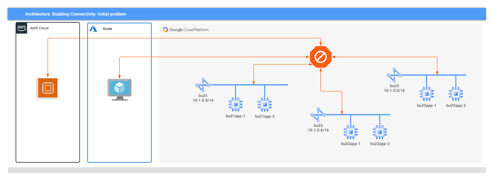

# Multi-cloud deployment scenario

<!-- spell-checker: ignore volterra markdownlint nating -->
ACME Corp has multiple business units that have independently migrated to AWS,
Azure, and GCP, and are now required to communicate with each other securely,
and with minimal changes to existing deployments.

<!-- markdownlint-disable no-inline-html -->

Figure 1: The challenge for ACME Corp

<!-- markdownlint-enable no-inline-html -->

As shown above, each business unit has been deployed without planning, and the
services are either deployed in a different cloud or on network with overlapping
RFC1918 CIDRs that cannot be easily connected without deploying NATing and
routing appliances.

## Proposed Solution

Volterra is used to provide connectivity between business unit implementations
*without* requiring changes to the existing applications or the networks CIDRs.

1. Each BU is added to Volterra as a AWS/Azure/GCP VPC site
2. A Volterra LB is defined for each service, and advertised to the virtual site
3. The Volterra Ingress/Egress gateway will receive all
