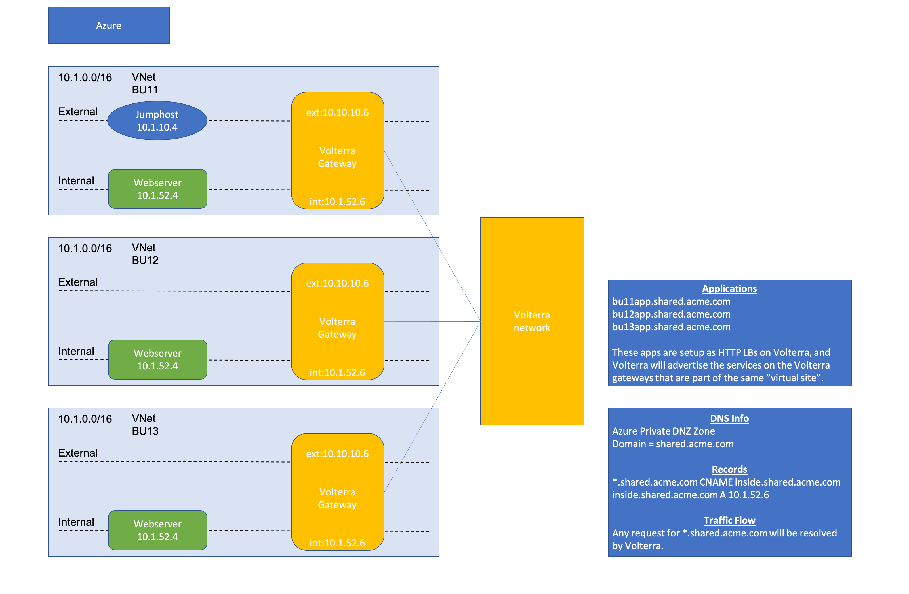

# Description
Azure accounts with overlapping ip addresses services connectivity

## Diagram




## Requirements

- Azure CLI
- Terraform
- Azure Subscription
- Azure User with 'Owner' role
- Azure Service Principal
- Volterra account
- Volterra p12 credential file and api password -  https://www.volterra.io/docs/how-to/user-mgmt/credentials
- Volterra Cloud Credentials

## Login to Azure Environment

```bash
# Login
az login

# Show subscriptions
az account show

# Set default
az account set -s <subscriptionId>
```

## Create Azure Service Principal

When you are deploying Azure resources from VoltConsole you will need to create 
a Cloud Credential that has access to your Azure Subscription. If you already
have a service principal you can use it. Otherwise you can follow these steps 
to create one. Note that you must have an "Owner" role for your subscription 
to create a service principal.

From the Azure Console Bash Cloud Shell, run the following command:

```
  $ az ad sp create-for-rbac -n "http://[unique-name]-volterra-cc" --role contributor
  {
    "appId": "xxx-xxxx",
    "displayName": "[unique-name]-volterra-cc",
    "name": "http://[unique-name]-volterra-cc",
    "password": "[password]",
    "tenant": "yyy-yyy"
  }
```

Copy the JSON output (starting with "{" ending with "}") of this command and keep it safe.
This credential enables read/write access to your Azure Subscription.

You will also need to retrieve your subscription ID. You can use the following command
to list out the name, id, and whether it is your default subscription.

```
  $ az account show  --query [name,id,isDefault]
  [
    "f5-AZR_xxxx", <-- name
    "xxx-xxx-xxx", <-- subscription id
    true           <-- is this the default subscription 
  ]
```

## Create Volterra Cloud Credentials for Azure

In VoltConsole go to the "System" namespace and navigate to "Manage" -> "Site Management" -> "Cloud Credentials".

Click on "Add Cloud Credential"

For the name enter "[unique-name]-azure".

For the Cloud Credential Type: "Azure Client Secret for Service Principal" and enter the 
values based on the JSON output from before.

- Client ID: "appId" from JSON output
- Subscription ID: output of id from "account show" command 
- Tenant ID: "tenant" from JSON output 

Under Azure Client Secret click on "Configure"

Enter the value of "password" from the previous JSON output and then click on "Blindfold"

## Usage example

- Clone the repo and open the solution's directory
```bash
git clone https://github.com/f5devcentral/f5-digital-customer-engagement-center
cd f5-digital-customer-engagement-center/solutions/security/multi-cloud-connectivity-volterra/azure/
```

- Set Volterra environment variables
Create a Volterra credentials p12 file and copy it to a local folder. Follow steps here - https://www.volterra.io/docs/how-to/user-mgmt/credentials

```bash
export VES_P12_PASSWORD="your_key"
export VOLT_API_URL="https://<tenant-name>.console.ves.volterra.io/api"
export VOLT_API_P12_FILE="/var/tmp/<example>.console.ves.volterra.io.api-creds.p12"
```

- Get the Volterra tenant name
General namespace in the VoltConsole UI, then Tenant Settings > Tenant overview

- Create the tfvars file and update it with your settings

```bash
cp admin.auto.tfvars.example admin.auto.tfvars
# MODIFY TO YOUR SETTINGS
vi admin.auto.tfvars
```

- Run the setup script to deploy all of the components into your Azure account (remember that you are responsible for the cost of those components)

```bash
./setup.sh
```

## TEST your setup:

View the created objects in VoltConsole

ssh to the bu11Jumphost (ip in the terraform output), from there try to access the apps in the other bu's


```bash
curl bu11app.shared.acme.com
curl bu12app.shared.acme.com
curl bu13app.shared.acme.com
```

Open VoltConsole, go to the 'HTTP load balancer' tab

Click on bu11app and open the 'requests' tab.

You should see your request.

Click on the request and notice it shows the original clientIp and the source site.


## Cleanup
Use the following command to destroy all of the resources

```bash
./destroy.sh
```

## How to Contribute

Submit a pull request

# Authors
Jeff Giroux
