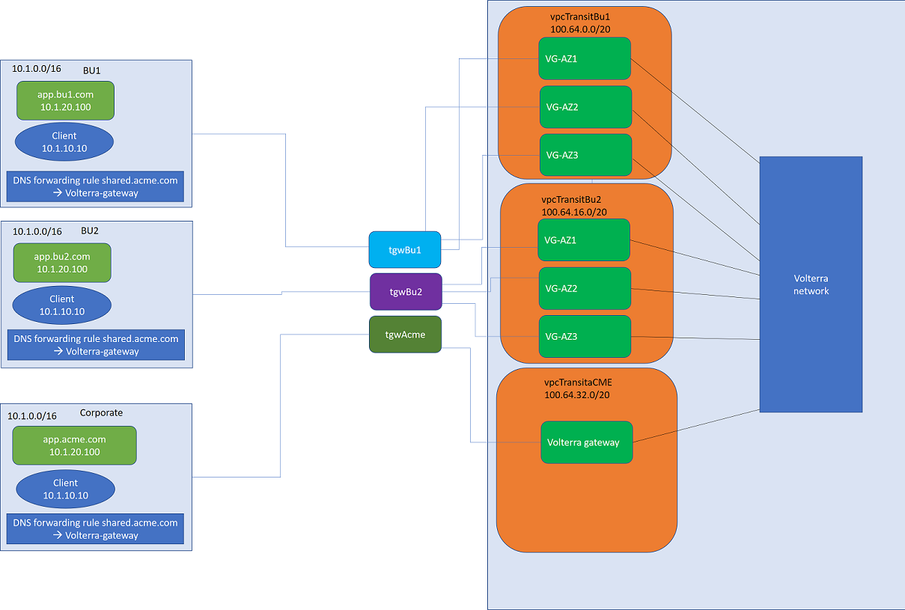
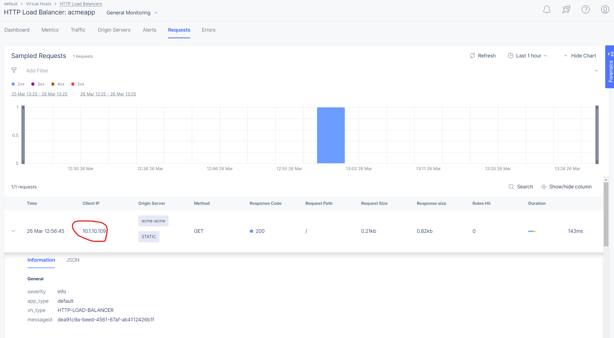

# Description
AWS transit gateway volterra sites

## Diagram




## Requirements

- AWS account, access and secret key
- Volterra account, p12 credential file and api passowrd -  https://www.volterra.io/docs/how-to/user-mgmt/credentials
- terraform
## Usage example

- Clone the repo and open the solution's directory
```bash
git clone https://github.com/f5devcentral/f5-digital-customer-engagement-center
cd f5-digital-customer-engagement-center/solutions/volterra/aws-tgw
```

- Set AWS environment variables
```bash
export AWS_ACCESS_KEY_ID="your_key"
export AWS_SECRET_ACCESS_KEY="your_secret_key"
```

- Set Volterra environment variables
Create a volterra credentials p12 file and copy it to a local folder. follow steps here - https://www.volterra.io/docs/how-to/user-mgmt/credentials
```bash
export VES_P12_PASSWORD="your_key"
export VOLT_API_URL="https://<tenant-name>.console.ves.volterra.io/api"
export VOLT_API_P12_FILE="/var/tmp/<example>.console.ves.volterra.io.api-creds.p12"
```

Get the Volterra tenant name:
General namespace in the UI, then Tenant Settings > Tenant overview

Create volterra cloud credentials using your AWS access and secret key

create the vars file and update it with your settings

```bash
cp admin.auto.tfvars.example admin.auto.tfvars
# MODIFY TO YOUR SETTINGS
vi admin.auto.tfvars
```

run the setup script to deploy all of the components into your AWS account (remember that you are responsible for the cost of those components)

```bash
./setup.sh
```


## TEST your setup:

view the created objects in voltConsole

ssh to the bu1Jumphost (ip in the terraform output), from there try to access the apps in the other bu's:


```bash
curl acmeapp.shared.acme.com
curl bu2app.shared.acme.com
```

you should get a default nginx page from the webserver in the other BU's.
open voltConsole, go to the 'HTTP load balancer' tab
click on acmeapp and open the 'requests' tab
you should see your request. click on the request and notice it shows the original clientIp and the source site.



## Cleanup
use the following command to destroy all of the resources

```bash
./destroy.sh
```


## How to Contribute

Submit a pull request

# Authors
Yossi rosenboim
