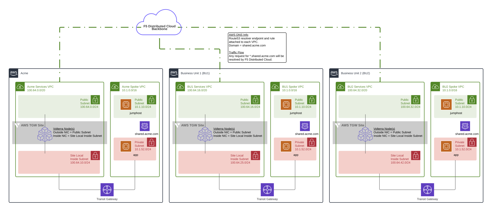
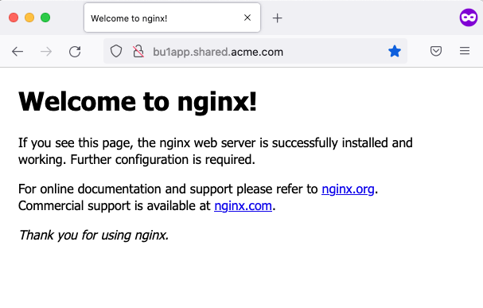
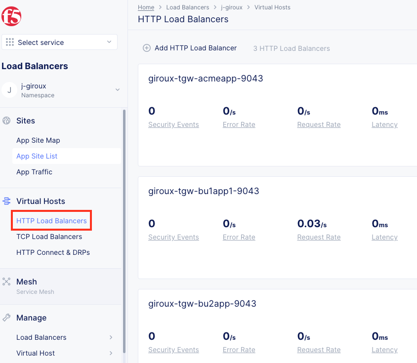
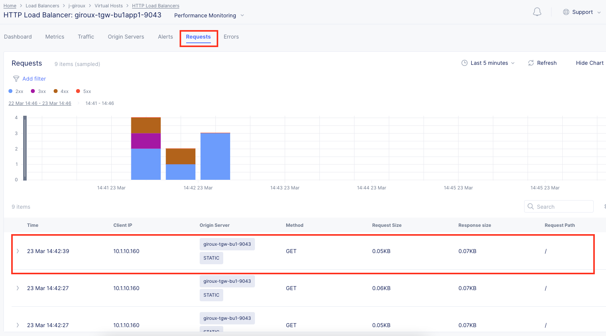
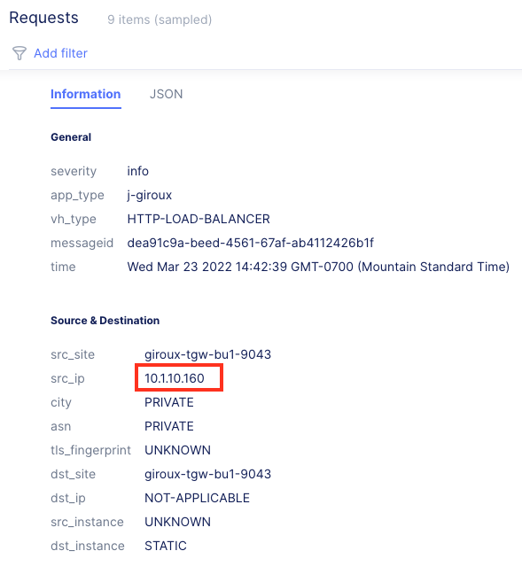

# AWS Site with Transit Gateway - F5 Distributed Cloud

This solution will deploy F5 Distributed Cloud Services into AWS VPCs with Transit Gateway (TGW). This is referred to as an F5 Distributed Cloud Site, specifically of type "AWS TGW Site". The AWS TGW Site automates the deployment and management of AWS TGW and F5 Distributed Cloud resources. The AWS TGW site can be deployed to an existing VPC or a new VPC. This VPC is typically referred to as a Services VPC or Security VPC, and it will be part of a hub and spoke design.

More info...
https://docs.cloud.f5.com/docs/how-to/site-management/create-aws-site-with-tgw

## Diagram



HTTP load balancers are created for each customer application service, and they are advertised across the AWS TGW Sites. This means that existing resources can use DNS discovery via the AWS TGW Site gateways without changing the deployment.

## Demo Scenario

The scenario consists of 3 customers: Acme, Business Unit 1 (BU1), Business Unit 2 (BU2). Each customer VPC has overlapping IP address space 10.1.0.0/16. This mimics a potential customer challenge where company and business unit acquisitions result in IP overlap. This is an issue for AWS TGW customers since TGW does not support VPC attachments with overlapping IP space.

To address this challenge of IP overlap, each customer VPC in this demo has a corresponding Services VPC in which the AWS TGW Site acts as a gateway for the ingress and egress traffic. Acme customer VPC(s) will attach to the Acme AWS TGW as well as Acme Services VPC. BU1 customer VPC(s) will attach to the BU1 AWS TGW as well as BU1 Services VPC...and so on. From the Services VPC, each AWS TGW Site will talk to the Regional Edges (RE) in the F5 Distributed Cloud Global Infrastructure.

Note: Typical customer environments will consist of multiple spoke VPCs connected to the customer AWS TGW. To limit resources, this demo deployes one spoke VPC and one Services VPC per customer. You can optionally create additional spoke VPCs yourself, then edit the F5 Distributed Cloud Site "VPC Attachments" to include the new VPC IDs.

## Requirements

- AWS CLI
- Terraform
- AWS account, access key ID and secret key
- F5 Distributed Cloud account
- F5 Distributed Cloud p12 credential file and API password
- F5 Distributed Cloud "Cloud Credentials"

## Set AWS Environment Variables

- Export the AWS access key ID and the secret access key

```bash
export AWS_ACCESS_KEY_ID="your_key"
export AWS_SECRET_ACCESS_KEY="your_secret_key"
```

## Set F5 Distributed Cloud Environment Variables

Create the F5 Distributed Cloud credentials p12 file and copy it to a local folder. Follow steps here - https://docs.cloud.f5.com/docs/how-to/user-mgmt/credentials.

- Export the p12 credential file path, p12 password, and API URL

```bash
export VES_P12_PASSWORD="your_key"
export VOLT_API_URL="https://<tenant-name>.console.ves.volterra.io/api"
export VOLT_API_P12_FILE="/var/tmp/<example>.console.ves.volterra.io.api-creds.p12"
```

## Create F5 Distributed Cloud "Cloud Credentials" for AWS

In F5 Distributed Cloud Console go to the "Cloud and Edge Sites" and navigate to "Manage" -> "Site Management" -> "Cloud Credentials".

Click on "Add Cloud Credential"

For the name enter "[unique-name]-aws".

For the Cloud Credential Type: "AWS Programmatic Access Credentials" and enter the values from your AWS access key and secret access key

- Access Key ID: This is your IAM user access key (reference AWS_ACCESS_KEY_ID)
- Secret Access Key: This is your IAM user secret access key (reference AWS_SECRET_ACCESS_KEY)

Under Secret Access Key click on "Configure"

Enter the value from environment variable AWS_SECRET_ACCESS_KEY and then click on "Blindfold"

## Usage example

- Clone the repo and open the solution's directory
```bash
git clone https://github.com/f5devcentral/f5-digital-customer-engagement-center
cd f5-digital-customer-engagement-center/solutions/volterra/aws-tgw
```

- Get the F5 Distributed Cloud tenant name
General namespace in the F5 Distributed Cloud Console, then Tenant Settings > Tenant overview

- Create the tfvars file and update it with your settings

```bash
cp admin.auto.tfvars.example admin.auto.tfvars
# MODIFY TO YOUR SETTINGS
vi admin.auto.tfvars
```

- Run the initial setup script to deploy all of the components into your AWS account (remember that you are responsible for the cost of those components):

```bash
./setup.sh
```

## TEST your setup:

1. Connect to the bu1Jumphost via SSH with port forwarding enabled.

The IP is in the terraform output. Example SSH command is below. Run this from your laptop terminal. You will use these settings later in your laptop web browser to configure SOCKS v5 proxy.

```bash
# run this from your laptop/pc
ssh -D 3128 ubuntu@x.x.x.x
# port = 3128
# user = ubuntu
# IP = x.x.x.x
```

2. From the jumphost CLI, test curl commands to each BU site.

```bash
# run this from the jumphost terminal
curl bu1app.shared.acme.com
curl bu2app.shared.acme.com
curl bu3app.shared.acme.com
```

3. On your laptop/PC, configure your browser to use 127.0.0.1:3128 as SOCKS v5 proxy and also enable the box "Proxy DNS when using SOCKS v5".


4. Browse to the BU sites. AWS will resolve with a basic NGINX page.



5. Open F5 Distributed Cloud console, go to the 'HTTP Load Balancers' tab



6. Click on bu1app and open the 'Requests' tab. You should see your request.



7. Click on the request and notice it shows the original clientIp and the source site.



## Cleanup
Use the following command to destroy all of the resources

```bash
./destroy.sh
```

## How to Contribute

Submit a pull request

# Authors
- Yossi Rosenboim
- Jeff Giroux
