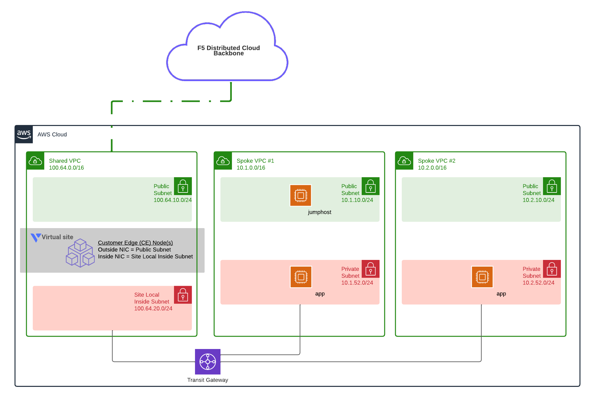

# Client PoC 1 - Two VPCs with Shared VPC and Shared Services with Volterra

## To Do
1. Fix LB, currently 503 error
2. check backend pool connectivity from Volterra node
3. define use cases for demo
4. currently ONLY an internal CE use case (client to  Volterra CE > pool)

This demo will deploy an example customer with two spoke VPCs and a shared VPC. The shared VPC will host F5 services such as Volterra and will deploy a Volterra AWS VPC site with ingress/egress gateway configured. The VPCs will be connected to an AWS Transit Gateway, and the spoke VPCs will utilize the AWS Transit Gateway for common access to the shared services VPC.

## Diagram


<!-- markdownlint-disable no-inline-html -->
<p align="center">Figure 1: High-level overview of solution; this module delivers the AWS resources</p>
<!-- markdownlint-enable no-inline-html -->

## Requirements

- AWS CLI
- Terraform
- AWS account, access and secret key
- Volterra account
- Volterra p12 credential file and api password -  https://www.volterra.io/docs/how-to/user-mgmt/credentials
- Volterra Cloud Credentials

## Login to AWS Environment

- Set AWS environment variables
```bash
export AWS_ACCESS_KEY_ID="your_key"
export AWS_SECRET_ACCESS_KEY="your_secret_key"
```

## Create Volterra Cloud Credentials for AWS

In VoltConsole go to the "System" namespace and navigate to "Manage" -> "Site Management" -> "Cloud Credentials".

Click on "Add Cloud Credential"

For the name enter "[unique-name]-aws".

For the Cloud Credential Type: "AWS Programmatic Access Credentials" and enter the values from your AWS access key and secret access key

- Access Key ID: This is your IAM user access key (reference AWS_ACCESS_KEY_ID)
- Secret Access Key: This is your IAM user secret access key (reference AWS_SECRET_ACCESS_KEY)

Under Secret Access Key click on "Configure"

Enter the value from environment variable AWS_SECRET_ACCESS_KEY and then click on "Blindfold"

<!-- markdownlint-disable no-inline-html -->
<!-- BEGINNING OF PRE-COMMIT-TERRAFORM DOCS HOOK -->
## Requirements

| Name | Version |
|------|---------|
| terraform | >= 1.0 |
| aws | >= 3 |
| volterra | 0.10 |

## Providers

| Name | Version |
|------|---------|
| aws | >= 3 |
| random | n/a |
| volterra | 0.10 |

## Modules

| Name | Source | Version |
|------|--------|---------|
| jumphost | ../../../modules/aws/terraform/workstation/ |  |
| sharedVpc | terraform-aws-modules/vpc/aws | ~> 2.0 |
| spokeVpc | terraform-aws-modules/vpc/aws | ~> 2.0 |
| webserver | ../../../modules/aws/terraform/backend/ |  |

## Resources

| Name |
|------|
| [aws_availability_zones](https://registry.terraform.io/providers/hashicorp/aws/latest/docs/data-sources/availability_zones) |
| [aws_ec2_transit_gateway](https://registry.terraform.io/providers/hashicorp/aws/latest/docs/resources/ec2_transit_gateway) |
| [aws_ec2_transit_gateway_vpc_attachment](https://registry.terraform.io/providers/hashicorp/aws/latest/docs/resources/ec2_transit_gateway_vpc_attachment) |
| [aws_instances](https://registry.terraform.io/providers/hashicorp/aws/latest/docs/data-sources/instances) |
| [aws_key_pair](https://registry.terraform.io/providers/hashicorp/aws/latest/docs/resources/key_pair) |
| [aws_network_interface](https://registry.terraform.io/providers/hashicorp/aws/latest/docs/data-sources/network_interface) |
| [aws_route](https://registry.terraform.io/providers/hashicorp/aws/latest/docs/resources/route) |
| [aws_security_group](https://registry.terraform.io/providers/hashicorp/aws/latest/docs/resources/security_group) |
| [aws_subnet](https://registry.terraform.io/providers/hashicorp/aws/latest/docs/resources/subnet) |
| [random_id](https://registry.terraform.io/providers/hashicorp/random/latest/docs/resources/id) |
| [volterra_aws_vpc_site](https://registry.terraform.io/providers/volterraedge/volterra/0.10/docs/resources/aws_vpc_site) |
| [volterra_http_loadbalancer](https://registry.terraform.io/providers/volterraedge/volterra/0.10/docs/resources/http_loadbalancer) |
| [volterra_origin_pool](https://registry.terraform.io/providers/volterraedge/volterra/0.10/docs/resources/origin_pool) |
| [volterra_tf_params_action](https://registry.terraform.io/providers/volterraedge/volterra/0.10/docs/resources/tf_params_action) |
| [volterra_virtual_site](https://registry.terraform.io/providers/volterraedge/volterra/0.10/docs/resources/virtual_site) |

## Inputs

| Name | Description | Type | Default | Required |
|------|-------------|------|---------|:--------:|
| awsRegion | aws region | `string` | n/a | yes |
| namespace | Volterra application namespace | `string` | n/a | yes |
| projectPrefix | projectPrefix name for tagging | `string` | n/a | yes |
| resourceOwner | Owner of the deployment for tagging purposes (ex. name@email) | `string` | n/a | yes |
| volterraCloudCredAWS | Name of the volterra aws credentials | `string` | n/a | yes |
| volterraTenant | Tenant of Volterra | `string` | n/a | yes |
| awsAz1 | Availability zone, will dynamically choose one if left empty | `string` | `null` | no |
| awsAz2 | Availability zone, will dynamically choose one if left empty | `string` | `null` | no |
| awsAz3 | Availability zone, will dynamically choose one if left empty | `string` | `null` | no |
| awsNumWebservers | The number of webserver instances to launch in each business unit spoke. | `number` | `1` | no |
| buildSuffix | random build suffix for resources | `string` | `null` | no |
| domain\_name | The DNS domain name that will be used as common parent generated DNS name of loadbalancers. | `string` | `"shared.acme.com"` | no |
| sharedVpcs | The shared VPCs with common services like security, firewall, load balancing, and more. | <pre>map(object({<br>    cidr                     = string<br>    public_subnets           = list(any)<br>    private_subnets          = list(any)<br>    volterra_inside_subnet   = string<br>    volterra_workload_subnet = string<br>  }))</pre> | <pre>{<br>  "hub": {<br>    "cidr": "100.64.0.0/20",<br>    "private_subnets": [<br>      "100.64.3.0/24",<br>      "100.64.4.0/24"<br>    ],<br>    "public_subnets": [<br>      "100.64.0.0/24",<br>      "100.64.1.0/24"<br>    ],<br>    "volterra_inside_subnet": "100.64.6.0/24",<br>    "volterra_workload_subnet": "100.64.7.0/24"<br>  }<br>}</pre> | no |
| spokeVpcs | The spoke VPCs with applications. | <pre>map(object({<br>    cidr            = string<br>    public_subnets  = list(any)<br>    private_subnets = list(any)<br>    workstation     = bool<br>  }))</pre> | <pre>{<br>  "bu1": {<br>    "cidr": "10.1.0.0/16",<br>    "private_subnets": [<br>      "10.1.52.0/24",<br>      "10.1.152.0/24"<br>    ],<br>    "public_subnets": [<br>      "10.1.10.0/24",<br>      "10.1.110.0/24"<br>    ],<br>    "workstation": true<br>  },<br>  "bu2": {<br>    "cidr": "10.2.0.0/16",<br>    "private_subnets": [<br>      "10.2.52.0/24",<br>      "10.2.152.0/24"<br>    ],<br>    "public_subnets": [<br>      "10.2.10.0/24",<br>      "10.2.110.0/24"<br>    ],<br>    "workstation": false<br>  }<br>}</pre> | no |
| ssh\_key | SSH public key used to create an EC2 keypair | `string` | `null` | no |
| volterraP12 | Location of volterra p12 file | `string` | `null` | no |
| volterraUrl | url of volterra api | `string` | `null` | no |

## Outputs

| Name | Description |
|------|-------------|
| JumphostPublicIpBu1 | BU1 Jumphost Public IP |
| backendPrivateIpBu1 | BU1 Backend Private IP |
| backendPrivateIpBu2 | BU2 Backend Private IP |
| backendPrivateIps | Backend Private IPs |
| testURL | URL to test from jumphost client |
| volterraInsideIp | Volterra Site Local Inside IP address |
| volterraOutsideIp | Volterra Site Local Outside IP address |
<!-- END OF PRE-COMMIT-TERRAFORM DOCS HOOK -->
<!-- markdownlint-enable no-inline-html -->

## Usage example

- Clone the repo and open the solution's directory
```bash
git clone https://github.com/f5devcentral/f5-digital-customer-engagement-center
cd f5-digital-customer-engagement-center/solutions/volterra/client-poc1/
```

- Set AWS cloud credentials. See [Login to AWS Environment](#Login-to-AWS-Environment)
- Set Volterra environment variables
- Create a Volterra credentials p12 file and copy it to a local folder. Follow steps here - https://www.volterra.io/docs/how-to/user-mgmt/credentials

```bash
export VES_P12_PASSWORD="your_key"
export VOLT_API_URL="https://<tenant-name>.console.ves.volterra.io/api"
export VOLT_API_P12_FILE="/var/tmp/<example>.console.ves.volterra.io.api-creds.p12"
```

- Get the Volterra tenant name
General namespace in the VoltConsole UI, then Tenant Settings > Tenant overview

- Create the tfvars file and update it with your settings

```bash
cp admin.auto.tfvars.example admin.auto.tfvars
# MODIFY TO YOUR SETTINGS
vi admin.auto.tfvars
```

- Run the setup script
This will perform 'terraform init' and 'terraform apply'.

```bash
./setup.sh
```

## TEST your setup:

1. TBD

## Cleanup
Use the following command to destroy all of the resources

```bash
./destroy.sh
```

## How to Contribute

Submit a pull request

# Authors
- Jeff Giroux
