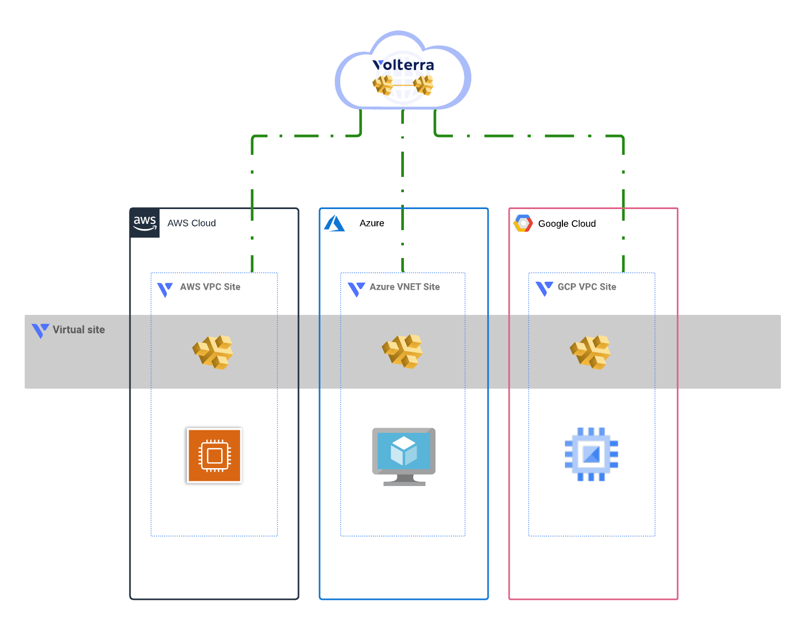

# Multi-cloud Volterra demo

<!-- spell-checker: ignore volterra markdownlint tfvars -->
This solution will create a set of Volterra AWS VPC, Azure VNET, and GCP VPC Sites
with ingress/egress gateways configured and a virtual site that spans the cloud
sites.


<!-- markdownlint-disable no-inline-html -->
<p align="center">Figure 1: High-level overview of solution</p>
<!-- markdownlint-enable no-inline-html -->

HTTP load balancers are created for each business unit service, and are advertised
on every CE site that match the selector predicate for the Virtual Site. This means
that existing resources can use DNS discovery via the Volterra gateways without
changing the deployment.

> See [Scenario](SCENARIO.md) document for details on why this solution was chosen
> for a hypothetical customer looking for a minimally invasive solution
> to multi-cloud networking.

> See [Troubleshooting](TROUBLESHOOTING.md) document for common issues you might
> see when deploying this demo along with recommended fixes or alternative actions.

## Prerequisites

### AWS

Cloud Credentials, awsRegion
- Reference [Set AWS Environment Variables](aws/README.md#login-to-aws-environment)

### Azure

Cloud Credentials, awsLocation
- Reference [Create Azure Service Principal](azure/README.md#login-to-azure-environment)

## Google

Cloud Credentials, gcpProjectId, gcpRegion
- Reference [Create Google Service Account](gcp/README.md#login-to-google-environment)
- Alternatively, you can add this module call to your demo code to create a service account programatically

```hcl
module "volterra_sa" {
  source                   = "git::https://github.com/memes/terraform-google-volterra//modules/service-account?ref=0.3.1"
  gcp_project_id           = "my-gcp-project-id"
  gcp_role_name            = "my_volterra_role"
  gcp_service_account_name = "volterra-site-sa"
  cloud_credential_name    = "my-gcp-volterra"
}
```

## Usage example

- Clone the repo and open the solution's directory
```bash
git clone https://github.com/f5devcentral/f5-digital-customer-engagement-center
cd f5-digital-customer-engagement-center/solutions/volterra/multi-cloud-connectivity/
```

- Set AWS/Azure/Google cloud credentials. See [Prerequisites](#prerequisites)
- Set Volterra environment variables
Create a Volterra credentials p12 file and copy it to a local folder. Follow steps here - https://www.volterra.io/docs/how-to/user-mgmt/credentials

```bash
export VES_P12_PASSWORD="your_key"
export VOLT_API_URL="https://<tenant-name>.console.ves.volterra.io/api"
export VOLT_API_P12_FILE="/var/tmp/<example>.console.ves.volterra.io.api-creds.p12"
```

- Get the Volterra tenant name
General namespace in the VoltConsole UI, then Tenant Settings > Tenant overview

- Create the tfvars file and update it with your settings

```bash
cp admin.auto.tfvars.example admin.auto.tfvars
# MODIFY TO YOUR SETTINGS
vi admin.auto.tfvars
```

- Run the initial setup script (sets up a random build suffix and a virtual site): 

```bash
./setup.sh
```

- Run the cloud specifc setup script: (remember that you are responsible for the cost of those components)

```bash
./aws-setup.sh
./azure-setup.sh
./gcp-setup.sh
```

## TEST your setup:

Reference each cloud for steps to validate.
- AWS [Test your setup](aws/README.md#test-your-setup)
- Azure [Test your setup](azure/README.md#test-your-setup)
- Google [Test your setup](google/README.md#test-your-setup)

## Cleanup
Use the following command to destroy all of the resources

- Run the cloud specifc destroy script:

```bash
./aws-destroy.sh
./azure-destroy.sh
./gcp-destroy.sh
```
- Run the solution destroy script:

```bash
./destroy.sh
```


<!-- markdownlint-disable no-inline-html -->
<!-- BEGINNING OF PRE-COMMIT-TERRAFORM DOCS HOOK -->
## Requirements

| Name | Version |
|------|---------|
| terraform | >= 0.14.5 |
| aws | >= 3.0 |
| azurerm | >= 2.69 |
| google | >= 3.77 |
| volterra | 0.8.1 |

## Providers

| Name | Version |
|------|---------|
| random | n/a |
| volterra | 0.8.1 |

## Modules

| Name | Source | Version |
|------|--------|---------|
| aws | ./aws/ |  |
| azure | ./azure/ |  |
| google | ./google/ |  |

## Resources

| Name |
|------|
| [random_id](https://registry.terraform.io/providers/hashicorp/random/latest/docs/resources/id) |
| [volterra_virtual_site](https://registry.terraform.io/providers/volterraedge/volterra/0.8.1/docs/resources/virtual_site) |

## Inputs

| Name | Description | Type | Default | Required |
|------|-------------|------|---------|:--------:|
| namespace | The Volterra namespace into which Volterra resources will be managed. | `string` | n/a | yes |
| volterraTenant | The Volterra tenant to use. | `string` | n/a | yes |
| awsRegion | aws region | `string` | `null` | no |
| azureLocation | location where Azure resources are deployed (abbreviated Azure Region name) | `string` | `null` | no |
| buildSuffix | unique build suffix for resources; will be generated if empty or null | `string` | `null` | no |
| domain\_name | The DNS domain name that will be used as common parent generated DNS name of<br>loadbalancers. Default is 'shared.acme.com'. | `string` | `"shared.acme.com"` | no |
| gcpProjectId | gcp project id | `string` | `null` | no |
| gcpRegion | region where GCP resources will be deployed | `string` | `null` | no |
| projectPrefix | prefix for resources | `string` | `"mcn-demo"` | no |
| resourceOwner | owner of the deployment, for tagging purposes | `string` | `"f5-dcec"` | no |
| ssh\_key | An optional SSH key to add to nodes. | `string` | `""` | no |
| volterraCloudCredAWS | Volterra Cloud Credential to use with AWS | `string` | `null` | no |
| volterraCloudCredAzure | Volterra Cloud Credential to use with Azure | `string` | `null` | no |
| volterraCloudCredGCP | Volterra Cloud Credential to use with GCP | `string` | `null` | no |

## Outputs

| Name | Description |
|------|-------------|
| aws\_jumphost\_publicIP | AWS Jumphost Public IP in BU1 |
| azure\_jumphost\_publicIP | Azure Jumphost Public IP in BU11 |
| connection\_helpers | gcloud connection helpers for GCP workstation(s) |
<!-- END OF PRE-COMMIT-TERRAFORM DOCS HOOK -->
<!-- markdownlint-enable no-inline-html -->
