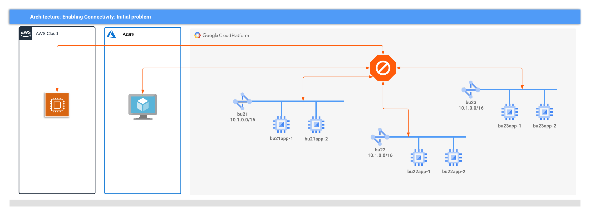
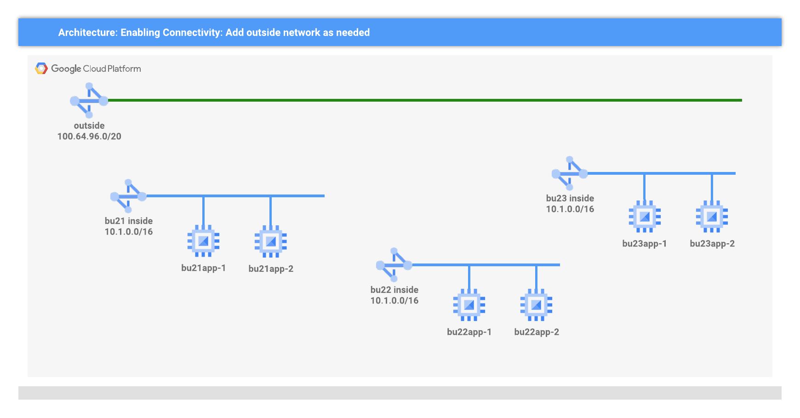
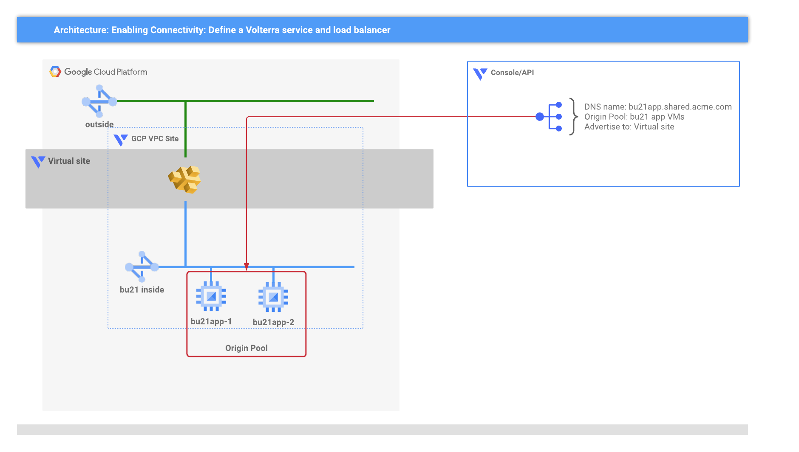
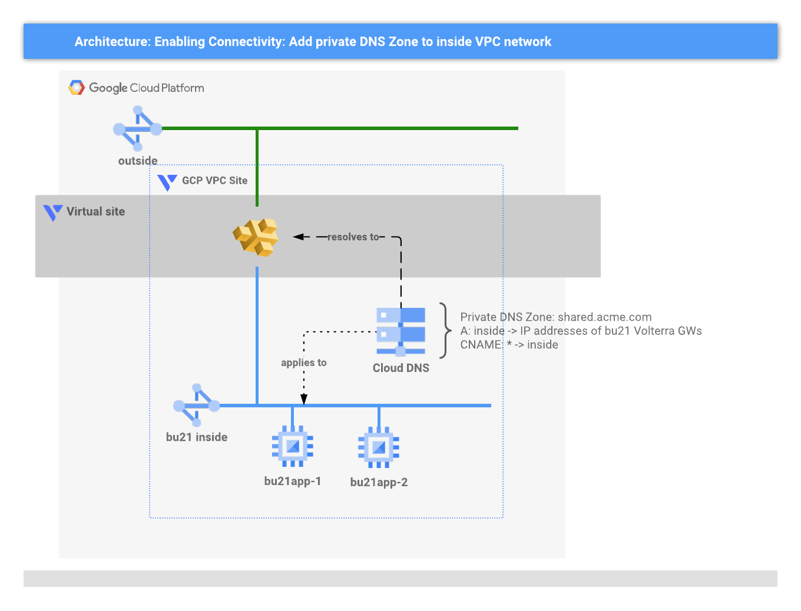
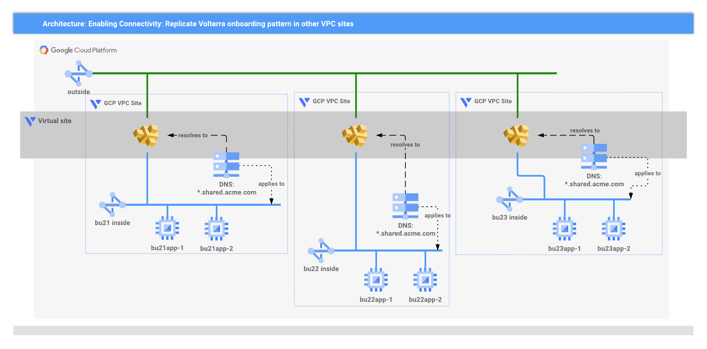
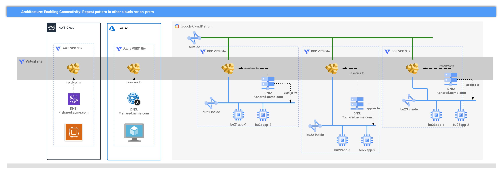

# Multi-cloud deployment scenario

<!-- spell-checker: ignore volterra markdownlint nating vnet -->
ACME Corp has multiple business units that have independently migrated to AWS,
Azure, and GCP, and are now required to communicate with each other securely,
and with minimal changes to existing deployments.

<!-- markdownlint-disable no-inline-html -->

Figure 1: The challenge for ACME Corp

<!-- markdownlint-enable no-inline-html -->

As shown in Figure 1 above, each business unit has been deployed without planning,
and the services are either deployed in a different cloud or on network with
overlapping RFC1918 CIDRs that cannot be easily connected without deploying NATing
and routing appliances.

## Customer Requirements

* No changes to existing deployments
* No outages or extended maintenance windows
* Extendable
* Provide a foundation for application modernisation

## Proposed Solution

Volterra is used to provide connectivity between business unit implementations
*without* requiring changes to the existing applications or the network address
ranges.

1. Each BU is represented in Volterra as an *AWS VPC*, an *Azure VNET*, or a
   *GCP VPC* **customer edge site**, as appropriate.
2. A Volterra *virtual site* is defined which encompasses all the BU specific
   customer edge sites.
3. Every service that needs to be shared will have a Volterra load balancer
   defined and advertised to the *virtual site*.
4. A private DNS zone is injected into each BU to provide simple service discovery.

## Step-by-step guide to the solution

Using GCP as the base example, these are the incremental changes that are made
to the customer's environments.

1. Add an outside network

   The solution will use Volterra Ingress/Egress gateways to provide connectivity
   to the Volterra backbone. On GCP that requires the creation of a distinct VPC
   network which will be attached to the outside interface of the Volterra gateway.

   

   <!-- markdownlint-disable no-inline-html -->
   
Figure 2: Outside network added to GCP project

   <!-- markdownlint-enable no-inline-html -->

   > NOTE: The demo uses a single, shared, outside network to avoid hitting quota
   > limits in pre-sales environments. The same approach works if each business
   > unit is given it's own outside network.

2. Define the virtual site in Volterra

   Volterra provides a powerful abstraction to group individual VPC sites into
   a collective set that can be managed and used in aggregate.

   

   <!-- markdownlint-disable no-inline-html -->
   
Figure 3: Define the virtual site with selector

   <!-- markdownlint-enable no-inline-html -->

   The virtual site will use *selector expressions* to match customer edge sites
   that comprise the shared solution. E.g. the selector `group = shared` will match
   any site that contains the label pair of `group: shared`.

   > NOTE: This demo uses a single virtual site to demonstrate the simplicity
   > with which the solution can be extended to multiple clouds. In reality, a
   > customer is likely to break their solution into multiple virtual sites that
   > define logical groupings.

3. Create the first GCP VPC site in Volterra

   

   <!-- markdownlint-disable no-inline-html -->
   
Figure 4: Define a GCP VPC site for the business unit

   <!-- markdownlint-enable no-inline-html -->

   Volterra will create a *stateful MIG* of Ingress/Egress instances with outside
   and inside interfaces attached to the existing VPC networks. Once fully on-boarded,
   these instances will provide secure connectivity to the Volterra global backend.

   > NOTE: By including the label(s) used by the virtual site selector, this new
   > GCP VPC site will automatically be associated with the virtual site.

4. Create the business unit's services

   A service must be defined for each business unit application that will be
   shared with others, along with a load balancer definition that knows how to
   distribute incoming traffic to service instances.

   

   <!-- markdownlint-disable no-inline-html -->
   
Figure 5: Define the service and load balancer

   <!-- markdownlint-enable no-inline-html -->

   In this demo, an *origin pool* is defined for the VM instances that provide
   the business unit's service and an HTTP load balancer will be the ingress point
   for the service. The HTTP load balancer will be given a FQDN that is sub-domain
   of `shared.acme.com`. E.g. the load balancer for bu21 app will have the FQDN
   `bu21app.shared.acme.com`, bu22 app will have the FQDN `bu22app.shared.acme.com`,
   etc.

   > NOTE: Specifying that the load balancer is advertised on *inside* interfaces
   > of the virtual site **and** using a common sub-domain allows the approach
   > to work across sites in any cloud.

5. Inject a DNS zone into each business unit network

   To make consumption of the shared services easy, a private DNS zone will be
   added to the *inside* network; this allows any VM attached to the network to
   resolve each service without changes to the VM. A single zone for
   `shared.acme.com` will be added with 2 records.

   

   <!-- markdownlint-disable no-inline-html -->
   
Figure 6: Inject private DNS zone

   <!-- markdownlint-enable no-inline-html -->

   <!-- spell-checker: ignore CNAME -->
   By defining a wildcard CNAME that resolves to the Volterra gateway instances
   any new service that uses the `shared.acme.com` domain will be automatically
   discoverable in each VPC site. E.g. a query for `bu21app.shared.acme.com` will
   resolve to the inside addresses of Volterra gateways, and the gateway will
   proxy the request to appropriate service regardless of cloud, or it will respond
   with an HTTP error.

6. Repeat for other business units on GCP

   The same pattern of changes can be applied to any other business units deployed
   to GCP.

   

   <!-- markdownlint-disable no-inline-html -->
   
Figure 7: Extend the pattern to other GCP business units

   <!-- markdownlint-enable no-inline-html -->

   > NOTE: The virtual site abstraction ensures that as each service endpoint is
   > defined it is automatically available on every GCP VPC site.

7. Extend to other clouds

   The same pattern of changes can be applied to other business units deployed
   to AWS and Azure.

   

   <!-- markdownlint-disable no-inline-html -->
   
Figure 8: Extend the pattern to AWS and Azure business units

   <!-- markdownlint-enable no-inline-html -->

   > NOTE: The virtual site abstraction ensures that as each service endpoint is
   > defined it is automatically available on every AWS VPC, Azure VNET, and GCP
   > VPC site.

The end result is a set of business unit services that are addressable from each
isolated deployment, and extendable, managed through Volterra SaaS console and API.
