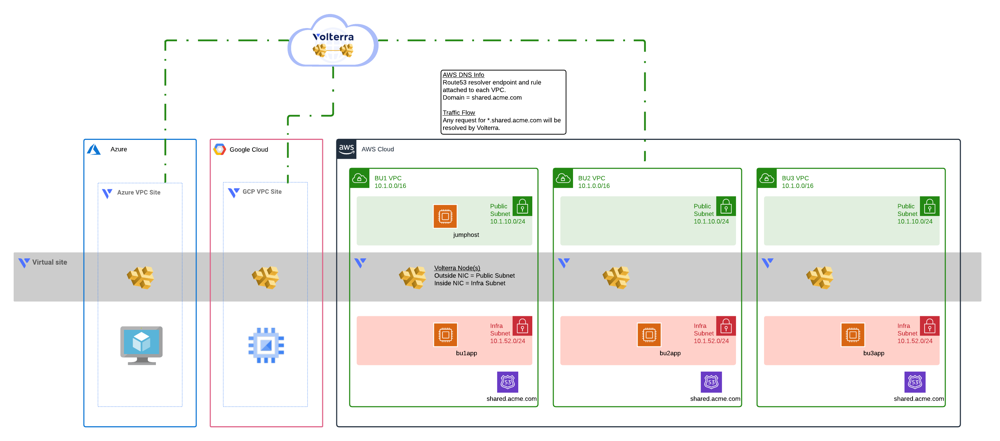
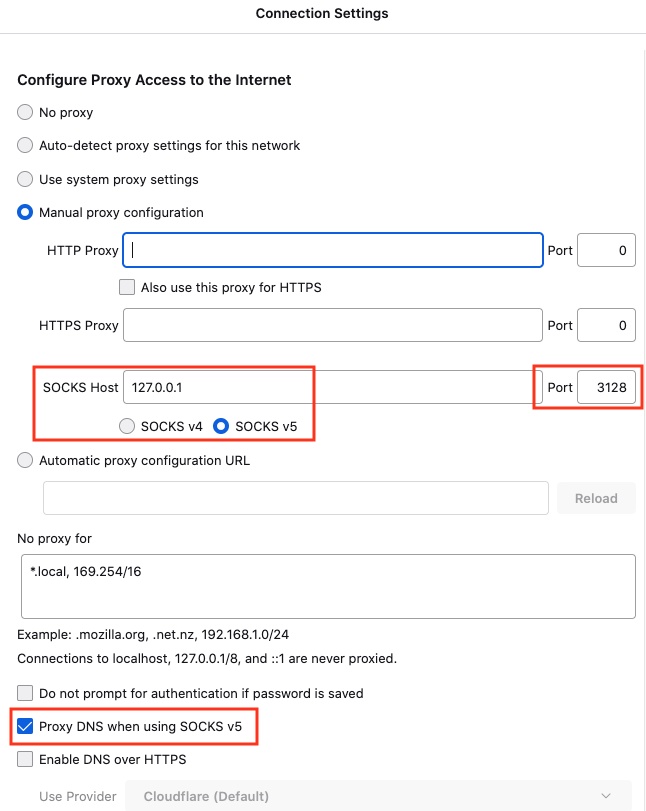
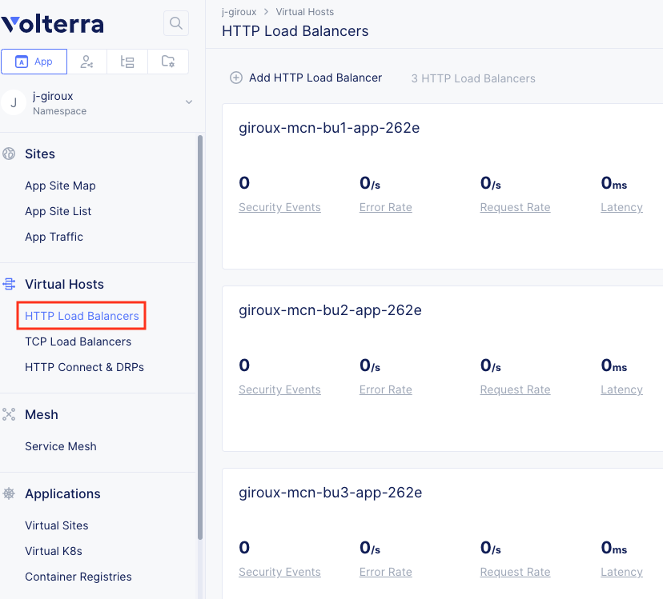
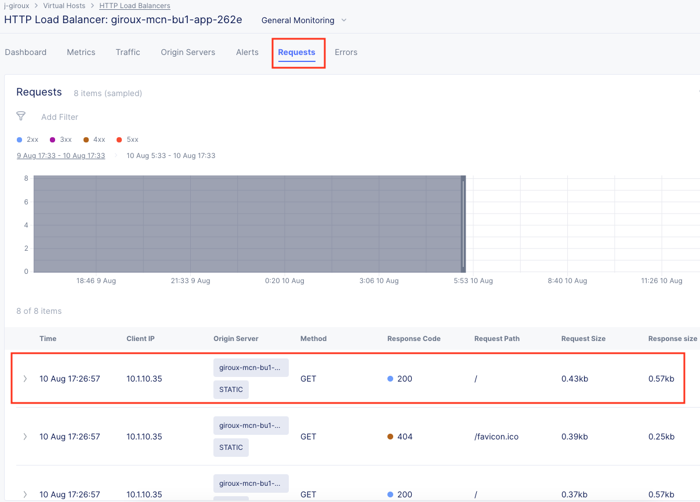
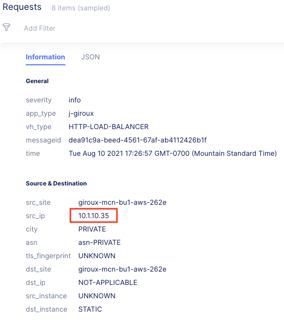

# AWS multi-cloud Volterra module

This module will create a set of Volterra AWS VPC Sites with ingress/egress gateways
configured and a virtual site that spans the CE sites.

## Diagram


<!-- markdownlint-disable no-inline-html -->
<p align="center">Figure 1: High-level overview of solution; this module delivers the AWS resources</p>
<!-- markdownlint-enable no-inline-html -->

HTTP load balancers are created for each business unit service, and are advertised
on every CE site that match the selector predicate for the Virtual Site. This means
that existing resources can use DNS discovery via the Volterra gateways without
changing the deployment.

> See [Scenario](../SCENARIO.md) document for details on why this solution was chosen
> for a hypothetical customer looking for a minimally invasive solution
> to multi-cloud networking.

## Requirements

- AWS CLI
- Terraform
- AWS account, access and secret key
- Volterra account
- Volterra p12 credential file and api password -  https://www.volterra.io/docs/how-to/user-mgmt/credentials
- Volterra Cloud Credentials

## Login to AWS Environment

- Set AWS environment variables
```bash
export AWS_ACCESS_KEY_ID="your_key"
export AWS_SECRET_ACCESS_KEY="your_secret_key"
```

## Create Volterra Cloud Credentials for AWS

In VoltConsole go to the "System" namespace and navigate to "Manage" -> "Site Management" -> "Cloud Credentials".

Click on "Add Cloud Credential"

For the name enter "[unique-name]-aws".

For the Cloud Credential Type: "AWS Programmatic Access Credentials" and enter the values from your AWS access key and secret access key

- Access Key ID: This is your IAM user access key (reference AWS_ACCESS_KEY_ID)
- Secret Access Key: This is your IAM user secret access key (reference AWS_SECRET_ACCESS_KEY)

Under Secret Access Key click on "Configure"

Enter the value from environment variable AWS_SECRET_ACCESS_KEY and then click on "Blindfold"

## Usage example

See parent [README Usage Example](../README.md#usage-example), then come back here to test.

## TEST your setup:

1. Connect to the bu1Jumphost via SSH with port forwarding enabled.

The IP is in the terraform output. Example SSH command is below. Run this from your laptop terminal. You will use these settings later in your laptop web browser to configure SOCKS v5 proxy.

```bash
# run this from your laptop/pc
ssh -D 3128 ubuntu@x.x.x.x
# port = 3128
# user = ubuntu
# IP = x.x.x.x
```

2. From the jumphost CLI, test curl commands to each BU site.

```bash
# run this from the jumphost terminal
curl bu1app.shared.acme.com
curl bu2app.shared.acme.com
curl bu3app.shared.acme.com
```

3. On your laptop/PC, configure your browser to use 127.0.0.1:3128 as SOCKS v5 proxy and also enable the box "Proxy DNS when using SOCKS v5".



4. Browse to the BU sites. AWS will resolve with a basic NGINX page.


5. Open VoltConsole, go to the 'HTTP Load Balancers' tab



6. Click on bu1app and open the 'Requests' tab. You should see your request.



7. Click on the request and notice it shows the original clientIp and the source site.



## Cleanup
Use the following command to destroy all of the resources

```bash
./destroy.sh
```

## How to Contribute

Submit a pull request

# Authors
- Yossi Rosenboim
- Jeff Giroux
