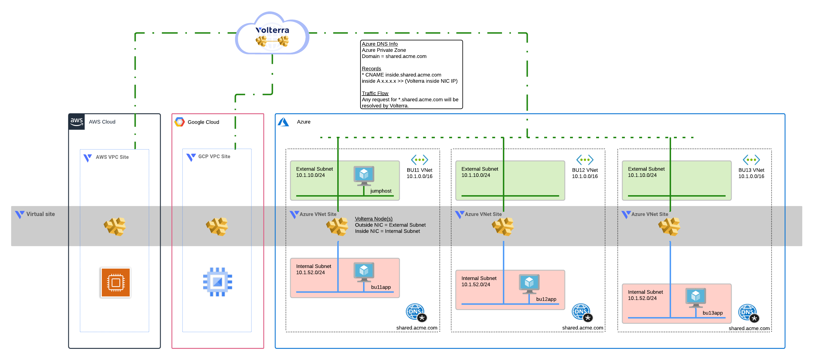
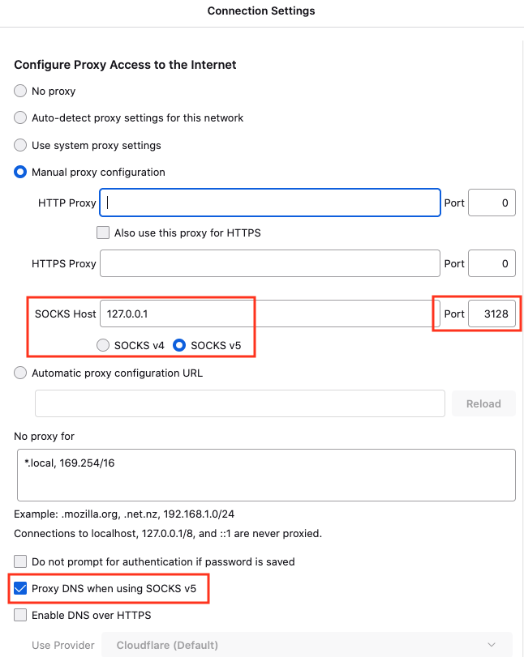
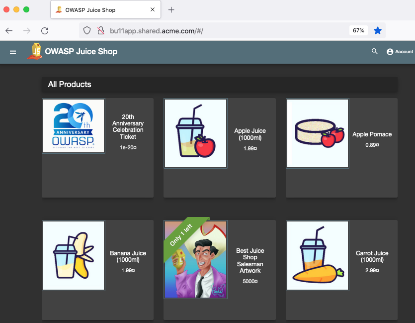
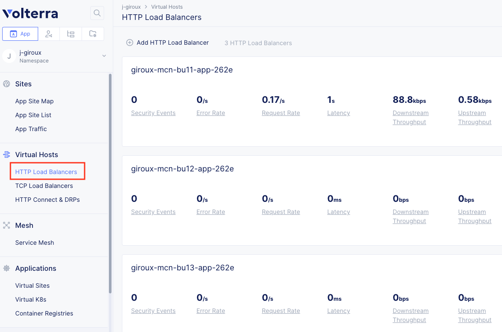
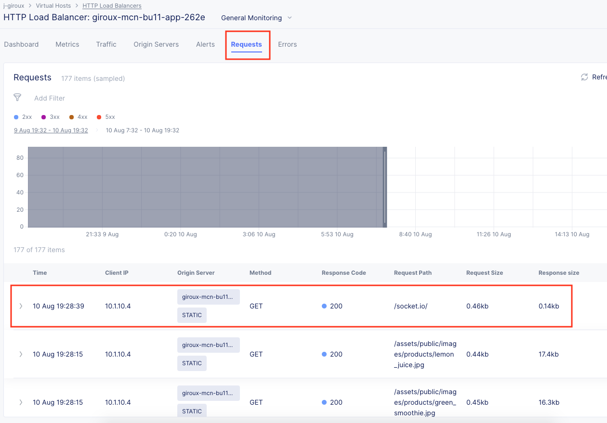
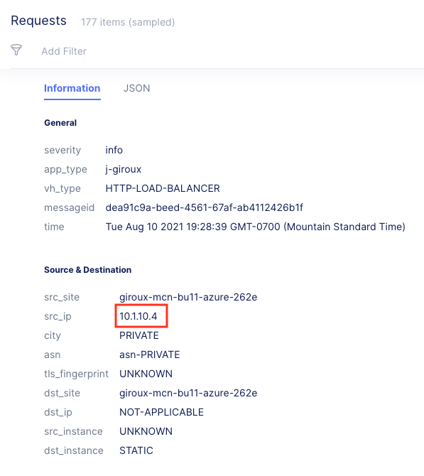

# Azure multi-cloud Volterra module

<!-- spell-checker: ignore volterra markdownlint tfvars -->
This module will create a set of Volterra Azure VNet Sites with ingress/egress gateways
configured and a virtual site that spans the CE sites.

## Diagram


<!-- markdownlint-disable no-inline-html -->
<p align="center">Figure 1: High-level overview of solution; this module delivers the Azure resources</p>
<!-- markdownlint-enable no-inline-html -->

HTTP load balancers are created for each business unit service, and are advertised
on every CE site that match the selector predicate for the Virtual Site. This means
that existing resources can use DNS discovery via the Volterra gateways without
changing the deployment.

> See [Scenario](../SCENARIO.md) document for details on why this solution was chosen
> for a hypothetical customer looking for a minimally invasive solution
> to multi-cloud networking.

## Requirements

- Azure CLI
- Terraform
- Azure Subscription
- Azure User with 'Owner' role
- Azure Service Principal
- Volterra account
- Volterra p12 credential file and api password -  https://www.volterra.io/docs/how-to/user-mgmt/credentials
- Volterra Cloud Credentials

## Login to Azure Environment

```bash
# Login
az login

# Show subscriptions
az account show

# Set default
az account set -s <subscriptionId>
```

## Create Azure Service Principal

When you are deploying Azure resources from VoltConsole you will need to create
a Cloud Credential that has access to your Azure Subscription. If you already
have a service principal you can use it. Otherwise you can follow these steps
to create one. Note that you must have an "Owner" role for your subscription
to create a service principal.

From the Azure Console Bash Cloud Shell, run the following command:

```
  $ az ad sp create-for-rbac -n "http://[unique-name]-volterra-cc" --role contributor
  {
    "appId": "xxx-xxxx",
    "displayName": "[unique-name]-volterra-cc",
    "name": "http://[unique-name]-volterra-cc",
    "password": "[password]",
    "tenant": "yyy-yyy"
  }
```

Copy the JSON output (starting with "{" ending with "}") of this command and keep it safe.
This credential enables read/write access to your Azure Subscription.

You will also need to retrieve your subscription ID. You can use the following command
to list out the name, id, and whether it is your default subscription.

```
  $ az account show  --query [name,id,isDefault]
  [
    "f5-AZR_xxxx", <-- name
    "xxx-xxx-xxx", <-- subscription id
    true           <-- is this the default subscription
  ]
```

## Create Volterra Cloud Credentials for Azure

In VoltConsole go to the "System" namespace and navigate to "Manage" -> "Site Management" -> "Cloud Credentials".

Click on "Add Cloud Credential"

For the name enter "[unique-name]-azure".

For the Cloud Credential Type: "Azure Client Secret for Service Principal" and enter the
values based on the JSON output from before.

- Client ID: "appId" from JSON output
- Subscription ID: output of id from "account show" command
- Tenant ID: "tenant" from JSON output

Under Azure Client Secret click on "Configure"

Enter the value of "password" from the previous JSON output and then click on "Blindfold"

## Usage example

See parent [README Usage Example](../README.md#usage-example), then come back here to test.

## TEST your setup:

1. Connect to the bu11Jumphost via SSH with port forwarding enabled.

The IP is in the terraform output. Example SSH command is below. Run this from your laptop terminal. You will use these settings later in your laptop web browser to configure SOCKS v5 proxy.

```bash
# run this from your laptop/pc
ssh -D 3128 ubuntu@x.x.x.x
# port = 3128
# user = ubuntu
# IP = x.x.x.x
```

2. From the jumphost CLI, test curl commands to each BU site.

```bash
# run this from the jumphost terminal
curl bu11app.shared.acme.com
curl bu12app.shared.acme.com
curl bu13app.shared.acme.com
```

3. On your laptop/PC, configure your browser to use 127.0.0.1:3128 as SOCKS v5 proxy and also enable the box "Proxy DNS when using SOCKS v5".



4. Browse to the BU sites. Azure will resolve with a OWASP Juice Shop page.



5. Open VoltConsole, go to the 'HTTP Load Balancers' tab



6. Click on bu11app and open the 'Requests' tab. You should see your request.



7. Click on the request and notice it shows the original clientIp and the source site.



## Cleanup
Use the following command to destroy all of the resources

```bash
./destroy.sh
```

## How to Contribute

Submit a pull request

# Authors
- Jeff Giroux
