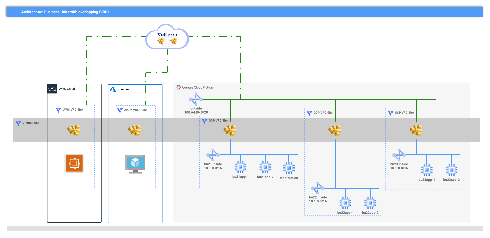
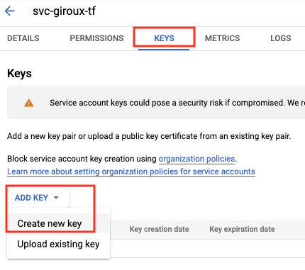
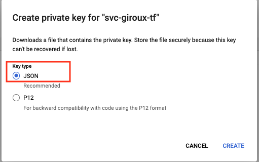
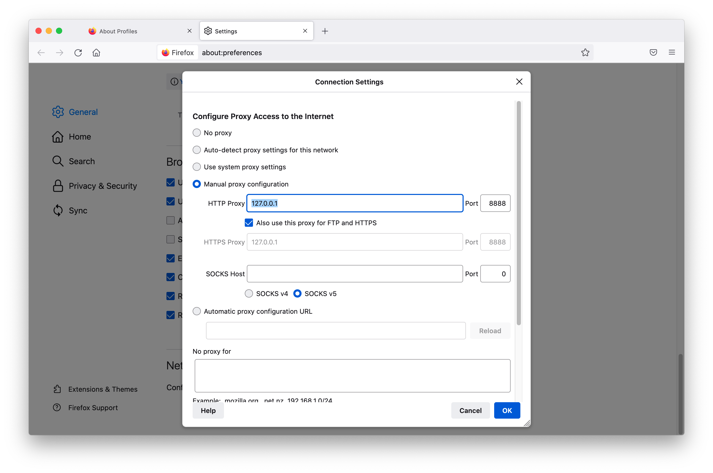
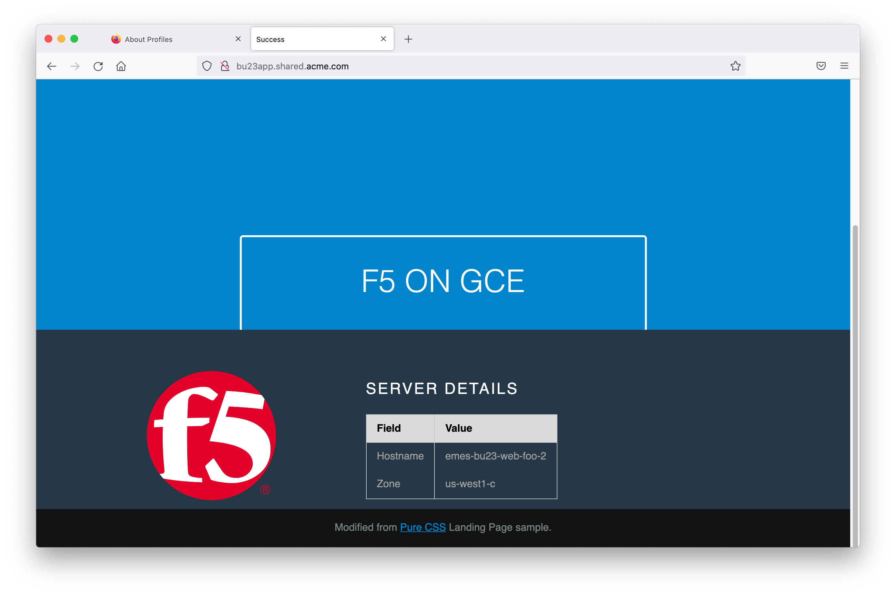

# GCP multi-cloud Volterra module

<!-- spell-checker: ignore volterra markdownlint tfvars -->
This module will create a set of Volterra GCP VPC Sites with ingress/egress gateways configured and a virtual site that spans the CE sites.

## Diagram


<!-- markdownlint-disable no-inline-html -->
<p align="center">Figure 1: High-level overview of solution; this module delivers the GCP resources</p>
<!-- markdownlint-enable no-inline-html -->

HTTP load balancers are created for each business unit service, and are advertised
on every CE site that match the selector predicate for the Virtual Site. This means
that existing resources can use DNS discovery via the Volterra gateways without
changing the deployment.

> See [Scenario](../SCENARIO.md) document for details on why this solution was chosen
> for a hypothetical customer looking for a minimally invasive solution
> to multi-cloud networking.

## Requirements

- Google gcloud CLI
- Terraform
- Google Project
- Google IAM Service Account
- Volterra account
- Volterra p12 credential file and api password -  https://www.volterra.io/docs/how-to/user-mgmt/credentials
- Volterra Cloud Credentials

## Login to Google Environment

```bash
# Login
gcloud init

# Show config
gcloud config list
```

## Create Google Service Account

When you are deploying Azure resources from VoltConsole you will need to create
a Cloud Credential that has access to your Azure Subscription. If you already
have a service account you can use it. Otherwise you can follow these steps
to create one. Note that you must have an "Editor" role within your Google project
to create a service account. Reference [Creating IAM Service Accounts](https://cloud.google.com/iam/docs/creating-managing-service-accounts#iam-service-accounts-create-console).

From the Google Console, navigate to IAM > Service Accounts.

Create an account with the following roles:
- Compute Admin
- DNS Administrator
- Service Account Admin
- Service Account User
- Project IAM Admin
- Secret Manager Admin
- Storage Admin

Upon save, you will be directed back to Service Account page. Find and select your new service account to edit it.

Click the 'Key' tab to create a new key.



Choose JSON format. The file will be saved as JSON to your computer.



Copy the JSON output (starting with "{" ending with "}") of this command and keep it safe.
This credential enables read/write access to your Google Project.

Add service account credentials to your Terraform environment. See the [Terraform Google Provider "Adding Credentials"](https://www.terraform.io/docs/providers/google/guides/getting_started.html#adding-credentials). At a high level, you are creating an environment variable that points to the newly downloaded JSON file.


## Create Volterra Cloud Credentials for Google

In VoltConsole go to the "System" namespace and navigate to "Manage" -> "Site Management" -> "Cloud Credentials".

Click on "Add Cloud Credential"

For the name enter "[unique-name]-gcp".

For the Cloud Credential Type: "GCP Credentials"

Under GCP Credentials click on "Configure"

Enter the content of the JSON key file then click on "Blindfold". Example...

```
{
  "type": "service_account",
  "project_id": "f5-project123",
  "private_key_id": "abcxyz",
  "private_key": "-----REDACTED=\n",
  "client_email": "",
  "client_id": "123456",
  "auth_uri": "https://accounts.google.com/o/oauth2/auth",
  "token_uri": "https://oauth2.googleapis.com/token",
  "auth_provider_x509_cert_url": "https://www.googleapis.com/oauth2/v1/certs",
  "client_x509_cert_url": ""
}
```

## Usage example

See parent [README Usage Example](../README.md#usage-example), then come back here to test.

## TEST your setup:

1. Launch HTTP/HTTPS proxy tunnel via Workstation VM.

The connection info is in the terraform output. Example command is below. Run this from your laptop terminal.

   > See [Workstation](../../../../modules/google/terraform/workstation/README.md#using-workstation) docs for more options

   <!-- spell-checker: disable -->
   ```shell
   eval $(terraform output connection_helpers | jq -r 'fromjson | .bu21.proxy_tunnel')
   ```

   ```text
   Testing if tunnel connection works.
   Listening on port [8888].
   ```
   <!-- spell-checker: enable -->

2. Configure browser to use `127.0.0.1:8888` as HTTP and HTTPS proxy

   
   <!-- markdownlint-disable no-inline-html -->
   <p align="center">Figure 2: Configure HTTP/HTTPS proxy in FireFox</p>
   <!-- markdownlint-enable no-inline-html -->

3. Browse to advertised services; e.g. bu23app.shared.acme.com

   
   <!-- markdownlint-disable no-inline-html -->
   <p align="center">Figure 3: Viewing bu23app from Workstation on bu21 VPC</p>
   <!-- markdownlint-enable no-inline-html -->

## Cleanup
Use the following command to destroy all of the resources

```bash
./destroy.sh
```
<!-- markdownlint-disable no-inline-html -->
<!-- BEGINNING OF PRE-COMMIT-TERRAFORM DOCS HOOK -->
## Requirements

| Name | Version |
|------|---------|
| terraform | >= 0.14.5 |
| google | >= 3.77 |
| volterra | 0.11.4 |

## Providers

| Name | Version |
|------|---------|
| external | n/a |
| google | >= 3.77 |
| random | n/a |
| volterra | 0.11.4 |

## Modules

| Name | Source | Version |
|------|--------|---------|
| inside | terraform-google-modules/network/google | 3.3.0 |
| outside | terraform-google-modules/network/google | 3.3.0 |
| region_locations | git::https://github.com/memes/terraform-google-volterra//modules/region-locations?ref=0.3.1 |  |
| webserver_sa | terraform-google-modules/service-accounts/google | 4.0.2 |
| webserver_tls | ../../../../modules/google/terraform/tls |  |
| webservers | ../../../../modules/google/terraform/backend |  |
| workstation | ../../../../modules/google/terraform/workstation |  |
| workstation_sa | terraform-google-modules/service-accounts/google | 4.0.2 |
| workstation_tls | ../../../../modules/google/terraform/tls/ |  |

## Resources

| Name |
|------|
| [external_external](https://registry.terraform.io/providers/hashicorp/external/latest/docs/data-sources/external) |
| [google_compute_firewall](https://registry.terraform.io/providers/hashicorp/google/latest/docs/resources/compute_firewall) |
| [google_compute_zones](https://registry.terraform.io/providers/hashicorp/google/latest/docs/data-sources/compute_zones) |
| [google_dns_managed_zone](https://registry.terraform.io/providers/hashicorp/google/latest/docs/resources/dns_managed_zone) |
| [google_dns_record_set](https://registry.terraform.io/providers/hashicorp/google/latest/docs/resources/dns_record_set) |
| [random_shuffle](https://registry.terraform.io/providers/hashicorp/random/latest/docs/resources/shuffle) |
| [volterra_cloud_site_labels](https://registry.terraform.io/providers/volterraedge/volterra/0.11.4/docs/resources/cloud_site_labels) |
| [volterra_gcp_vpc_site](https://registry.terraform.io/providers/volterraedge/volterra/0.11.4/docs/resources/gcp_vpc_site) |
| [volterra_healthcheck](https://registry.terraform.io/providers/volterraedge/volterra/0.11.4/docs/resources/healthcheck) |
| [volterra_http_loadbalancer](https://registry.terraform.io/providers/volterraedge/volterra/0.11.4/docs/resources/http_loadbalancer) |
| [volterra_origin_pool](https://registry.terraform.io/providers/volterraedge/volterra/0.11.4/docs/resources/origin_pool) |
| [volterra_tf_params_action](https://registry.terraform.io/providers/volterraedge/volterra/0.11.4/docs/resources/tf_params_action) |

## Inputs

| Name | Description | Type | Default | Required |
|------|-------------|------|---------|:--------:|
| buildSuffix | random build suffix for resources | `string` | n/a | yes |
| gcpProjectId | gcp project id | `string` | n/a | yes |
| gcpRegion | region where gke is deployed | `string` | n/a | yes |
| namespace | The Volterra namespace into which Volterra resources will be managed. | `string` | n/a | yes |
| projectPrefix | prefix for resources | `string` | n/a | yes |
| resourceOwner | owner of the deployment, for tagging purposes | `string` | n/a | yes |
| volterraCloudCredGCP | Name of the Volterra cloud credentials to use with GCP VPC sites | `string` | n/a | yes |
| volterraTenant | The Volterra tenant to use. | `string` | n/a | yes |
| volterraVirtualSite | The name of the Volterra virtual site that will receive LB registrations. | `string` | n/a | yes |
| business\_units | The set of VPCs to create with overlapping CIDRs. | <pre>map(object({<br>    cidr        = string<br>    mtu         = number<br>    workstation = bool<br>  }))</pre> | <pre>{<br>  "bu21": {<br>    "cidr": "10.1.0.0/16",<br>    "mtu": 1460,<br>    "workstation": true<br>  },<br>  "bu22": {<br>    "cidr": "10.1.0.0/16",<br>    "mtu": 1460,<br>    "workstation": false<br>  },<br>  "bu23": {<br>    "cidr": "10.1.0.0/16",<br>    "mtu": 1460,<br>    "workstation": false<br>  }<br>}</pre> | no |
| domain\_name | The DNS domain name that will be used as common parent generated DNS name of<br>loadbalancers. | `string` | `"shared.acme.com"` | no |
| labels | An optional list of labels to apply to GCP resources. | `map(string)` | `{}` | no |
| num\_servers | The number of webserver instances to launch in each business unit spoke. Default<br>is 2. | `number` | `2` | no |
| num\_volterra\_nodes | The number of Volterra gateway instances to launch in each business unit spoke.<br>Default is 1. | `number` | `1` | no |
| outside\_cidr | The CIDR to assign to shared outside VPC. Default is '100.64.96.0/20'. | `string` | `"100.64.96.0/20"` | no |
| ssh\_key | An optional SSH key to add to Volterra nodes. | `string` | `""` | no |

## Outputs

| Name | Description |
|------|-------------|
| connection\_helpers | A set of `gcloud` commands to connect to SSH, setup a forward-proxy, and to access<br>Code Server on each workstation, mapped by business unit. |
<!-- END OF PRE-COMMIT-TERRAFORM DOCS HOOK -->
<!-- markdownlint-enable no-inline-html -->

## FAQs?

1. Why is there a single `outside` network? Can this work with multiple `outside` networks?

   For the purposes of this [multi-cloud-connectivity-volterra](../) demo, the
   module is creating a single VPC for `outside` use to minimise the risk of
   hitting VPC quota limits on GCP. The solution can function without issue if
   independent `outside` networks are used; the `outside` network is a requirement
   to use a 2-NIC Volterra Ingress/Egress gateway that can support routing traffic
   _from_ an `inside` network.
